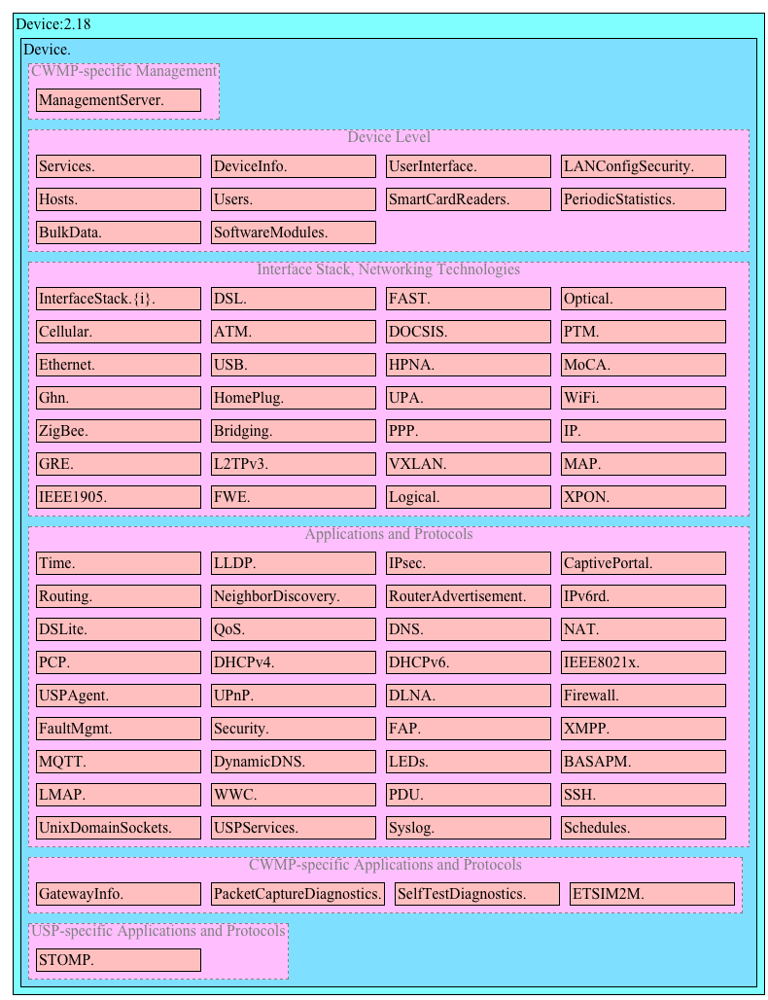
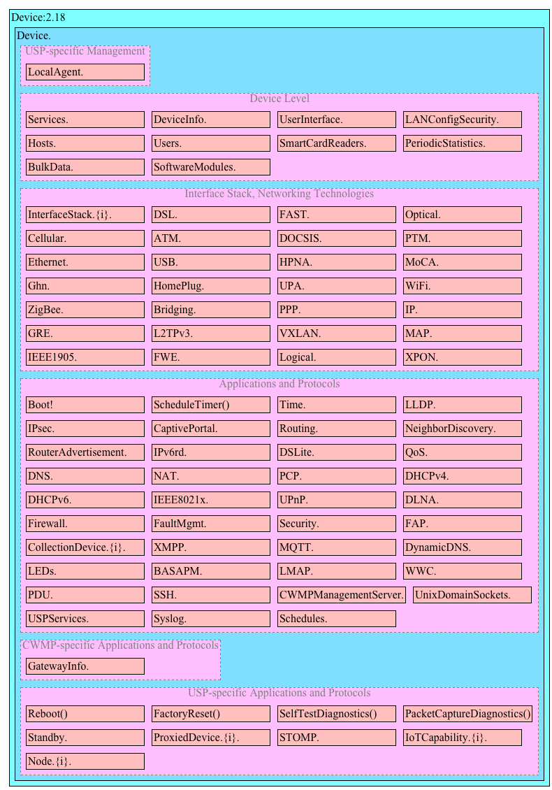
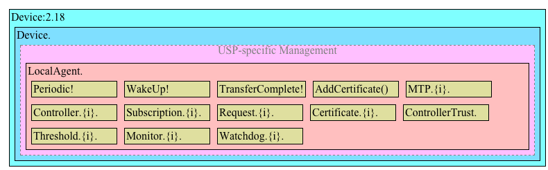
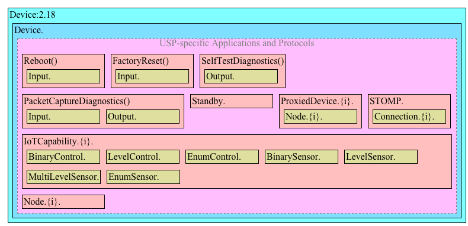
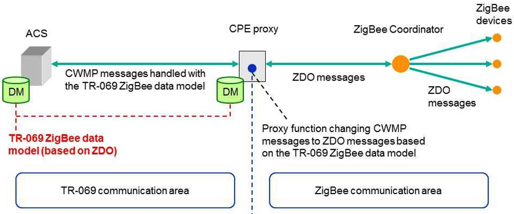

---
# navigation buttons shown on each page header
buttons:
- label: HTML
  title: '%bbfNumber% Single-file HTML'
  url: index.htm
- label: PDF
  title: '%bbfNumber% PDF'
  url: index.pdf
- label: CWMP Data Models
  url: https://cwmp-data-models.broadband-forum.org
- label: USP Data Models
  url: https://usp-data-models.broadband-forum.org
- label: Data Model Template
  url: https://data-model-template.broadband-forum.org
  title: TR-106

# references assume use of bbf.csl; please follow the existing style
references:

# end of metadata
...

!include cover-page.md

!include %notice%-notice.md

!include METADATA-%bbfMajor%.md

# Purpose and Scope {.new-page}

## Purpose

This %bbfType% defines version 2 of the Device data model (Device:2). The Device:2 data model applies to all types of TR-069 or USP enabled devices, including End Devices, Residential Gateways, and other Network Infrastructure Devices.

## Scope

The Device:2 data model defined in this %bbfType% consists of a set of data objects covering things like basic device information, time-of-day configuration, network interface and protocol stack configuration, routing and bridging management, throughput statistics, and diagnostic tests. It also defines a baseline profile that specifies a minimum level of data model support.

The cornerstone of the Device:2 data model is the interface stacking mechanism. Network interfaces and protocol layers are modeled as independent data objects (a.k.a. interface objects) that can be stacked, one on top of the other, into whatever configuration a device might support.

Because the Device:2 data model can be used with either the USP or the CWMP (TR-069) protocol, it contains some objects and parameters which only apply if the specific protocol is used.

@{fig:cwmp-specific-device2-data-model-structure--overview} illustrates the top-level Device:2 data model structure for CWMP, @{fig:usp-specific-device2-data-model-structure--overview} the top-level Device:2 data model structure for USP.

### Detailed structure for common elements {.new-page}

The next figures illustrate the data model structure of the common parts in greater detail. This structure applies equally for USP and CWMP. See *[Parameter Definitions]* for the complete list of objects.

### Detailed structure for CWMP specific elements

The next figures illustrate the data model structure of the CWMP specific parts in greater detail. See *[Parameter Definitions]* for the complete list of objects.

### Detailed structure for USP specific elements {.new-page}

The next figures illustrate the data model structure of the USP specific parts in greater detail. See *[Parameter Definitions]* for the complete list of objects.

# References and Terminology {.new-page}

## Conventions

In this %bbfType%, several words are used to signify the requirements of the specification. These words are always capitalized. More information can be found in RFC 2119 [@RFC2119].

::: borderless
|                |
|----------------|--------------------------------------------------------------------------------
| **MUST**       | This word, or the term "REQUIRED", means that the definition is an absolute requirement of the specification.
| **MUST NOT**   | This phrase means that the definition is an absolute prohibition of the specification.
| **SHOULD**     | This word, or the term "RECOMMENDED", means that there could exist valid reasons in particular circumstances to ignore this item, but the full implications need to be understood and carefully weighed before choosing a different course.
| **SHOULD NOT** | This phrase, or the phrase "NOT RECOMMENDED" means that there could exist valid reasons in particular circumstances when the particular behavior is acceptable or even useful, but the full implications need to be understood and the case carefully weighed before implementing any behavior described with this label.
| **MAY**        | This word, or the term "OPTIONAL", means that this item is one of an allowed set of alternatives. An implementation that does not include this option MUST be prepared to inter-operate with another implementation that does include the option.
:::

The key words "DEPRECATED" and "OBSOLETED" in this %bbfType% are to be interpreted as defined in TR-106 [@TR-106].

## References

The following references are of relevance to this %bbfType%. At the time of publication, the editions indicated were valid. All references are subject to revision; users of this %bbfType% are therefore encouraged to investigate the possibility of applying the most recent edition of the references listed below.

A list of currently valid Broadband Forum Technical Reports is published at <https://www.broadband-forum.org>.

::: {#refs}
:::

## Definitions

The following terminology is used throughout this %bbfType%.

::: borderless
|                   |
|-------------------|----------------------------------------------------------
| **5G Residential Gateway** | A CPE that uses native 5G control plane N1 signaling.
| **ACS**           | Auto-Configuration Server. This is a component in the broadband network responsible for *CWMP* auto-configuration of the *CPE* for advanced services.
| **Agent**         | A generic term that refers (as appropriate) to either a CWMP Endpoint or to a USP Agent.
| **AGF**           | A function connecting wireline access networks to the 5GC. AGF-CP is the control plane while AGF-UP is the user plane of the AGF.
| **AMF**           | The AMF is a 5G control plane function that terminates N1 and N2. It is responsible for mobility and access related functions.
| **CPE**           | Customer Premises Equipment; refers (as appropriate) to any *CWMP*-enabled [@TR-069] or *USP*-enabled [@TR-369] device and therefore covers both Internet Gateway devices and LAN-side end devices.
| **Command**       | A named element allowing a USP Controller to execute an operation on a USP Agent. This concept does not apply to CWMP, which uses Objects and/or Parameters to simulate operations.
| **Component**     | A named collection of *Objects* and/or *Parameters* and/or Profiles that can be included anywhere within a *Data Model*.
| **Controller**    | A generic term that refers (as appropriate) to either a CWMP ACS or a USP Controller.
| **CWMP**          | *CPE* WAN Management Protocol. Defined in TR-069 [@TR-069], CWMP is a communication protocol between an *ACS* and a CWMP-enabled *CPE* that defines a mechanism for secure auto-configuration of a *CPE* and other *CPE* management functions in a common framework.
| **CWMP Endpoint** | A CWMP termination point used by a CWMP-enabled CPE for communication with the ACS*.*
| **Data Model**    | A hierarchical set of *Objects,* *Parameters, Commands and/or Events* that define the managed objects accessible via a particular *Agent*.
| **Device**        | Used here as a synonym for *CPE*.
| **DM Instance**   | Data Model Schema instance document. This is an XML document that conforms to the *DM Schema* and to any additional rules specified in or referenced by the *DM Schema*.
| **DM Schema**     | Data Model Schema. This is the XML Schema [@REC-xmlschema-0-20041028] that is used for defining data models for use with *CWMP and USP*.
| **Downstream Interface** | A physical interface object whose Upstream parameter is set to *false*, or an interface that is associated with such a physical interface via the InterfaceStack. For example, a downstream IP Interface is an IP.Interface object that is associated with an Upstream=false physical layer interface.
| **Event**         | An indication that something of interest has happened that requires the Agent to notify the Controller.
| **Fixed Network Residential Gateway** | A CPE connecting a home LAN to the WAN, which does not exchange N1 signaling with the 5GC.
| **Interface Object** | A type of *Object* that models a network interface or protocol layer. Commonly referred to as an interface. They can be stacked, one on top of the other, using *Path References* in order to dynamically define the relationships between interfaces.
| **N1**            | Reference point between the 5G-RG and the AMF and between the AGF and AMF in case of FN-RG.
| **N2**            | Reference point between W-5GAN and AMF. On the W-5GAN side, the termination point is the AGF-CP.
| **N3**            | Reference point between W-5GAN and UPF. On the W-5GAN side, the termination point is the AGF-UP.
| **Object**        | An internal node in the name hierarchy, i.e., a node that can have Object, Parameter, Command and/or Event children. An Object name is a Path Name.
| **Parameter**     | A name-value pair that represents part of a CPE or USP Agent's configuration or status. A Parameter name is a Path Name.
| **Path Name**     | A name that has a hierarchical structure similar to files in a directory, with each level separated by a "." (dot). References an Object, Parameter, Command or Event.
| **Path Reference** | Describes how a parameter can reference another parameter or object via its path name (A.2.3.4/TR-106 [@TR-106]). Such a reference can be weak or strong (Section A.2.3.6/TR-106 [@TR-106]).
| **Upstream Interface** | A physical interface object whose Upstream parameter is set to *true*, or an interface that is associated with such a physical interface via the InterfaceStack. For example, an upstream IP Interface is an IP.Interface object that is associated with an Upstream=true physical layer interface.
| **USP**           | User Services Platform. Defined in TR-369 [@TR-369], USP is an evolution of CWMP that allows applications to manipulate Service Elements in a network of Controllers and Agents.
| **USP Agent**     | A USP Agent is a USP Endpoint that exposes Service Elements to one or more USP Controllers.
| **USP Controller** | A USP Controller is a USP Endpoint that manipulates Service Elements through one or more USP Agents.
| **USP Endpoint**  | A USP Endpoint is a termination point for a USP message.
| **Wireline 5G Access Network** | This is a wireline AN that can connect to a 5G core via the AGF. The egress interfaces of a W-5GAN form the border between access and core. The interfaces are N2 for the control plane and N3 for the user plane.
:::

## Abbreviations

This %bbfType% uses the following abbreviations:

::: borderless
|                  |
|------------------|-----------------------------------------------------------
| 3GPP             | Third Generation Partnership Project
| 5G-RG            | 5G Residential Gateway
| 5QI              | 5G QoS Indicator
| 5WE              | 5G Wireline Encapsulation
| AAA              | Authentication, Authorization and Accounting
| AGF              | Access Gateway Function
| ARP              | Allocation and Retention Priority
| ATM              | Asynchronous Transfer Mode
| ATSSS            | Access Traffic Steering Switching and Splitting
| BNG              | Broadband Network Gateway
| CGN              | Carrier Grade NAT
| CUPS             | Control User Plane Separation
| DHCP             | Dynamic Host Configuration Protocol
| DHCPv6           | Dynamic Host Configuration Protocol for IPv6
| DNN              | Data Network Name
| DSCP             | Differentiated Services Code Point
| DSL              | Digital Subscriber Line
| FMIF             | Fixed Mobile Interworking Function
| FN-RG            | Fixed Network Residential Gateway
| GBR              | Guaranteed Bit Rate
| IoT              | Internet of Things
| IP               | Internet Protocol
| IPsec            | Internet Protocol Security
| LCP              | Link Control Protocol
| M2M              | Machine to Machine
| NAS              | Non Access Stratum
| NAT              | Network Address Translation
| NSCL             | Network Service Capability Layer
| OSI              | Open Systems Interconnection
| PCF              | Policy Control Function
| PCO              | Protocol Configuration Options
| PCP              | Port Control Protocol
| PDU              | Protocol Data Unit
| PPP              | Point-to-Point Protocol
| PPPoE            | Point-to-Point Protocol over Ethernet
| PTM              | Packet Transfer Mode
| QFI              | QoS Flow Indicator
| QoS              | Quality of Service
| REM              | Remote Entity Management
| RG               | Residential Gateway
| RPC              | Remote Procedure Call
| RQI              | Reflective QoS Indicator
| SCL              | Service Capability Layer
| S-NSSAI          | Single Network Slice Selection Assistance Information
| SSID             | Service Set Identifier
| TR               | Technical Report
| UPF              | User Plane Function
| URI              | Uniform Resource Identifier [@RFC3986]
| URL              | Uniform Resource Locator [@RFC3986]
| URSP             | User equipment Route Selection Policy
| USB              | Universal Serial Bus
| UUID             | Universally Unique IDentifier
| VLAN             | Virtual Local Area Network
| W-5GAN           | Wireline 5G Access Network
| WFA              | Wi-Fi Alliance
| WWC              | Wireline Wireless Convergence
| xREM             | x (Device or Gateway) Remote Entity Management
| ZDO              | ZigBee Device Object
:::

# %bbfType% Impact

## Energy Efficiency

%bbfNumber% %bbfIssue% %bbfVersion% has no impact on Energy Efficiency.

## IPv6

%bbfNumber% %bbfIssue% %bbfVersion% defines IPv6 extensions (introduced in Issue 2 Amendment 2) to the Device:2 data model.

## Security

%bbfNumber% %bbfIssue% %bbfVersion% has no impact on Security.

## Privacy

%bbfNumber% %bbfIssue% %bbfVersion% has no impact on Privacy.

#  Architecture {.new-page}

## Interface Layers

This %bbfType% models network interfaces and protocol layers as independent data objects, generally referred to as interface objects (or interfaces). Interface objects can be stacked, one on top of the other, using path references in order to dynamically define the relationships between interfaces.

The interface object and interface stack are concepts inspired by RFC 2863 [@RFC2863].

Within the Device:2 data model, interface objects are arbitrarily restricted to definitions that operate at or below the IP network layer (i.e., layers 1 through 3 of the OSI model [@X.200]). However, vendor-specific interface objects MAY be defined which fall outside this restricted scope.

@fig:osi-layers-and-interface-objects lists the interface objects defined in the Device:2 data model.
The indicated OSI layer is non-normative; it serves as a guide only, illustrating at what level in the stack an interface object is expected to appear. However, a CPE need not support or use all interfaces, which means that the figure does not reflect all possible stacking combinations and restrictions. For example, one CPE stack might exclude DSL Bonding, while another CPE stack might include DSL Bonding but exclude Bridging, while still another might include VLANTermination under PPP, or VLANTermination under IP with no PPP, or even Ethernet Link under IP with no VLANTermination and no PPP.

::: note
Throughout this %bbfType%, object names are often abbreviated in order to improve readability. For example, Device.Ethernet.VLANTermination.{i}. is the full name of a Device:2 object, but might casually be referred to as Ethernet.VLANTermination.{i} or VLANTermination.{i} or VLANTermination, just so long as the abbreviation is unambiguous (with respect to similarly named objects defined elsewhere within the data model).
:::

::: note
The Bridge.{i}.Port.{i} object models both management (upwards facing) Bridge Ports and non-management (downwards facing) Bridge Ports, where each instance is configured as one or the other. Management Bridge Ports are stacked above non-management Bridge Ports.
:::

## Interface objects

An interface object is a type of network interface or protocol layer. Each type of interface is modeled by a Device:2 data model table, with a row per interface instance (e.g., IP.Interface.{i} for IP Interfaces).

Each interface object contains a core set of parameters and objects, which serves as the template for defining interface objects within the data model. Interface objects can also contain other parameters and sub-objects specific to the type of interface.

The core set of parameters consists of:

::: borderless
|                             |
|-----------------------------|--------------------------------------------------------------------------
| Enable                      | The administrative state of the interface (i.e., boolean indicating enabled or disabled)
| Status                      | The operational state of the interface (i.e., Up, Down, Unknown, Dormant, NotPresent, LowerLayerDown, Error)
| Alias                       | An alternate name used to identify the interface, which is assigned an initial value by the CPE but can later be chosen by the Controller
| Name                        | The textual name used to identify the interface, which is chosen by the CPE
| LastChange                  | The accumulated time in seconds since the interface entered its current operational state
| LowerLayers                 | A list of path references to interface objects that are stacked immediately below the interface
:::

Also, a core set of statistics parameters is contained within a Stats sub-object. The definition of these parameters MAY be customized for each interface type. The core set of parameters within the Stats sub-object consists of:

::: borderless
|                             |
|-----------------------------|--------------------------------------------------------------------------
| BytesSent                   | The total number of bytes transmitted out of the interface, including framing characters.
| BytesReceived               | The total number of bytes received on the interface, including framing characters.
| PacketsSent                 | The total number of packets transmitted out of the interface.
| PacketsReceived             | The total number of packets received on the interface.
| ErrorsSent                  | The total number of outbound packets that could not be transmitted because of errors.
| ErrorsReceived              | The total number of inbound packets that contained errors preventing them from being delivered to a higher-layer protocol.
| UnicastPacketsSent          | The total number of packets requested for transmission, which were not addressed to a multicast or broadcast address at this layer, including those that were discarded or not sent.
| UnicastPacketsReceived      | The total number of received packets, delivered by this layer to a higher layer, which were not addressed to a multicast or broadcast address at this layer.
| DiscardPacketsSent          | The total number of outbound packets, which were chosen to be discarded even though no errors had been detected to prevent their being transmitted.
| DiscardPacketsReceived      | The total number of inbound packets, which were chosen to be discarded even though no errors had been detected to prevent their being delivered.
| MulticastPacketsSent        | The total number of packets that higher-layer protocols requested for transmission and which were addressed to a multicast address at this layer, including those that were discarded or not sent.
| MulticastPacketsReceived    | The total number of received packets, delivered by this layer to a higher layer, which were addressed to a multicast address at this layer.
| BroadcastPacketsSent        | The total number of packets that higher-level protocols requested for transmission and which were addressed to a broadcast address at this layer, including those that were discarded or not sent.
| BroadcastPacketsReceived    | The total number of received packets, delivered by this layer to a higher layer, which were addressed to a broadcast address at this layer.
| UnknownProtoPacketsReceived | The total number of packets received via the interface, which were discarded because of an unknown or unsupported protocol.
:::

::: note
The CPE MUST reset an interface's Stats parameters (unless otherwise stated in individual object or parameter descriptions) either when the interface becomes operationally down due to a previous administrative down (i.e., the interface's Status parameter transitions to a down state after the interface is disabled) or when the interface becomes administratively up (i.e., the interface's Enable parameter transitions from false to true). Administrative and operational status are discussed in *[Administrative and Operational Status]*.
:::

### Lower Layers

Each interface object can be stacked on top of zero or more other interface objects, which MUST be specified using its LowerLayers parameter. By having each interface object, in turn, reference the interface objects in its lower layer; a logical hierarchy of all interface relationships is built up.

The LowerLayers parameter is a comma-separated list of path references to interface objects. Each item in the list represents an interface object that is stacked immediately below the referencing interface. If a referenced interface is deleted, the CPE MUST remove the corresponding item from this list (i.e., items in the LowerLayers parameter are strong references).

These relationships between interface objects can either be set by management action, in order to specify new interface configurations, or be pre-configured within the CPE.

A CPE MUST reject any attempt to set LowerLayers values that would result in an invalid or unsupported configuration. The corresponding fault response from the CPE MUST indicate this, using the appropriate protocol response.

The lowest layer in a fully configured and operational stack is generally the physical interface (e.g., DSL Line instance representing a DSL physical link). Within these physical interface objects the LowerLayers parameter will be an empty list, unless some lower layer vendor-specific interface objects are defined and present. Higher layer interface objects MAY operate without a physical layer being modeled, however this is a local matter to the CPE.

@fig:interface-lowerlayers illustrates the use of the LowerLayers parameter. A, B, C, and D represent interface objects. Interface A's LowerLayers parameter references interfaces B and C. Interface B's LowerLayers parameter references interface D. Interfaces C and D have no interface references specified in their LowerLayers parameters. In this way, a multi-layered interface stack is configured. If the Controller were to delete interface B, then the CPE would update interface A's LowerLayers parameter to no longer reference interface B (and interface D would be stranded, no longer referenced by the now deleted interface B).

### Administrative and Operational Status

::: note
Many of the requirements outlined in this section were derived from Section 3.1.13/RFC 2863 [@RFC2863].
:::

An interface object's Enable and Status parameters specify the current administrative and operational status of the interface, respectively. Valid values for the Status parameter are: Up, Down, Unknown, Dormant, NotPresent, LowerLayerDown, and Error.

The CPE MUST do everything possible in order to follow the operational state transitions as described below. In some cases, these requirements are defined as SHOULD; this is not an indication that they are optional. These transitions, and the relationship between the Enable parameter and the Status parameter, are required behavior -- it is simply the timing of how long these state transitions take that is implementation specific.

When the Enable parameter is *false* the Status parameter SHOULD normally be *Down* (or *NotPresent* or *Error* if there is a fault condition on the interface). Note that when the Enable parameter transitions to *false*, it is possible that the Status parameter's transition to *Down* might occur after a small time lag if the CPE needs to first complete certain operations (e.g., finish transmitting a packet).

When the Enable parameter is changed to *true*, the Status SHOULD do one of the following:

* Change to *Up* if and only if the interface is able to transmit and receive network traffic.
* Change to *Dormant* if and only if the interface is operable, but is waiting for external actions before it can transmit and receive network traffic.
* Change to *LowerLayerDown* if and only if the interface is prevented from entering the *Up* state because one or more of the interfaces beneath it is down.
* Remain in the *Error* state if there is an error or other fault condition detected on the interface.
* Remain in the *NotPresent* state if the interface has missing (typically hardware) components.
* Change to *Unknown* if the state of the interface cannot be determined for some reason.

The *Dormant* state indicates that the interface is operable, but it is waiting for external events to occur before it can transmit/receive traffic. When such events occur, and the interface is then able to transmit/receive traffic, the Status SHOULD change to the *Up* state. Note that both the *Up* and *Dormant* states are considered healthy states.

The *Down*, *NotPresent*, *LowerLayerDown,* and *Error* states all indicate that the interface is down. The *NotPresent* state indicates that the interface is down specifically because of a missing (typically hardware) component. The *LowerLayerDown* state indicates that the interface is stacked on top of one or more other interfaces, and that this interface is down specifically because one or more of these lower-layer interfaces is down.

The *Error* state indicates that the interface is down because an error or other fault condition was detected on the interface.

### Stacking and Operational Status

::: note
The requirements outlined in this section were derived from Section 3.1.14/RFC 2863 [@RFC2863].
:::

When an interface object is stacked on top of lower-layer interfaces (i.e., is not a bottommost layer in the stack), then:

* The interface SHOULD be *Up* if it is able to transmit/receive traffic due to one or more interfaces lower down in the stack being *Up*, irrespective of whether other interfaces below it are in a non-*Up* state (i.e., the interface is functioning in conjunction with at least some of its lower-layered interfaces).
* The interface MAY be *Up* or *Dormant* if one or more interfaces lower down in the stack are *Dormant* and all other interfaces below it are in a non-*Up* state.
* The interface is expected to be *LowerLayerDown* while all interfaces lower down in the stack are either *Down*, *NotPresent*, *LowerLayerDown,* or *Error*.

### Vendor-specific Interface Objects

Vendor-specific interface objects MAY be defined and used. If such objects are specified by vendors, they MUST be preceded by *X_<VENDOR>_* and follow the syntax for vendor extensions used for parameter names (as defined in Section 3.3/TR-106 [@TR-106]).

If the Controller encounters an unknown vendor-specific interface object within a CPE's interface stack, rather than responding with a fault, the Controller MUST proceed as if this object's upper-layer interfaces were directly linked to its lower-layer interfaces. This applies whether the Controller encounters such an object via the [InterfaceStack table] or via an interface object's LowerLayers parameter.

@fig:ignoring-a-vendor-specific-interface-object-in-the-stack illustrates a stacked vendor-specific interface object being bypassed by the Controller, where there is just one object below the vendor-specific object.

@fig:ignoring-a-vendor-specific-interface-object-in-the-stack-multiple-sub-objects illustrates a stacked vendor-specific interface object being bypassed by the Controller, where there are multiple objects below the vendor-specific object.

## InterfaceStack Table

Although the interface stack can be traversed via [LowerLayers parameters][Lower Layers], an alternate mechanism is provided to aid in visualizing the overall stacking relationships and to quickly access objects within the stack.

The InterfaceStack table is a Device:2 data model object, namely *Device.InterfaceStack.{i}*. This is a read-only table whose rows are auto-generated by the CPE based on the current relationships that are configured between interface objects (via each interface instance's LowerLayers parameter). Each table row represents a "link" between a higher-layer interface object (referenced by its HigherLayer parameter) and a lower-layer interface object (referenced by its LowerLayer parameter). This means that an InterfaceStack table row's HigherLayer and LowerLayer parameters will always both be non-null.

::: note
As a consequence, interface instances that have been stranded will not be represented within the InterfaceStack table. It is also likely that multiple, disjoint groups of stacked interface objects will coexist within the table (for example, each IP interface will be the root of a disjoint group; unused "fragments", e.g., a secondary DSL channel with a configured ATM PVC that isn't attached to anything above, will linger if they remain interconnected; and finally, partially configured "fragments" can be present when an interface stack is being set up).
:::

::: note
An interface instance is considered stranded when it has no lower layer references to or from other interface instances. Stranded interface instances will be omitted from the InterfaceStack table until such time as they are stacked, above or below another interface instance, via a LowerLayers parameter reference.
:::

A CPE MUST autonomously add or remove rows in the InterfaceStack table in response to the following circumstances:

* An interface's LowerLayers parameter was updated to remove a reference to another interface (i.e., a "link" is being removed from the stack).
* An interface's LowerLayers parameter was updated to add a reference to another interface (i.e., a "link" is being added to the stack).
* An interface was deleted that had referenced, or been referenced by, one other interface (i.e., a "link" is being removed from the stack).
* An interface was deleted that had referenced, or been referenced by, multiple interfaces (i.e., multiple "links" are being removed from the stack).

Once the CPE issues the response to the Controller request, all autonomous InterfaceStack table changes associated with the corresponding request (as described in the preceding paragraph) MUST be available for subsequent commands to operate on, regardless of whether or not these changes have been applied by the CPE.

As an example, @tbl:simple-router-example-interfacestack-table lists an InterfaceStack table configuration imagined for a fictitious, simple router. Each row in this table corresponds to a row in the InterfaceStack table. The specified objects and instance numbers are manufactured for the sake of this example; real world configurations will likely differ.

:Simple Router Example (InterfaceStack table)

| Row/Instance     | Higher Layer Interface                | Lower Layer Interface
|------------------|---------------------------------------|-----------------------------------------
| 1                | Device.IP.Interface.1                 | Device.PPP.Interface.1
| 2                | Device.PPP.Interface.1                | Device.Ethernet.Link.1
| 3                | Device.Ethernet.Link.1                | Device.ATM.Link.1
| 4                | Device.ATM.Link.1                     | Device.DSL.Channel.1
| 5                | Device.DSL.Channel.1                  | Device.DSL.Line.1
| 6                | Device.IP.Interface.2                 | Device.Ethernet.Link.2
| 7                | Device.Ethernet.Link.2                | Device.ATM.Link.2
| 8                | Device.ATM.Link.2                     | Device.DSL.Channel.1
| 9                | Device.IP.Interface.3                 | Device.Ethernet.Link.3
| 10               | Device.Ethernet.Link.3                | Device.Bridging.Bridge.1.Port.1
| 11               | Device.Bridging.Bridge.1.Port.1       | Device.Bridging.Bridge.1.Port.2
| 12               | Device.Bridging.Bridge.1.Port.2       | Device.Ethernet.Interface.1
| 13               | Device.Bridging.Bridge.1.Port.1       | Device.Bridging.Bridge.1.Port.3
| 14               | Device.Bridging.Bridge.1.Port.3       | Device.Ethernet.Interface.2
| 15               | Device.Bridging.Bridge.1.Port.1       | Device.Bridging.Bridge.1.Port.4
| 16               | Device.Bridging.Bridge.1.Port.4       | Device.WiFi.SSID.1
| 17               | Device.WiFi.SSID.1                    | Device.WiFi.Radio.1

By looking at the rows from the example InterfaceStack table as a whole, we can visualize the overall stack configuration. @fig:simple-router-example-interfaces-visualized shows how this information can be pictured. Interface instances are represented by colored boxes, while InterfaceStack instances are represented by numbered circles.

::: note
"Device." should be considered prepended to each parameter name in @fig:simple-router-example-interfaces-visualized. It is left off to make the figure more legible.
:::

Finally, @tbl:simple-router-example-interface-lowerlayers completes the example by listing each interface instance and its corresponding LowerLayers parameter value.

:Simple Router Example (Interface LowerLayers)

| Interface                       | LowerLayers value
|---------------------------------|-------------------------------------------------------------------
| Device.IP.Interface.1           | Device.PPP.Interface.1
| Device.IP.Interface.2           | Device.Ethernet.Link.2
| Device.IP.Interface.3           | Device.Ethernet.Link.3
| Device.PPP.Interface.1          | Device.Ethernet.Link.1
| Device.Ethernet.Link.1          | Device.ATM.Link.1
| Device.Ethernet.Link.2          | Device.ATM.Link.2
| Device.Ethernet.Link.3          | Device.Bridging.Bridge.1.Port.1
| Device.Bridging.Bridge.1.Port.1 | Device.Bridging.Bridge.1.Port.2, Device.Bridging.Bridge.1.Port.3, Device.Bridging.Bridge.1.Port.4
| Device.Bridging.Bridge.1.Port.2 | Device.Ethernet.Interface.1
| Device.Bridging.Bridge.1.Port.3 | Device.Ethernet.Interface.2
| Device.Bridging.Bridge.1.Port.4 | Device.WiFi.SSID.1
| Device.ATM.Link.1               | Device.DSL.Channel.1
| Device.ATM.Link.2               | Device.DSL.Channel.1
| Device.DSL.Channel.1            | Device.DSL.Line.1
| Device.DSL.Line.1               |
| Device.Ethernet.Interface.1     |
| Device.Ethernet.Interface.2     |
| Device.WiFi.SSID.1              | Device.WiFi.Radio.1
| Device.WiFi.Radio.1             |

# Parameter Definitions {.new-page}

The normative definition of the Device:2 data model is provided in XML DM Instance documents, as defined by TR-106 [@TR-106] Annex A.

For a given revision of the data model, the corresponding TR-181 Issue 2 XML document defines the Device:2 model itself and imports additional components from the other XML documents listed.

Each TR-181 Issue 2 HTML document is a report generated from the XML files, and lists a consolidated view of the Device:2 data model in human-readable form.

For use with CWMP the corresponding Device:2 data model is published at [https://cwmp-data-models.broadband-forum.org](https://cwmp-data-models.broadband-forum.org/), and for use with USP the data model is published at [https://usp-data-models.broadband-forum.org](https://usp-data-models.broadband-forum.org/).

# Bridging and Queuing {.annex}

## Queuing and Bridging Model

@fig:queuing-model-of-a-device shows the queuing and bridging model for a device. This model relates to the QoS object as well as the Bridging and Routing objects. The elements of this model are described in the following sections.

::: note
The queuing model described in this Annex is meant strictly as a model to clarify the intended behavior of the related data objects. There is no implication intended that an implementation has to be structured to conform to this model.
:::

### Packet Classification

The Classification table within the QoS object specifies the assignment of each packet arriving at an ingress interface to a specific internal class. This classification can be based on a number of matching criteria, such as destination and source IP address, destination and source port, and protocol.

Each entry in the Classification table includes a series of parameters, each indicated to be a Classification Criterion. Each classification criterion can be set to a specified value, or can be set to a value that indicates that criterion is not to be used. A packet is defined to match the classification criteria for that table entry only if the packet matches all of the specified criteria. That is, a logical AND operation is applied across all classification criteria within a given Classification table entry.

::: note
To apply a logical OR to sets of classification criteria, multiple entries in the Classification table can be created that specify the same resulting queuing behavior.
:::

For each classification criterion, the Classification table also includes a corresponding "exclude" flag. This flag can be used to invert the sense of the associated classification criterion. That is, if this flag is *false* for a given criterion, the classifier is to include only packets that meet the specified criterion (as well as all others). If this flag is *true* for a given criterion, the classifier is to include all packets except those that meet the associated criterion (in addition to meeting all other criteria).

For a given entry in the Classification table, the classification is to apply only to the interface specified by the Interface parameter. This parameter can specify a particular ingress interface or all sources. Depending on the particular interface, not all classification criteria will be applicable. For example, Ethernet layer classification criteria would not apply to packets arriving on a non-bridged ATM VC.

Packet classification is modeled to include all ingress packets regardless of whether they ultimately will be bridged or routed through the device.

#### Classification Order

The class assigned to a given packet corresponds to the first entry in the Classification table (given the specified order of the entries in the table) whose matching criteria match the packet. If there is no entry that matches the packet, the packet is assigned to a default class.

Classification rules are sensitive to the order in which they are applied because certain traffic might meet the criteria of more than one Classification table entry. The Order parameter is responsible for identifying the order in which the Classification entries are to be applied.

The following rules apply to the use and setting of the Order parameter:

* Order goes in order from 1 to n, where n is equal to the number of entries in the Classification table. 1 is the highest precedence, and n the lowest. For example, if entries with Order of 4 and 7 both have rules that match some particular traffic, the traffic will be classified according to the entry with the 4.

* The CPE is responsible for ensuring that all Order values are unique and sequential.

    * If an entry is added (number of entries becomes n+1), and the value specified for Order is greater than n+1, then the CPE will set Order to n+1.

    * If an entry is added (number of entries becomes n+1), and the value specified for Order is less than n+1, then the CPE will create the entry with that specified value, and increment the Order value of all existing entries with Order equal to or greater than the specified value.

    * If an entry is deleted, the CPE will decrement the Order value of all remaining entries with Order greater than the value of the deleted entry.

    * If the Order value of an entry is changed, then the value will also be changed for other entries greater than or equal to the lower of the old and new values, and less than the larger of the old and new values. If the new value is less than the old, then these other entries will all have Order incremented. If the new value is greater than the old, then the other entries will have Order decremented and the changed entry will be given a value of <new value>-1. For example, an entry is changed from 8 to 5. The existing 5 goes to 6, 6 to 7, and 7 to 8. If the entry goes from 5 to 8, then 6 goes to 5, 7 to 6, and the changed entry is 7. This is consistent with the behavior that would occur if the change were considered to be an Add of a new entry with the new value, followed by a Delete of the entry with the old value.

#### Dynamic Application Specific Classification

In some situations, traffic to be classified cannot be identified by a static set of classification criteria. Instead, identification of traffic flows might require explicit application awareness. The model accommodates such situations via the App and Flow tables in the QoS object.

Each entry in the App table is associated with an application-specific protocol handler, identified by the ProtocolIdentifier, which contains a URN. For a particular CPE, the AvailableAppList parameter indicates which protocol handlers that CPE is capable of supporting, if any. A list of standard protocol handlers and their associated URNs is specified in *[URN Definitions for App and Flow Tables]*, though a CPE can also support vendor-specific protocol handlers as well. Multiple App table entries can refer to the same ProtocolIdentifier.

The role of the protocol handler is to identify and classify flows based on application awareness. For example, a SIP protocol handler might identify a call-control flow, an audio flow, and a video flow. The App and Flow tables are used to specify the classification outcome associated with each such flow.

For each App table entry there can be one or more associated Flow table entries. Each flow table entry identifies a type of flow associated with the protocol handler. The Type parameter is used to identify the specific type of flow associated with each entry. For example, a Flow table entry for a SIP protocol handler might refer only to the audio flows associated with that protocol handler. A list of standard flow type values is given in *[URN Definitions for App and Flow Tables]*, though a CPE can also support vendor-specific flow types.

A protocol handler can be defined as being fed from the output of a Classification table entry. That is, a Classification entry can be used to single out control traffic to be passed to the protocol handler, which then subsequently identifies associated flows. Doing so allows more than one instance of a protocol handler associated with distinct traffic. For example, one could define two App table entries associated with SIP protocol handlers. If the classifier distinguished control traffic to feed into each handler based on the destination IP address of the SIP server, this could be used to separately classify traffic for different SIP service providers. In this case, each instance of the protocol handler would identify only those flows associated with a given service. Note that the Classification table entry that feeds each protocol handler wouldn't encompass all of the flows; only the traffic needed by the protocol handler to determine the flows---typically only the control traffic.

#### Classification Outcome

Each Classification entry specifies a tuple composed of either:

* A TrafficClass and (optionally) a Policer, or
* An App table entry

Each entry also specifies:

* Outgoing DiffServ and Ethernet priority marking behavior
* A ForwardingPolicy tag that can be referenced in the Routing table to affect packet routing (note that the ForwardingPolicy tag affects only routed traffic)

Note that the information associated with the classification outcome is modeled as being carried along with each packet as it flows through the system.

If a packet does not match any Classification table entry, the DefaultTrafficClass, DefaultPolicer, default markings, and default ForwardingPolicy are used.

If a TrafficClass/Policer tuple is specified, classification is complete. If, however, an App is specified, the packet is passed to the protocol handler specified by the ProtocolIdentifier in the specified App table entry for additional classification (see *[Dynamic Application Specific Classification]*). If any of the identified flows match the Type specified in any Flow table entry corresponding to the given App table entry (this correspondence is indicated by the App identifier), the specified tuple and markings for that Flow table entry is used for packets in that flow. Other flows associated with the application, but not explicitly identified, use the default tuple and markings specified for that App table entry.

### Policing

The Policer table defines the policing parameters for ingress packets identified by either a Classification table entry (or the default classification) or a dynamic flow identified by a protocol handler identified in the App table.

Each Policer table entry specifies the packet handling characteristics, including the rate requirements and behavior when these requirements are exceeded.

### Queuing and Scheduling

The Queue table specifies the number and types of queues, queue parameters, shaping behavior, and scheduling algorithm to use. Each Queue table entry specifies the TrafficClasses with which it is associated, and a set of egress interfaces for which a queue with the corresponding characteristics needs to exist.

::: note
If the CPE can determine that among the interfaces specified for a queue to exist, packets classified into that queue cannot egress to a subset of those interfaces (from knowledge of the current routing and bridging configuration), the CPE can choose not to instantiate the queue on those interfaces.
:::

::: note
Packets classified into a queue that exit through an interface for which the queue is not specified to exist, will instead use the default queuing behavior. The default queue itself will exist on all egress interfaces.
:::

The model defined here is not intended to restrict where the queuing is implemented in an actual implementation. In particular, it is up to the particular implementation to determine at what protocol layer it is most appropriate to implement the queuing behavior (IP layer, Ethernet MAC layer, ATM layer, etc.). In some cases, however, the QoS configuration would restrict the choice of layer where queuing can be implemented. For example, if a queue is specified to carry traffic that is bridged, then it could not be implemented as an IP-layer queue.

::: note
Care needs to be taken to avoid having multiple priority queues multiplexed onto a single connection that is rate shaped. In such cases, the possibility exists that high priority traffic can be held back due to rate limits of the overall connection exceeded by lower priority traffic. Where possible, each priority queue will be shaped independently using the shaping parameters in the Queue and Shaping table.
:::

The scheduling parameters defined in the Queue table apply to the first level of what might be a more general scheduling hierarchy. This specification does not specify the rules that an implementation needs to apply to determine the most appropriate scheduling hierarchy given the scheduling parameters defined in the Queue table.

As an example, take a situation where the output of four distinct queues is to be multiplexed into a single connection, and two entries share one set of scheduling parameters while the other two entries share a different set of scheduling parameters. In this case, it might be appropriate to implement this as a scheduling hierarchy with the first two queues multiplexed with a scheduler defined by the first pair, and the second two queues being multiplexed with a scheduler defined by the second pair. The lower layers of this scheduling hierarchy cannot be directly determined from the content of the Queue table.

### Bridging

::: note
From the point of view of a bridge, packets arriving into the bridge from the local router (either upstream or downstream) are treated as ingress packets, even though the same packets, which just left the router, are treated as egress from the point of view of the router. For example, a Filter table entry might admit packets on ingress to the bridge from a particular IP interface, which means that it admits packets on their way out of the router over this layer 3 connection.
:::

For each interface, the output of the classifier is modeled to feed a set of 802.1D [@802.1D-2004] or 802.1Q [@802.1Q-2011] layer 2 bridges as specified by the Bridging object. Each bridge specifies layer 2 connectivity between one or more layer 2 downstream and/or upstream interfaces, and optionally one or more layer 3 connections to the local router.

Each bridge corresponds to a single entry in the Bridge table of the Bridging object. The Bridge table contains the following sub-tables:

* Port table: models the Bridge ports, which are either management ports (modeling layer 3 connections to the local router) or non-management ports (modeling connections to layer 2 interfaces). Bridge ports are [stackable interface objects][Interface objects].

* VLAN table: models the Bridge VLANs (relevant only to 802.1Q bridges).

* VLANPort table: for each VLAN, defines the ports that comprise its member set (relevant only to 802.1Q bridges).

#### Filtering

Traffic from a given interface (or set of interfaces) can be selectively admitted to a given Bridge, rather than bridging all traffic from that interface. Each entry in the Filter table includes a series of classification criteria. Each classification criterion can be set to a specified value, or can be set to a value that indicates that criterion is not to be used. A packet is admitted to the Bridge only if the packet matches all of the specified criteria. That is, a logical AND operation is applied across all classification criteria within a given Filter table entry.

::: note
To apply a logical OR to sets of classification criteria, multiple entries in the Filter table can be created that refer to the same interfaces and the same Bridge table entry.
:::

::: note
A consequence of the above rule is that, if a packet does not match the criteria of any of the enabled Filter table entries, then it will not be admitted to any bridges, i.e., it will be dropped. As a specific example of this, if none of the enabled Filter table entries reference a given interface, then all packets arriving on that interface will be dropped.
:::

For each classification criterion, the Filter table also includes a corresponding "exclude" flag. This flag can be used to invert the sense of the associated classification criterion. That is, if this flag is false for a given criterion, the Bridge will admit only packets that meet the specified criterion (as well as all other criteria). If this flag is true for a given criterion, the Bridge will admit all packets except those that meet the associated criterion (in addition to meeting all other criteria).

Note that because the classification criteria are based on layer 2 packet information, if the selected port for a given Filter table entry is a layer 3 connection from the local router, the layer 2 classification criteria do not apply.

#### Filter Order

Any packet that matches the filter criteria of one or more filters is admitted to the Bridge associated with the first entry in the Filter table (relative to the specified Order).

The following rules apply to the use and setting of the Order parameter:

* The Order goes in order from 1 to n, where n is equal to the number of filters. 1 is the highest precedence, and n the lowest.

* The CPE is responsible for ensuring that all Order values among filters are unique and sequential.

* If a filter is added (number of filters becomes n+1), and the value specified for Order is greater than n+1, then the CPE will set Order to n+1.

* If a filter is added (number of entries becomes n+1, and the value specified for Order is less than n+1, then the CPE will create the entry with that specified value, and increment the Order value of all existing filters with Order equal to or greater than the specified value.

* If a filter is deleted, the CPE will decrement the Order value of all remaining filters with Order greater than the value of the deleted entry.

* If the Order value of a filter is changed, then the value will also be changed for other filters greater than or equal to the lower of the old and new values, and less than the larger of the old and new values. If the new value is less than the old, then these other entries will all have Order incremented. If the new value is greater than the old, then the other entries will have Order decremented and the changed entry will be given a value of <new value>-1. For example, an entry is changed from 8 to 5. The existing 5 goes to 6, 6 to 7, and 7 to 8. If the entry goes from 5 to 8, then 6 goes to 5, 7 to 6, and the changed entry is 7. This is consistent with the behavior that would occur if the change were considered to be an Add of a new filter with the new value, followed by a Delete of the filter with the old value.

## Default Layer 2/3 QoS Mapping

@tbl:default-layer-23-qos-mapping presents a "default" mapping between layer 2 and layer 3 QoS. In practice, it is a guideline for automatic marking of DSCP (layer 3) based upon Ethernet Priority (layer 2) and the other way around. Please refer to the QoS Classification table's DSCPMark and EthernetPriorityMark parameters (and related parameters) for configuration of a default automatic DSCP / Ethernet Priority mapping.

Automatic marking of DSCP or Ethernet Priority is likely only in the following cases:

* WAN &rarr; LAN: to map DSCP (layer 3) to Ethernet Priority (layer 2)
* LAN &rarr; WAN: to map Ethernet Priority (layer 2) to DSCP (layer 3)

Automatic marking in the LAN &rarr; LAN case is unlikely, since LAN QoS is likely to be supported only at layer 2, and LAN DSCP values, if used, will probably be a direct representation of Ethernet Priority, e.g., Ethernet Priority shifted left by three bits.

In the table, grayed and bolded items are added to allow two-way mapping between layer 2 and layer 3 QoS (where the mapping is ambiguous, the grayed values SHOULD be ignored and the bolded values SHOULD be used). If, when mapping from layer 3 to layer 2 QoS, the DSCP value is not present in the table, the mapping SHOULD be based only on the first three bits of the DSCP value, i.e., on DSCP & 111000.

:Default Layer 2/3 QoS Mapping

| Layer 2 Ethernet Priority | Layer 2 Designation      | Layer 3 DSCP             | Layer 3 Per Hop Behavior
|---------------------------|--------------------------|--------------------------|--------------------------
| 001 (1)                   | BK                       | [000000 (0x00)]{.gray}   | [Default]{.gray}
| 010 (2)                   | spare                    | [000000 (0x00)]{.gray}   |
| 000 (0)                   | BE                       | 000000 (0x00)\
**000000 (0x00)** | Default\
CS0
| 011 (3)                   | EE                       | 001110 (0x0e)\
001100 (0x0c)\
001010 (0x0a)\
**001000 (0x08)** | AF13\
AF12\
AF11\
CS1
| 100 (4)                   | CL                       | 010110 (0x16)\
010100 (0x14)\
010010 (0x12)\
**010000 (0x10)** | AF23\
AF22\
AF21\
CS2
| 101 (5)                   | VI                       | 011110 (0x1e)\
011100 (0x1c)\
011010 (0x1a)\
**011000 (0x18)** | AF33\
AF32\
AF31\
CS3
| [110 (6)]{.gray}          | [VO]{.gray}              | 100110 (0x26)\
100100 (0x24)\
100010 (0x22)\
**100000 (0x20)** | AF43\
AF42\
AF41\
CS4
| 110 (6)                   | VO                       | 101110 (0x2e)\
**101000 (0x28)** | EF\
CS5
| 111 (7)                   | NC                       | 110000 (0x30)\
**111000 (0x38)** | CS6\
CS7

## URN Definitions for App and Flow Tables

### App ProtocolIdentifier

@tbl:protocolidentifer-urns lists the URNs defined for the QoS App table's ProtocolIdentifier parameter. Additional standard or vendor-specific URNs can be defined following the standard syntax for forming URNs.

:ProtocolIdentifer URNs

| URN                    | Description
|------------------------|-------------------------------------------------------------------
| urn:dslforum-org:sip   | Session Initiation Protocol (SIP) as defined by RFC 3261 [@RFC3261]
| urn:dslforum-org:h.323 | ITU-T Recommendation H.323
| urn:dslforum-org:h.248 | ITU-T Recommendation H.248 (MEGACO)
| urn:dslforum-org:mgcp  | Media Gateway Control Protocol (MGCP) as defined by RFC 3435 [@RFC3435]
| urn:dslforum-org:pppoe | Bridged sessions of PPPoE

### Flow Type

A syntax for forming URNs for the QoS Flow table's Type parameter is defined for the Session Description Protocol (SDP) as defined by RFC 4566 [@RFC4566]. Additional standard or vendor-specific URNs can be defined following the standard syntax for forming URNs.

A URN to specify an SDP flow is formed as follows:

* urn:dslforum-org:sdp-[MediaType]-[Transport]

[MediaType] corresponds to the "media" sub-field of the "m" field of an SDP session description.\
[Transport] corresponds to the "transport" sub-field of the "m" field of an SDP session description.

Non-alphanumeric characters in either field are removed (e.g., "rtp/avp" becomes "rtpavp").

For example, the following would be valid URNs referring to SDP flows:

* urn:dslforum-org:sdp-audio-rtpavp
* urn:dslforum-org:sdp-video-rtpavp
* urn:dslforum-org:sdp-data-udp

For flow type URNs following this convention, there is no defined use for TypeParameters, which SHOULD be left empty.

For the ProtocolIdentifier urn:dslforum-org:pppoe, a single flow type is defined referring to the entire PPPoE session. The URL for this flow type is:

* urn:dslforum-org:pppoe

### Flow TypeParameters

For the flow type urn:dslforum-org:pppoe, @tbl:flow-typeparameters-values-for-flow-type-urndslforum-orgpppoe specifies the defined TypeParameter values.

:Flow TypeParameters values for flow type urn:dslforum-org:pppoe

| Name        | Description of Value
|-------------|-------------------------------------------------------------------
| ServiceName | The PPPoE service name.\
If specified, only bridged PPPoE sessions designated for the named service would be considered part of this flow.\
If this parameter is not specified, or is empty, bridged PPPoE associated with any service considered part of this flow.
| ACName      | The PPPoE access concentrator name.\
If specified, only bridged PPPoE sessions designated for the named access concentrator would be considered part of this flow.\
If this parameter is not specified, or is empty, bridged PPPoE associated with any access concentrator considered part of this flow.
| PPPDomain   | The domain part of the PPP username.\
If specified, only bridged PPPoE sessions in which the domain portion of the PPP username matches this value are considered part of this flow.\
If this parameter is not specified, or is empty, all bridged PPPoE sessions are considered part of this flow.

# Tunneling {.annex}

## Overview

Consider a device that provides a layer 3 tunnel endpoint. Some packets will need to be en-tunneled and then will leave the device in the tunnel. Other packets will arrive at the device in the tunnel and will need to be de-tunneled. This is illustrated in @fig:tunneling-overview, in which green indicates application traffic, yellow indicates an IP interface, and pink indicates a tunnel (carrying green application traffic).

The Figure highlights three decisions:

#. Whether to en-tunnel an upstream packet.
#. Whether to de-tunnel a downstream packet.
#. To which egress interface to send an outgoing packet.

This egress interface decision is just a normal forwarding decision. By separately modeling the *Tunnel interface* and the *Tunnel*, the Device:2 data model is able to present the en-tunnel decision as also being a forwarding decision. The de-tunnel decision is not really a decision at all, because it happens automatically as a result of normal packet processing.

This modeling approach imposes no restrictions on the device implementation; it is just how the en-tunnel and de-tunnel decisions are modeled.

* Each *Tunnel* instance models a tunnel and has one or more *Tunnel interface* children, each of which models a flow / session within that tunnel. These *Tunnel interface* children are stackable interface objects.

* Upstream traffic that is to be en-tunneled is routed to a *Tunnel interface* instance, is passed to the parent *Tunnel* instance, is encapsulated, and then arrives on the *Tunnel* instance.

* Downstream traffic that is to be de-tunneled is passed to a *Tunnel* instance, is de-encapsulated, and then arrives on the appropriate child *Tunnel interface* instance.

* Traffic arriving on a *Tunnel* or on a *Tunnel* *interface* is classified, marked, policed, bridged, routed and queued in the same way as traffic arriving on any other interface.

::: note
A Tunnel is not a stackable interface object, because it breaks the layering order and can be regarded as separating two different protocol stacks, one of which acts as a carrier for the other. This is clearly illustrated in @fig:general-layer-3-tunneling-interface-stack and the other interface stack Figures.
:::

::: note
Even though a Tunnel is not an interface, it can be referenced by QoS classification rules. Traffic arriving on a Tunnel instance, i.e., packets that have just been encapsulated, is conceptually similar to locally-generated traffic.
:::

In summary, the decision to en-tunnel a packet is a forwarding decision to send a packet to an IP interface that is stacked above a *Tunnel* *interface* instance, and the decision to de-tunnel a packet is a consequence of the fact that it is addressed to the CPE and is therefore passed to a *Tunnel* instance. @fig:tunneling-overview-showing-forwarding-decisions extends @fig:tunneling-overview by expanding the tunnel into a *Tunnel IP interface*, a *Tunnel interface*, and the *Tunnel* instance, thereby showing where these two decisions are made.

::: note
The existing 6rd, DS-Lite and IPsec data models use a less flexible approach in which the Tunnel interfaces are not explicitly modeled, and a separate non-stackable Tunnel table references auto-created Tunnel/Tunneled IP interface pairs. See *[Details](#tunneling-details)* for further details.
:::

::: note
The Tunnel interface and Tunnel approach is more flexible because (a) it supports multiple flows / sessions with a tunnel (e.g., GRE traffic flows or L2TP sessions), (b) it supports additional encapsulation layers between the Tunnel IP interface and the Tunnel interface (e.g., PPP for L2TP), and (c) it supports layer 2 tunneling use cases (traffic is bridged directly to the Tunnel interface and there is no Tunnel IP interface). See *[Details](#tunneling-details)* for further details.
:::

[@fig:sample-flow-of-upstream-tunneled-traffic-through-the-device; @fig:sample-flow-of-downstream-tunneled-traffic-through-the-device] show upstream and downstream examples of how the *Tunnel interface* and *Tunnel* instances are used to describe the traffic path through the device for both untunneled and tunneled packets.

The less flexible (*Tunnel,Tunneled*) IP interface mechanism is used in the following three cases:

* [IPv6rd][6rd Theory of Operation] *Device.IPv6rd*.
* [DS-Lite][Dual-Stack Lite Theory of Operation] *Device.DSLite*.
* [IPsec][IPsec Theory of Operation] *Device.IPsec*.

The flexible *Tunnel interface* and *Tunnel* mechanism is used for the following two cases and will be used for modeling all future tunneling scenarios:

* [GRE][GRE Tunnel Theory of Operation] *Device.GRE*.
* [MAP][MAP Theory of Operation] *Device.MAP*.

## Details {#tunneling-details}

@fig:general-layer-3-tunneling-interface-stack shows the interface stack for a general layer 3 tunneling scenario. Compare with @fig:general-layer-3-tunneling-from-tunneling-overview), which is derived from @fig:tunneling-overview-showing-forwarding-decisions. It can be seen that each Figure presents a different view of the same thing.

::: note
IP.Interface.3 is labeled as Type=Normal in @fig:general-layer-3-tunneling-interface-stack but as Tunnel IP interface in @fig:general-layer-3-tunneling-from-tunneling-overview. IP interface Type=Tunnel was defined specifically for the (Tunnel,Tunneled) IP interface mechanism and is not needed because IP.Interface.3 is stacked above TT.Tunnel.1.Interface.1.
:::

@fig:general-layer-3-tunneling-interface-stack is general in that it is independent of the tunnel technology, but it doesn't illustrate all the possibilities. If supported by the tunnel technology:

* A Tunnel can have multiple Tunnel interface children, each of which models a flow or session. In this case the Tunnel interface object is multi-instance.

* There can be additional encapsulation layers between the Tunnel IP interface(s) and the Tunnel interface(s).

@fig:l2tp-interface-stack-example shows an L2TP [@RFC2661] example that illustrates both of the above.

Some tunneling technologies support layer 2 tunnels, in which the tunnel payload is a layer 2 packet. @fig:general-layer-2-tunneling-interface-stack shows the interface stack for a general layer 2 tunneling scenario. This is conceptually similar to the layer 3 case, but a bridge port rather than an IP interface is stacked above the *Tunnel interface*.

# Software Module Management UUID Usage {.annex}

## Overview

The Software Module Management mechanism uses a UUID (see RFC 4122 [@RFC4122] for a complete definition of UUID) to uniformly identify a Deployment Unit across Agents. Since Deployment Units can be installed multiple times on a single Agent (e.g., multiple versions of the same Deployment Unit or the same version of the Deployment Unit on different Execution Environments), a Deployment Unit on a specific Agent is uniquely identified by the combination of UUID, version, and Execution Environment that the Deployment Unit is installed upon, but the UUID is still the uniform unique identifier of that Deployment Unit (i.e., this means that the UUID will be the same independent of the version of the Deployment Unit). A version 5 UUID is a method for generating UUIDs from "names" that are unique within some "namespace", which means that a UUID generated by different actors but using the same "name" and "namespace" will cause the generation of the same exact UUID. The Software Module Management mechanism requires, whether the Controller or the Agent generates the UUID, that the UUID be generated in the exact same manner following both the rules defined in Section 4.3 / RFC 4122 [@RFC4122] and the rules defined within this Annex.

Section 4.3 / RFC 4122 [@RFC4122] identifies the following high-level requirements for a Version 3 UUID:

* The UUIDs generated at different times from the same name in the same namespace MUST be equal.

* The UUIDs generated from two different names in the same namespace should be different (with very high probability).

* The UUIDs generated from the same name in two different namespaces should be different with (very high probability).

* If two UUIDs that were generated from names are equal, then they were generated from the same name in the same namespace (with very high probability).

The remainder of this Annex defines additional rules that MUST be followed by the Controller and Agent when generating a UUID as well as under what circumstances a Agent will be required to generate a UUID.

## UUID Generation Requirements

The following set of additional requirements ensures that the Version 5 UUID will be uniform regardless of whether the Controller or Agent generates it:

The FQDN "namespace" UUID as defined in Appendix C /RFC 4122 [@RFC4122] MUST be used: 6ba7b810-9dad-11d1-80b4-00c04fd430c8

The "name" will be the FQDN of the Deployment Unit, which MUST be a combination of the Deployment Unit's Name (the value that will be contained within the DeploymentUnit.{i}.Name Parameter) and the Deployment Unit Vendor's domain name (the value that will be contained within the DeploymentUnit.{i}.Vendor Parameter). The format is: *'<Name> + "." + <Vendor> + "."'*. For example, if the DU Vendor is "broadband-forum.org" and the DU Name is "sample1", then the FQDN of the DU is "sample1.broadband-forum.org."

::: note
As the Deployment Unit's Name is used within generation of the FQDN, it MUST be altered if it contains any characters other than 0-9, a-z, A-Z, _ (underscore), or - (hyphen). Percent-encoding MUST be used to replace any other characters (i.e., a '%' character followed by the ASCII hex value of the replaced character). For example, a Deployment Unit Name of "sample.1" would be converted to "sample%2e1".
:::

An example of a Version 5 UUID looks like:
* 76183ed7-6a38-3890-66ef-a6488efb6690

## Agent Requirements

There are three circumstances when a Agent MUST generate its own UUID:

* Factory-Installed Deployment Units : a Deployment Unit is installed at factory time without the aid of a Controller
* LAN-Side-Installed Deployment Units : a Deployment Unit is installed by a LAN-Side management mechanism (e.g., UPnP DM SMS, CLI, or GUI) without the aid of a Controller
* Controller-Installed Deployment Units : a Deployment Unit is installed by a Controller, but the Controller either does not send the UUID or sends an empty string as the UUID within the Install operation of the ChangeDUState RPC.

In these circumstances the Agent MUST generate the UUID as it installs the Deployment Unit. The Controller can discover / validate the generated UUID by either inspecting the DUStateChangeComplete or inspecting the Deployment Unit Data Model table.

# Appendices {.hidden .unlisted .unnumbered}

# Example RG Queuing Architecture {.appendix .same-file}

The queuing and scheduling discipline envisioned upstream for the RG is shown in @fig:queuing-and-scheduling-example-for-rg, taken from the description of TR-059 [@TR-059].

There are multiple access sessions supported in this model, however, all traffic is classified and scheduled in a monolithic system. So, while it might appear at first that the Diffserv queuing and scheduling might apply only to IP-aware access -- in fact all access, IP, Ethernet, or PPP is managed by the same system that adheres to the Diffserv model.

For example, at the bottom of the figure, BE treatment is given to the non-IP-aware access sessions (PPPoE started behind the RG or delivered to an L2TP tunnel delivery model). This queue might be repeated several times in order to support fairness among multiple PPPoE accesses -- or it can be a monolithic queue with separate rate limiters applied to the various access sessions.

The PTA access is a single block of queues. This is done because NSP access typically works with a single default route to the NSP, and managing more than one simultaneously at the RG would be perilous. The  rate limiter would limit the overall access traffic for a service provider.

Rate limiters are also shown within the EF and AF service classes because the definition of those Diffserv types is based on treating the traffic differently when it falls into various rates.

Finally, at the top of the diagram is the ASP access block of queues. In phase 1A, these queues are provisioned and provide aggregate treatment of traffic mapped to them. In phase 1B, it will become possible to assign AF queues to applications to give them specific treatment instead of aggregate treatment. The EF service class can also require a high degree of coordination among the applications that make use of it so that its maximum value is not exceeded.

Notable in this architecture is that all the outputs of the EF, AF, and BE queues are sent to a scheduler (**S**) that pulls traffic from them in a strict priority fashion. In this configuration EF traffic is, obviously, given highest precedence and BE is given the lowest. The AF service classes fall in-between.

Note that there is significant interest in being able to provide a service arrangement that would allow general Internet access to have priority over other (bulk rate) services. Such an arrangement would be accomplished by assigning the bulk rate service class to BE and by assigning the default service class (Internet access) as AF with little or no committed information rate.

::: note
A "bulk rate" service class would typically be used for background downloads and potentially for peer-to-peer applications as an alternative to blocking them entirely.
:::

Given this arrangement, the precedence of traffic shown in the figure is arranged as:

#. EF -- red dotted line
#. AF -- blue dashed line (with various precedence among AF classes as described in RFC 2597 [@RFC2597])
#. BE -- black solid line

In @fig:queuing-and-scheduling-example-for-rg the following abbreviations apply:

|     ASP -- Application Service Provider
|     PTA -- PPP Terminated Aggregation
|     PPP -- Point-to-Point Protocol
|     EF -- Expedited Forwarding -- as defined in RFC 3246 [@RFC3246]
|     AF -- Assured Forwarding -- as defined in RFC 2597 [@RFC2597]
|     BE -- Best Effort forwarding
|     RL -- Rate Limiter
|     RL -- Summing Rate Limiter (limits multiple flows)
|     S -- Scheduler

# Use of Bridging Objects for VLAN Tagging {.appendix .same-file}

In the case of an Ethernet upstream Interface or a VDSL2 upstream Interface based on PTM-EFM, 802.1Q Tagging can be used to tag egress traffic. This choice enables a multi-VLAN architecture in order to deploy a multi-service configuration (high speed Internet, VoIP, Video Phone, IPTV, etc.), where one VLAN or a group of VLANs are associated with each service. If 802.1Q tagging on the upstream interface is used, it is necessary to have a way to associate incoming upstream 802.1Q tagged or untagged traffic or internally generated traffic (PPPoE, IPoE connections) to the egress (and vice-versa). The solution is to apply coherent bridging rules.

Regarding different traffic bridging rules, the possible cases are characterized as follows:

* Tagged LAN to tagged WAN traffic (pure VLAN bridging), with VLAN ID translation as a special case
* Untagged LAN to tagged WAN traffic
* Internally generated to tagged WAN traffic

To better understand the different cases, refer to @fig:examples-of-vlan-configuration-based-on-bridging-and-vlan-termination-objects and to the following examples.

## Tagged LAN to Tagged WAN Traffic (VLAN Bridging)

Ethernet port 1 (instance Device.Ethernet.Interface.2) might be dedicated to VoIP service, receiving VLAN ID x tagged traffic from a VoIP phone, and this port would be included in the same bridge dedicated to VoIP service on the upstream interface (instance Device.Ethernet.Interface.1), identified with the same VLAN ID x.

To achieve this, an interface-based bridge would be created using the Bridging object. A Bridge table entry would be created with entries for Ethernet port 1 and the upstream interface and for the VLAN ID x associated with VoIP.

The Bridging model is depicted in @fig:bridge-1-model, while the configuration rules for this situation are summarized in @tbl:tagged-lan-to-tagged-wan-configuration.

---
bridge1ModelTableSpec:
  caption: Tagged LAN to tagged WAN configuration
  headers:
    - Description
    - Bridging Configuration!!!!!!!!
  labels:
    - descr
    - config

bridge1ModelTable:
  - descr: |
      Bridge between WAN and LAN 1 interfaces with VLANID=*x*

    config: |
      [Define VLANx]

      | Device.Bridging.Bridge.1.VLAN.1     |
      |-------------------------------------|-----------------------------------
      | Name                                | *VLANx*
      | VLANID                              | *X*

      [Define Ingress Port2-3 -- Create an entry for the upstream and
      downstream port]

      | Device.Bridging.Bridge.1.Port.2     |
      |-------------------------------------|------------------------------------
      | PVID                                | *x*
      | Name                                | *Port2*
      | AcceptableFrameTypes                | AdmitOnlyVLANTagged

      | Device.Bridging.Bridge.1.Port.3     |
      |-------------------------------------|------------------------------------
      | PVID                                | *x*
      | Name                                | *Port3*
      | AcceptableFrameTypes                | AdmitOnlyVLANTagged

      [Associate Egress Port2-3 to VLANx -- Create an entry for the upstream
      and downstream port]

      | Device.Bridging.Bridge.1.VLANPort.1 |
      |-------------------------------------|------------------------------------
      | VLAN                                | *VLANx*
      | Port                                | *Port2*
      | Untagged                            | *false*

      | Device.Bridging.Bridge.1.VLANPort.2 |
      |-------------------------------------|------------------------------------
      | VLAN                                | *VLANx*
      | Port                                | *Port3*
      | Untagged                            | *false*
...

::: {bbfTable=bridge1ModelTable}
:::

## Tagged LAN to Tagged WAN Traffic (Special Case with VLAN ID Translation)

Ethernet port 2 (instance Device.Ethernet.Interface.3) might be dedicated to Video Phone service, receiving VLAN ID y tagged traffic from a Video phone, and this port would be included in the same bridge dedicated to Video Phone service on the upstream interface (instance Device.Ethernet.Interface.1), identified by a different VLAN ID (VLAN ID z). In this case a VLAN translation needs to be performed.

To achieve this, a bridge would be created using the Bridging object. A Bridge table entry would be created along with two associated Filter object entries for {Ethernet port 2/VLAN ID z} and {upstream interface/VLAN ID y}. The Filter identifies the ingress interface and causes the ingress frames to be bridged to the egress VLAN, permitting VLAN-ID translation.

The Bridging model is depicted in @fig:bridge-2-model, while the configuration rules for this situation are summarized in @tbl:tagged-lan-to-tagged-wan-configuration-vlan-id-translation.

---
bridge2ModelTableSpec:
  caption: Tagged LAN to tagged WAN configuration (VLAN ID translation)
  headers:
    - Description
    - Bridging Configuration!!!!!!!!
  labels:
    - descr
    - config

bridge2ModelTable:
  - descr: |
      Tagged LAN 2 to tagged WAN traffic (and vice versa) (special case with VLAN ID translation)

      upstream VLAN-ID=z

      downstream VLAN-ID=y

    config: |
      [Define VLANy and VLANz]

      | Device.Bridging.Bridge.2.VLAN.1     |
      |-------------------------------------|------------------------------------
      | Name                                | *VLANy*
      | VLANID                              | *y*

      | Device.Bridging.Bridge.2.VLAN.2     |
      |-------------------------------------|------------------------------------
      | Name                                | *VLANz*
      | VLANID                              | *z*

      [Define Ingress Port2 -- Create an entry for upstream port]

      | Device.Bridging.Bridge.2.Port.2     |
      |-------------------------------------|------------------------------------
      | PVID                                | *Z*
      | Name                                | *Port2*
      | AcceptableFrameTypes                | AdmitOnlyVLANTagged

      [Define Ingress Port3 -- Create an entry for the downstream port]

      | Device.Bridging.Bridge.2.Port.3     |
      |-------------------------------------|------------------------------------
      | PVID                                | *y*
      | Name                                | *Port3*
      | AcceptableFrameTypes                | AdmitOnlyVLANTagged

      [Associate Egress Port2 to VLANz - Create an entry for upstream port]

      | Device.Bridging.Bridge.2.VLANPort.1 |
      |-------------------------------------|------------------------------------
      | VLAN                                | *VLANz*
      | Port                                | *Port2*
      | Untagged                            | *false*

      [Associate Egress Port3 to VLANy - Create an entry for each downstream port]

      | Device.Bridging.Bridge.2.VLANPort.2 |
      |-------------------------------------|------------------------------------
      | VLAN                                | *VLANy*
      | Port                                | *Port3*
      | Untagged                            | *false*

      [Define filter on upstream: ingress from Port 2 is associated with VLANy]

      | Device.Bridging.Filter.1.           |
      |-------------------------------------|------------------------------------
      | Bridge                              | *VLANy*
      | Interface                           | *Port2*

      [Define filter on downstream: ingress from Port 3 is associated with VLANz]

      | Device.Bridging.Filter.2.           |
      |-------------------------------------|------------------------------------
      | Bridge                              | *VLANz*
      | Interface                           | *Port3*
...

::: {bbfTable=bridge2ModelTable}
:::

## Untagged LAN to Tagged WAN Traffic

Ethernet port 3 (instance Device.Ethernet.Interface.4) might be dedicated to IPTV service, receiving untagged traffic from a STB, and this port would be included in the same bridge dedicated to IPTV service on the upstream interface (instance Device.Ethernet.Interface.1), identified with the VLAN ID k.

To achieve this, an interface-based bridge would be created using the Bridging object. A Bridge table entry would be created, associating in the same bridge untagged frames on Ethernet port 3 with tagged frames on the upstream interface.

The Bridging model is depicted in @fig:bridge-3-model, while the configuration rules for this situation are summarized in @tbl:untagged-lan-to-tagged-wan-configuration.

---
bridge3ModelTableSpec:
  caption: Untagged LAN to tagged WAN configuration
  headers:
    - Description
    - Bridging Configuration!!!!!!!!
  labels:
    - descr
    - config

bridge3ModelTable:
  - descr: |
      Untagged LAN 3 to tagged WAN (VLAN-ID=k) traffic

    config: |
      [Define VLANk]

      | Device.Bridging.Bridge.3.VLAN.1     |
      |-------------------------------------|------------------------------------
      | Name                                | *VLANk*
      | VLANID                              | *k*

      [Define Ingress Port2 -- Create an entry for upstream port]

      | Device.Bridging.Bridge.3.Port.2     |
      |-------------------------------------|------------------------------------
      | PVID                                | *k*
      | Name                                | *Port2*
      | AcceptableFrameTypes                | AdmitOnlyVLANTagged

      [Define Ingress Port3 -- Create an entry for the downstream port]

      | Device.Bridging.Bridge.3.Port.3     |
      |-------------------------------------|------------------------------------
      | Name                                | *Port3*
      | AcceptableFrameTypes                | AdmitAll

      [Associate Egress Port2 to VLANk - Create an entry for upstream port]

      | Device.Bridging.Bridge.3.VLANPort.1 |
      |-------------------------------------|------------------------------------
      | VLAN                                | *VLANk*
      | Port                                | *Port2*
      | Untagged                            | *false*

      [Associate Egress Port3 to VLANk - Create an entry for each downstream port]

      | Device.Bridging.Bridge.3.VLANPort.2 |
      |-------------------------------------|------------------------------------
      | VLAN                                | *VLANk*
      | Port                                | *Port3*
      | Untagged                            | *true*
...

::: {bbfTable=bridge3ModelTable}
:::

## Internally Generated to Tagged WAN Traffic

A CPE PPPoE internal session (instance Device.PPP.Interface.1) might be dedicated to Management service and this logical interface would encapsulate/de-encapsulate its outgoing or incoming traffic in the VLAN ID j, dedicated to Management service.

To achieve this, instead of using a bridging object, a VLAN Termination interface would be created (Device.Ethernet.VLANTermination.1). The Bridging model is depicted in @fig:vlan-termination-model, while the configuration rules for this situation are summarized in @tbl:internally-generated-to-tagged-wan-configuration.

---
vlanTerminationModelTableSpec:
  caption: Internally generated to tagged WAN configuration
  headers:
    - Description
    - Bridging Configuration!!!!!!!!
  labels:
    - descr
    - config

vlanTerminationModelTable:
  - descr: |
      Internal to tagged WAN (VLAN-ID=j) traffic

    config: |
      [DefineVLAN Termination on top of Ethernet Link]

      | Device.Ethernet.VLANTermination.1  |
      |------------------------------------|-------------------------------------
      | VLANID                             | *j*
      | LowerLayers                        | Ethernet.Link.1
...

::: {bbfTable=vlanTerminationModelTable}
:::

## Other Issues

The previous rules can be applied to allow all combinations of traffic. If the subscriber's services are modified, the Bridging configuration might need to be modified accordingly.

It can be interesting to detail the configuration of three special cases:

* More than one downstream interface in a bridge
* 802.1D (re-)marking
* More than one VLAN ID tag for the same downstream interface

### More than one Downstream Interface in a Bridge

Referring to the example in *[Tagged LAN to tagged WAN traffic (VLAN bridging)]*, consider adding other Ethernet interfaces (e.g., Ethernet ports 3 and 4 = instance Device.Ethernet.Interface.3/4) to the Video Phone service. The behavior is the same as for the existing Ethernet port 2 (instance Device.Ethernet.Interface.2).

To achieve this, new entries need to be added for interface Eth-3 and Eth-4. The Bridging model is depicted in @fig:bridge-1-model-additional-ethernet-interfaces, while the configuration rules for this situation are summarized in @tbl:tagged-lan-to-tagged-wan-configuration and @tbl:configuration-to-be-added-to-tagged-lan-to-tagged-wan-configuration-table.

---
bridge1ModelPlusTableSpec:
  caption: Configuration to be added to "Tagged LAN to tagged WAN configuration" table
  headers:
    - Description
    - Bridging Configuration!!!!!!!!
  labels:
    - descr
    - config

bridge1ModelPlusTable:
  - descr: |
      Bridge between WAN and LAN 2/LAN 3 interfaces with VLANID=*x*
      *(Configuration to be added to @tbl:tagged-lan-to-tagged-wan-configuration)*

    config: |
      [Define Ingress Port4-5 -- Create an entry for the other downstream ports]

      | Device.Bridging.Bridge.1.Port.4     |
      |-------------------------------------|------------------------------------
      | PVID                                | *x*
      | Name                                | *Port4*
      | AcceptableFrameTypes                | AdmitOnlyVLANTagged

      | Device.Bridging.Bridge.1.Port.5     |
      |-------------------------------------|------------------------------------
      | PVID                                | *x*
      | Name                                | *Port5*
      | AcceptableFrameTypes                | AdmitOnlyVLANTagged

      [Associate Egress Port4-5 to VLANx - Create an entry for the downstream ports]

      | Device.Bridging.Bridge.1.VLANPort.3 |
      |-------------------------------------|------------------------------------
      | VLAN                                | *VLANx*
      | Port                                | *Port4*
      | Untagged                            | *false*

      | Device.Bridging.Bridge.1.VLANPort.4 |
      |-------------------------------------|------------------------------------
      | VLAN                                | *VLANx*
      | Port                                | *Port5*
      | Untagged                            | *false*
...

::: {bbfTable=bridge1ModelPlusTable}
:::

### 802.1D (Re)-marking {#sec:802.1d-re-marking}

The 802.1Q Tag includes the 802.1D user priority bits field. All the previous cases can also be extended to mark (or re-mark) this 802.1D field. To achieve this, there are different configuration options; one of them is to use the DefaultUserPriority or PriorityRegeneration fields in the Bridge Port object. For untagged frames, more complex rules can be defined referring to the QoS Classification, using the PriorityTagging value. The Bridging configuration rules for marking egress traffic on the upstream interface are summarized in @tbl:802.1d-re-marking]. Compare it with @tbl:tagged-lan-to-tagged-wan-configuration.

---
bridgeRemarkingTableSpec:
  caption: 802.1D (re-)marking
  headers:
    - Description
    - Bridging Configuration!!!!!!!!
  labels:
    - descr
    - config

bridgeRemarkingTable:
  - descr: |
      802.1D (re-)marking

      Remark all WAN egress traffic

    config: |
      [Mark the ingress frames with Default user Priority, in this case *0*]

      | Device.Bridging.Bridge.1.Port.2.   |
      |------------------------------------|-------------------------------------
      | DefaultUserPriority                | *0*

      [Remark each ingress priority value (0,1,2,3,4,5,6,7) with the priority
      regeneration string, in this case *(0,0,0,0,4,4,4,4)*]

      | Device.Bridging.Bridge.1.Port.2.   |
      |------------------------------------|-------------------------------------
      | PriorityRegeneration               | *0,0,0,0,4,4,4,4*

      [In case of ingress untagged frames, for more complex classification, QoS
      object are referred. In this case remark with *0*]

      | Device.Bridging.Bridge.1.Port.2.   |
      |------------------------------------|-------------------------------------
      | PriorityTagging                    | *true*

      | Device.QoS.Classification.{i}.     |
      |------------------------------------|-------------------------------------
      | EthernetPriorityMark               | *0*
...

::: {bbfTable=bridgeRemarkingTable}
:::

### More than one VLAN ID Tag Admitted on the Same Downstream Interface

Another scenario that can be further detailed is the case of more than one VLAN ID tag admitted on the same downstream interface. A practical example would be a 2 box scenario, with a User Device generating traffic segregated in multiple VLANs (e.g., a router offering services to the customer), and a Residential Gateway, providing upstream connectivity to the Access Network, with the connection between the two pieces of equipment using an Ethernet interface.

In this case, we assume the User Device is able to tag the different traffic flows, segregating the different services (Voice, Video, ...) into different VLANs. The Residential Gateway needs, on the same downstream interface, to be able to receive different VLAN ID and correctly forward or translate to the upstream interface (and vice versa). To achieve this, appropriate Bridging objects need to be configured.

Referring to @fig:example-of-vlan-configuration-in-a-2-box-scenario as an example, assume the case of three VLANs (VLAN ID=x,y,z) offered by a User Device to the Residential Gateway on the same downstream interface (Eth #1). The Residential Gateway bridges two of them (VLAN ID=x,y) and translates the other one (VLAN ID=z) to the upstream interface (VLAN ID=k).

On the Residential Gateway, this can be achieved using a combination of the Bridging objects detailed in the preceding sections, with 3 bridge entries and their related entries. Refer to @fig:bridge-123-model for the Bridging model and @tbl:more-than-one-vlan-id-tag-admitted-on-the-same-downstream-interface for the global configuration.

---
bridge123ModelTableSpec:
  caption: More than one VLAN ID tag admitted on the same Downstream interface
  headers:
    - Description
    - Bridging Configuration!!!!!!!!
  labels:
    - descr
    - config

bridge123ModelTable:
  - descr: |
      More than one VLAN ID tag admitted on the same downstream interface

    config: |
      The configuration is the sum of *[Tagged LAN to Tagged
      WAN Traffic VLAN Bridging]* and *[Tagged LAN to Tagged WAN Traffic
      Special Case with VLAN ID Translation]*, but on the downstream side the
      lower layer to be configured for each Bridge Port is always:
      Ethernet.Interface.2

      | Device.Bridging.Bridge.1.Port.3.   |
      |------------------------------------|-------------------------------------
      | LowerLayers                        | *Ethernet.Interface.2*

      | Device.Bridging.Bridge.2.Port.3.   |
      |------------------------------------|-------------------------------------
      | LowerLayers                        | *Ethernet.Interface.2*

      | Device.Bridging.Bridge.3.Port.3.   |
      |------------------------------------|-------------------------------------
      | LowerLayers                        | *Ethernet.Interface.2*
...

::: {bbfTable=bridge123ModelTable}
:::

# Wi-Fi Theory of Operation {.appendix .same-file}

This section discusses the theory of operations for various technologies in the Wi-Fi domain found within the Device:2 data model.

## Multi-radio and Multi-band Wi-Fi Radio Devices

The WiFi.Radio object description says "This object models an 802.11 wireless radio on a device. If the device can establish more than one connection simultaneously (e.g., a dual radio device), a separate WiFi.Radio instance will be used for representing each physical radio of the device."

The following sections clarify when multiple WiFi.Radio instances are needed, and the impact on their underlying parameters in the case of multi-radio and/or multi-band devices.

## Definitions

Each physical radio allows the transmission and reception of data on a single Wi-Fi channel at a given time. A single-radio device is able to transmit/receive a packet at a given time only on one Wi-Fi channel. Similarly, a dual-radio device is able to simultaneously transmit/receive data on two Wi-Fi channels. In general, a device with N radios is able to simultaneously transmit/receive data on N Wi-Fi channels.

An important point is that Wi-Fi can operate at different frequency bands, 2.4 GHz, 5 GHz and 6 GHz, as follows:

* Wi-Fi technologies based on IEEE 802.11b/g standard operate on the 2.4 GHz frequency band.
* Wi-Fi technologies based on IEEE 802.11a/ac standard operate on the 5 GHz frequency band.
* Wi-Fi technologies based on IEEE 802.11n standard operate on both the 2.4 and 5 GHz frequency bands.IEEE 802.11n is also called Wi-Fi 4 and High Throughput (HT).
* Wi-Fi technologies based on IEEE 802.11ac standard operate on the 5 GHz frequency band. IEEE 802.11ac is also called Wi-Fi 5 and Very High Throughput (VHT).
* Wi-Fi technologies based on IEEE 802.11ax standard operate on the 2.4, 5 and 6 GHz frequency bands. IEEE 802.11ax is also called Wi-Fi 6 and High Efficiency (HE).

Radios that operate at a single frequency band (e.g., 2.4 GHz only 802.11b/g devices) are called single-band radios. Radios that can operate in two frequency bands (e.g., 802.11a/b/g/n/ac/ax devices) are called dual-band radios, and radios that can operate in three bands (e.g., 802.11ax/Wi-Fi6E devices) are called tri-band radios.

A dual-band device can be a single-radio device if it can be configured to operate at 2.4 or 5 GHz frequency bands. However, only a single frequency band is used to transmit/receive at a given time. In such a case the device has a single physical radio that is dual-band.

Also, a dual-radio single-band device can exist (although uncommon) if both radios are single-band.

## Number of Instances of WiFi.Radio Object

Given the definitions above, a separate WiFi.Radio instance will be used for each physical radio of the device, i.e., one instance for a single-radio device, two instances for dual-radio devices, and so on. A single WiFi.Radio instance will therefore be used for a dual-band single-radio device.

Each WiFi.Radio instance is configured separately and is, in general, completely independent of other instances.

## SupportedFrequencyBands and OperatingFrequencyBand

The frequency band used by a WiFi device is an important parameter. With first generations of WiFi technologies, the specific frequency band was linked to the IEEE standard in use (i.e., 802.11b/g are 2.4 GHz standards, while 802.11a is a 5 GHz standard). With the introduction of the IEEE 802.11n standard, which can work both at 2.4 and 5 GHz, two specific parameters are used to indicate the supported frequency bands and the operating frequency band.

SupportedFrequencyBands is a list-valued parameter, containing one item for single-band radios (either 2.4GHz, 5GHz, or 6GHz) and two items for dual-band radios. 802.11ax can also operate in the 6 GHz band.

The OperatingFrequencyBand parameter specifies which frequency band is currently being used by a dual-band radio (i.e., set to one of the two items listed in the SupportedFrequencyBands parameter). For single-band radios, OperatingFrequencyBand always has the same value as SupportedFrequencyBands (since only one frequency band is supported).

## Behavior of Dual-band Radios when OperatingFrequencyBand Changed

When the configured operating frequency band of a dual-band radio is changed (i.e., the value of the OperatingFrequencyBand parameter is modified), this has an impact on other parameters within the WiFi.Radio object.

The Channel parameter has to be changed, since channels for the 2.4 GHz frequency band are in the range 1-14, while channels for the 5 GHz frequency band can be in the range of 36-165 (for example). The expected behavior is that, upon modifying the OperatingFrequencyBand parameter, the device automatically selects a new channel that is valid for the new frequency band (according to some vendor-specific selection procedure).

Other related parameters of significance for the Channel properties are AutoChannelEnable, OperatingChannelBandwidth and CurrentOperatingChannelBandwidth.

Persistence of the Channel parameter value for the previous frequency band is not required. For example, if OperatingFrequencyBand is later changed back to *5GHz*, a new valid value for the Channel parameter is automatically selected by the device, but this value need not be the same as was selected the last time OperatingFrequencyBand was set to *5GHz*.

Other parameters whose values can be impacted when the OperatingFrequencyBand changes, include: ExtensionChannel, PossibleChannels, SupportedStandards, OperatingStandards, IEEE80211hSupported, and IEEE80211hEnabled. If the current value is no longer valid, the device will automatically select a valid new value according to some vendor-specific procedure, and the old value need not persist.

## SupportedStandards and OperatingStandards

The SupportedStandards parameter is a list of all IEEE 802.11 physical layer modes supported by the devices. Wi-Fi is in general backward compatible, so 802.11g devices are also 802.11b devices, 802.11n devices are also 802.11b/g devices (if operating at 2.4 GHz), and 802.11n devices are also 802.11a devices (if operating at 5 GHz).

For dual-band radios, the OperatingFrequencyBand parameter is used for switching the operating frequency band. For this reason SupportedStandards only includes those values corresponding to operation in the frequency band indicated by the OperatingFrequencyBand parameter. For example, for dual-band 802.11a/b/g/n devices, SupportedStandards can be *b, g, n* when OperatingFrequencyBand is *2.4GHz* and *a, n, ac, ax* when OperatingFrequencyBand is *5GHz*. In addition an 802.11ax device can support tri-band operation in the 2.4, 5, and 6 GHz bands.

The OperatingStandards parameter is used to limit operation to a subset of physical modes supported. For example, an 802.11b/g/n radio will have *b, g, n* value for the SupportedStandards parameter, but can be configured to operate only with 802.11n by setting the OperatingStandards parameter to *n*.

## Different Types of WiFi Errors

This section first describes the different WiFi data units and the layers where they apply.

The MAC Service Data Unit (MSDU) is the service data unit that is received from the logical link control (LLC) sub-layer which lies above the medium access control (MAC) sub-layer in the protocol stack.

The MAC protocol data unit (MPDU) is a message exchanged between MAC entities in a communication system. "WiFi frames" refer to MPDUs and WiFi counters are counts of MPDUs.

The Physical Layer Convergence Procedure (PLCP) protocol data unit (PPDU) corresponds with the bits that are actually transmitted across the physical layer.

The MSDU is the frame that interfaces to higher layers, while the MPDU is the frame that is actually transmitted through the wireless medium, excluding the physical layer overhead. The MPDU is the MSDU plus MAC layer overhead (header, FCS, etc.). The PPDU is the MPDU plus physical layer overhead (preamble, PHY header, etc.).

The number of errored MPDUs is the number of MPDUs without corresponding ACKs. In most cases, the number of MSDUs is the same as the number of MPDUs. However, if fragmentation is enabled, then one MSDU can become multiple MPDUs, and there is one ACK per MPDU, hence multiple ACKs for one MSDU.

With frame aggregation in 802.11n, multiple MPDUs become one aggregated MPDU (A-MPDU). There is usually one block ACK for each A-MPDU, and only the errored MPDU(s) can be retransmitted selectively. In this case the WiFi counters will count the original MPDUs and not the A-MPDUs.

To avoid confusion that may be caused by fragmentation or frame aggregation, "WiFi frames" or packets are all considered here to be MPDUs and WiFi counters refer to MPDUs.

@fig:wifi-functions-within-layers explains the process of the MSDU/MPDU flow structure through the MAC layer of the WiFi receiver.

PLCPErrorCount: This error occurs at point (1) in @fig:wifi-functions-within-layers, and is the first error type that can be counted. The PLCPErrorCount is the number of errors in the PLCP headers of the received MPDUs, which is the number of frames for which the parity check of the PLCP header failed.

There are two errors that happen at point (2) of the wireless reception:

* FCSErrorCount: This error occurs at point (2) in @fig:wifi-functions-within-layers. After the MPDU passes the PLCP header check, it is passed onto MAC layer validation. The FCSErrorCount is the number of frames for which the Frame Check Sequence (FCS) at the end of the MAC frame was in error.

* InvalidMACCount: This error also occurs at point (2) in @fig:wifi-functions-within-layers. The MAC header of the MPDU has a field called 'Protocol Version'. Currently, it is set to '0'. If this number is anything but 0, or the frame type is not data/control/management,' the InvalidMACCount is incremented.

After verifying that the frame was received without errors, the WiFi receiver will then check if the frame was designated for its own use or not (still MAC layer).

PacketsOtherReceived: This counter is used to catch those MPDUs that are not addressed to this radio. This can be assessed by checking if the 'Address 1' field of the 802.11 MAC header contains a MAC address that is associated with this radio, if not then 'PacketsOtherReceived' is incremented.

After this step, the AP can also discard duplicate frames or fragments among the frames addressed to it, to simplify higher-level processing.

The ErrorsReceived count is the sum of the PLCPErrorCount plus the FCSErrorCount plus the InvalidMACCount.

## Wi-Fi Data Elements

The Wi-Fi Alliance has specified Wi-Fi CERTIFIED Data Elements [@DataElements]. Wi-Fi Data Elements objects are under the Device.WiFi.DataElements. tree. Wi-Fi Data Elements Release 1.0 objects were put into Device:2.13, and Wi-Fi Data Elements Release 2.0 and Release 2.1 objects were put into Device:2.15.

In addition to Wi-Fi Data Elements, additional objects and parameters have been specified in TR-181 which are useful for managing Multi-AP Wi-Fi networks. These were originally in the Device.WiFi.MultiAP. tree, however the Device.WiFi.MultiAP. tree has been deprecated in Device:2.15, with some parameters deleted and other parameters moved into the structure of Wi-Fi Data Elements under the Device.WiFi.DataElements. tree. Objects whose titles contain MultiAP are not Wi-Fi Data Elements. These MultiAP objects are in the Device.WiFi.DataElements. tree to simplify the structure and avoid duplication, but they are not specified by the Wi-Fi Alliance.

The structure of Device.WiFi.DataElements. differs somewhat from that of the pre-existing Device.WiFi; and there is some overlap between these structures. Wi-Fi Native predates WiFi.DataElements, and Wi-Fi Native includes WiFi.Radio.{i}., WiFi.SSID.{i}, WiFi.AccessPoint.{i}. and WiFi.EndPoint.{i}. @tbl:objects-and-parameters-in-wi-fi-native-that-correspond-to-wi-fi-data-elements shows objects, parameters and commands in WiFi.DataElements which have a corresponding object or parameter in Wi-Fi Native. Note that many objects and parameters in WiFi.DataElements do not have any corresponding object or parameter in Wi-Fi Native and so are not listed in @tbl:objects-and-parameters-in-wi-fi-native-that-correspond-to-wi-fi-data-elements. Also, commands are only in the USP data model and are not in the CWMP data model. Further, Wi-Fi Data Elements' Network Device table, Device.WiFi.DataElements.Network.Device.{i}., represents all of the devices within Wi-Fi network while Device.WiFi represents only the Wi-Fi device that is being modeled. @tbl:objects-and-parameters-in-wi-fi-data-elements-that-correspond-to-wi-fi-native similarly shows objects and parameters in Wi-Fi Native which have a corresponding object or parameter in WiFi.DataElements.

::: {.list-table widths=50,50} :::

Objects and parameters in Wi-Fi Native that correspond to Wi-Fi Data Elements

- - Wi-Fi Data Elements
  - Wi-Fi Native

- []{.object}
  - Device.WiFi.DataElements.
  -

- []{.object}
  - Device.WiFi.DataElements.Network.
  -
- []{.command}
  - SetSSID()
  - Device.WiFi.SSID.{i}. (W)

- []{.object}
  - Device.WiFi.DataElements.Network.SSID.{i}.
  -
- - SSID
  - Device.WiFi.SSID.{i}. (W)

- []{.object}
  - Device.WiFi.DataElements.Network.Device.{i}.
  -
- - Manufacturer
  - Device.Manufacturer
- - SerialNumber
  - Device.SerialNumber
- - ManufacturerModel
  - Device.ModelName
- - SoftwareVersion
  - Device.SoftwareVersion
- - ExecutionEnv
  - Device.SoftwareModules.ExecEnv.{i}.
- - CountryCode
  - Device.WiFi.Radio.{i}.RegulatoryDomain

- []{.object}
  - Device.WiFi.DataElements.Network.Device.{i}.Radio.{i}.
  -
- - Enabled
  - Device.WiFi.Radio.{i}.Enable (W)
- - Noise
  - Device.WiFi.Radio.{i}.Stats.Noise
- []{.command}
  - ChannelScanRequest()
  - Device.WiFi.Radio.{i}.ChannelScan() and .FullScan()
- []{.command}
  - RadioEnable()
  - Device.WiFi.Radio.{i}.Enable (W)
- []{.command}
  - WiFiRestart()
  - Device.WiFi.Reset()

- []{.object}
  - Device.WiFi.DataElements.Network.Device.{i}.Radio.{i}.ScanResult.{i}.
  - Output of Device.WiFi.Radio.{i}.FullScan() and ChannelScan() are bigger

- []{.object}
  - Device.WiFi.DataElements.Network.Device.{i}.Radio.{i}.Capabilities.AKMFrontHaul.{i}.
  -
- - Type
  - Device.WiFi.AccessPoint.{i}.Security.ModesSupported

- []{.object}
  - Device.WiFi.DataElements.Network.Device.{i}.Radio.{i}.Capabilities.CapableOperatingClassProfile.{i}.
  -
- - MaxTxPower
  - Device.WiFi.Radio.{i}.TransmitPowerSupported
- - NonOperable
  - Device.WiFi.Radio.{i}.PossibleChannels

- []{.object}
  - Device.WiFi.DataElements.Network.Device.{i}.Radio.{i}.CurrentOperatingClassProfile.{i}.
  -
- - Channel
  - Device.WiFi.Radio.{i}.ChannelsInUse
- - TxPower
  - Device.WiFi.Radio.{i}.TransmitPower

- []{.object}
  - Device.WiFi.DataElements.Network.Device.{i}.Radio.{i}.DisAllowedOpClassChannels.{i}.
  -
- - ChannelList
  - Device.WiFi.Radio.{i}.Channel

- []{.object}
  - Device.WiFi.DataElements.Network.Device.{i}.Radio.{i}.BSS.{i}.
  -
- - BSSID
  - Device.WiFi.SSID.{i}.BSSID
- - SSID
  - Device.WiFi.SSID.{i}.SSID (W)
- - Enabled
  - Device.WiFi.SSID.{i}.Enable (W)
- - LastChange
  - Device.WiFi.SSID.{i}.LastChange
- - FronthaulAKMsAllowed
  - Device.WiFi.AccessPoint.{i}.Security.ModesSupported, .ModeEnabled (W)

- []{.object}
  - Device.WiFi.DataElements.Network.Device.{i}.Radio.{i}.BSS.{i}.STA.{i}.
  -
- - MACAddress
  - Device.WiFi.AccessPoint.{i}.AssociatedDevice.{i}.MACAddress
- - LastDataDownlinkRate
  - Device.WiFi.AccessPoint.{i}.AssociatedDevice.{i}.LastDataDownlinkRate
- - LastDataUplinkRate
  - Device.WiFi.AccessPoint.{i}.AssociatedDevice.{i}.LastDataUplinkRate
- - SignalStrength
  - Device.WiFi.AccessPoint.{i}.AssociatedDevice.{i}.SignalStrength
- - BytesSent
  - Device.WiFi.AccessPoint.{i}.AssociatedDevice.{i}.Stats.BytesSent
- - BytesReceived
  - Device.WiFi.AccessPoint.{i}.AssociatedDevice.{i}.BytesReceived
- - PacketsSent
  - Device.WiFi.AccessPoint.{i}.AssociatedDevice.{i}.PacketsSent
- - PacketsReceived
  - Device.WiFi.AccessPoint.{i}.AssociatedDevice.{i}.PacketsReceived
- - ErrorsSent
  - Device.WiFi.AccessPoint.{i}.AssociatedDevice.{i}.ErrorsSent
- - ErrorsReceived
  - Device.WiFi.AccessPoint.{i}.AssociatedDevice.{i}.ErrorsReceived
- - RetransCount
  - Device.WiFi.AccessPoint.{i}.AssociatedDevice.{i}.RetransCount

- []{.object}
  - Device.WiFi.DataElements.Network.Device.{i}.MultiAPDevice.
  - (not part of Wi-Fi Data Elements)
- - ManufacturerOUI
  - Device.ManufacturerOUI

- []{.object}
  - Device.WiFi.DataElements.Network.Device.{i}.Radio.{i}.BSS.{i}.STA.{i}.MultiAPSTA.
  -
- - AssociationTime
  - Device.WiFi.AccessPoint.{i}.AssociatedDevice.{i}.AssociationTime
- - Noise
  - Device.WiFi.AccessPoint.{i}.AssociatedDevice.{i}.Noise

- []{.object}
  - Device.WiFi.DataElements.Network.Device.{i}.Radio.{i}.MultiAPRadio.
  -
- []{.command}
  - FullScan()
  - Device.WiFi.Radio.{i}.FullScan()
- []{.command}
  - ChannelScan()
  - Device.WiFi.Radio.{i}.ChannelScan()

:::

::: spacer :::
:::

::: {.list-table widths=50,50} :::

Objects and parameters in Wi-Fi Data Elements that correspond to Wi-Fi Native

- []{.object}
  - Wi-Fi Native
  - Wi-Fi Data Elements

- []{.object}
  - Device.WiFi.Radio.{i}.
  -
- - Enable
  - Device.WiFi.DataElements.Network.Device.{i}.Radio.{i}.Enabled
- - MaxBitRate
  - Device.WiFi.DataElements.Network.Device.{i}.Radio.{i}.Capabilities.CapableOperatingClassProfile.{i}.
- - SupportedFrequencyBands
  - Device.WiFi.DataElements.Network.Device.{i}.Radio.{i}.Capabilities.CapableOperatingClassProfile.{i}.
- - OperatingFrequencyBand
  - Device.WiFi.DataElements.Network.Device.{i}.Radio.{i}.Capabilities.CurrentOperatingClassProfile
- - SupportedStandards
  - Device.WiFi.DataElements.Network.Device.{i}.Radio.{i}.Capabilities.HTCapabilities,
    .VHTCapabilities, .HECapabilities
- - PossibleChannels
  - Device.WiFi.DataElements.Network.Device.{i}.Radio.{i}.Capabilities.CapableOperatingClassProfile.{i}.
- - ChannelsInUse
  - Device.WiFi.DataElements.Network.Device.{i}.Radio.{i}.Capabilities.CurrentOperatingClassProfile
- - Channel
  - Device.WiFi.DataElements.Network.Device.{i}.Radio.{i}.Capabilities.CurrentOperatingClassProfile
- - FirmwareVersion
  - Device.WiFi.DataElements.Network.Device.{i}.SoftwareVersion
- - SupportedOperatingChannelBandwidths
  - Device.WiFi.DataElements.Network.Device.{i}.Radio.{i}.Capabilities.CapableOperatingClassProfile.{i}.
- - OperatingChannelBandwidth
  - Device.WiFi.DataElements.Network.Device.{i}.Radio.{i}.Capabilities.CurrentOperatingClassProfile
- - CurrentOperatingChannelBandwidth
  - Device.WiFi.DataElements.Network.Device.{i}.Radio.{i}.Capabilities.CurrentOperatingClassProfile
- - TransmitPowerSupported
  - Device.WiFi.DataElements.Network.Device.{i}.Radio.{i}.Capabilities.CapableOperatingClassProfile.{i}.MaxTxPower
- - TransmitPower
  - Device.WiFi.DataElements.Network.Device.{i}.MultiAPDevice.Backhaul.CurrentOperatingClassProfile.{i}.TxPower
- - RegulatoryDomain
  - Device.WiFi.DataElements.Network.Device.{i}.CountryCode
- []{.command}
  - FullScan()
  - Device.WiFi.DataElements.Network.Device.{i}.Radio.{i}.ChannelScanRequest()
- []{.command}
  - ChannelScan()
  - Device.WiFi.DataElements.Network.Device.{i}.Radio.{i}.ChannelScanRequest()

- []{.object}
  - Device.WiFi.Radio.{i}.Stats.
  -
- - Noise
  - Device.WiFi.DataElements.Network.Device.{i}.Radio.{i}.Noise

- []{.object}
  - Device.WiFi.SSID.{i}.
  -
- - Enable
  - Device.WiFi.DataElements.Network.Device.{i}.Radio.{i}.BSS.{i}.Enabled
- - LastChange
  - Device.WiFi.DataElements.Network.Device.{i}.Radio.{i}.BSS.{i}.LastChange
- - BSSID
  - Device.WiFi.DataElements.Network.Device.{i}.Radio.{i}.BSS.{i}.BSSID
- - SSID
  - Device.WiFi.DataElements.Network.Device.{i}.Radio.{i}.BSS.{i}.SSID

- []{.object}
  - Device.WiFi.AccessPoint.{i}.
  -

- []{.object}
  - Device.WiFi.AccessPoint.{i}.Security.
  -
- - ModesSupported
  - Device.WiFi.DataElements.Network.Device.{i}.Radio.{i}.Capabilities.AKMFrontHaul.{i}.
- - ModeEnabled
  - Device.WiFi.DataElements.Network.Device.{i}.Radio.{i}.BSS.{i}.FronthaulAKMsAllowed
- - WEPKey
  - SetSSID(), Input PassPhrase
- - SAEPassphrase
  - SetSSID(), Input PassPhrase

- []{.object}
  - Device.WiFi.AccessPoint.{i}.AssociatedDevice.{i}.
  -
- - MACAddress
  - Device.WiFi.DataElements.Network.Device.{i}.Radio.{i}.BSS.{i}.STA.{i}.MACAddress
- - LastDataDownlinkRate
  - Device.WiFi.DataElements.Network.Device.{i}.Radio.{i}.BSS.{i}.STA.{i}.LastDataDownlinkRate
- - LastDataUplinkRate
  - Device.WiFi.DataElements.Network.Device.{i}.Radio.{i}.BSS.{i}.STA.{i}.LastDataUplinkRate
- - AssociationTime
  - Device.WiFi.DataElements.Network.Device.{i}.Radio.{i}.BSS.{i}.STA.{i}.LastConnectTime
- - SignalStrength
  - Device.WiFi.DataElements.Network.Device.{i}.Radio.{i}.BSS.{i}.STA.{i}.SignalStrength
- - Noise
  - MultiAP: Device.WiFi.DataElements.Network.Device.{i}.Radio.{i}.BSS.{i}.STA.{i}.MultiAPSTA.Noise
- - Retransmissions
  - Device.WiFi.DataElements.Network.Device.{i}.Radio.{i}.BSS.{i}.STA.{i}.RetransCount

- []{.object}
  - Device.WiFi.AccessPoint.{i}.AssociatedDevice.{i}.Stats.
  -
- - BytesSent
  - Device.WiFi.DataElements.Network.Device.{i}.Radio.{i}.BSS.{i}.STA.{i}.BytesSent
- - BytesReceived
  - Device.WiFi.DataElements.Network.Device.{i}.Radio.{i}.BSS.{i}.STA.{i}.BytesReceived
- - PacketsSent
  - Device.WiFi.DataElements.Network.Device.{i}.Radio.{i}.BSS.{i}.STA.{i}.PacketsSent
- - PacketsReceived
  - Device.WiFi.DataElements.Network.Device.{i}.Radio.{i}.BSS.{i}.STA.{i}.PacketsReceived
- - ErrorsSent
  - Device.WiFi.DataElements.Network.Device.{i}.Radio.{i}.BSS.{i}.STA.{i}.ErrorsSent
- - ErrorsReceived
  - Device.WiFi.DataElements.Network.Device.{i}.Radio.{i}.BSS.{i}.STA.{i}.ErrorsReceived
- - RetransCount
  - Device.WiFi.DataElements.Network.Device.{i}.Radio.{i}.BSS.{i}.STA.{i}.RetransCount

:::

## Incorporating Wi-Fi Data Elements into TR-181 {.appendix .same-file}

This section discusses the Theory of Operation for representing the Wi-Fi Alliance (WFA) Data Elements (DE) data model [@DataElements] using the Device.WiFi.DataElements object. The WFA DE specification provides a data model that can be used to represent a single access point or a multi access point network.

### Data Sources for Wi-Fi Data Elements

The DataElements object may be populated by data from any of the following sources:

* IEEE 1905.1 implementation
* WFA DE Agent implementation (for information from the local device, only)
* WFA Multi Access Point Controller implementation
* Network interface card device drivers (for information from the local device, only)
* Application (e.g., a topology database application) that gets data from any of the above sources

Whatever source is used to acquire the data, the data will be represented according to the DE specification [@DataElements].

### Mapping new Wi-Fi Data Elements objects and parameters

The YANG representation of WFA DE is considered the normative reference to use for mapping purposes.

For the initial mapping (included in Release 13), the names of YANG grouping nodes were used for the TR-181 object names, instead of the names of the lists and containers that used these groupings. This was done because the names of the groupings were consistent with TR-181 naming conventions and there was a one-to-one mapping of grouping to a list or a container. For subsequent mapping, the names of containers and lists will be used, and not groupings.

Wi-Fi Data Elements objects and parameters will be added according to the following rules when WFA defines new nodes:

* YANG "container" and "list" nodes will be mapped to TR-181 "object" elements within the DataElements object hierarchy.
    * If the YANG name of the container or list complies with TR-181 naming conventions specified in [@TR-106] section 3.1, the exact name will be used for the TR-181 object name. If the name does not comply, the container or list cannot be automatically added, and an appropriate compliant name will need to be identified.
    * The YANG container or list description can be used "as is" for an automated mapping to the object description, but BBF may modify it slightly for grammar preferences, to include bibliographic references, or to add other useful information when the new object is included in a published revision of TR-181. BBF may also use the grouping description used by the container or list, if this is more descriptive.
    * If the YANG "config true" statement is present, the object will be 'access="readWrite"'. Otherwise, the object will be 'access="readOnly"'.
    * For all multi-instance objects, the TR-181 model will include a parameter named "<object name>NumberOfEntries" of type unsignedInt in the parent object.

* YANG "leaf" nodes will be mapped to TR-181 "parameter" elements within the DataElements. hierarchy.
  * Put under the "object" that corresponds to the YANG container or list
  * If the YANG name of the leaf complies with TR-181 naming conventions specified in [@TR-106] section 3.1, the exact name will be used for the TR-181 parameter name. If the name does not comply, the leaf cannot be automatically added, and an appropriate compliant name will need to be identified.
  * The YANG leaf description can be used "as is" for an automated mapping to the parameter description, but BBF may modify it slightly for grammar preferences, to include bibliographic references, or to add other useful information when the new parameter is included in a published revision of TR-181. Descriptions from DE-custom data type definitions are also mapped into the parameter description.
  * "NumberOf<grouping>" leaf nodes are not mapped. See final bullet of above mapping for containers and lists for inclusion of "<object name>NumberOfEntries" parameter in the TR-181 data model.
  * Data Types are mapped as follows:
    * zero-based-counter32 (and any DE-custom data types based on this, such as bytecounter_t, packetcounter_t) to StatsCounter64  [Note that the TR-181 convention is to use StatsCounter64 for all counters.]
    * uint8 (and any DE-custom data types based on this, such as rssi_t, noisepower_t, operatingclass_t, channel_t, utilization_t) to unsignedInt with range indicated by minInclusive and maxInclusive, if identified
    * uint16 (and any DE-custom data types based on this, such as reasoncode_t, statuscode_t, vlanid_t, pcp_t) to unsignedInt with range indicated by minInclusive and maxInclusive, if identified
    * uint32 to unsignedInt with range indicated by minInclusive and maxInclusive, if identified
    * gauge32 (and any DE-custom data types based on this, such as phyrate_t, macrate_t) to unsignedInt
    * int8 (and any DE-custom data types based on this, such as txpower_t) to int with ranges, if identified (e.g., int[-127:127] for txpower_t)
    * string to string with length indicated by maxLength, if identified
    * mac-address to MACAddress
    * binary to base64
    * boolean to boolean
    * ipv4-address to IPv4Address
    * ipv6-address to IPv6Address
    * additional mappings for data types not listed may be defined by WFA or BBF

* YANG "leaf-list" nodes are mapped like "leaf" elements for name and description with syntax of "<list/>". The data type is mapped as described above for leaf nodes.

# Use Cases {.appendix .same-file}

This section presents a number of management-related use cases that correspond to typical Controller activities.

## Create a WAN Connection

The Controller can create the objects in the interface stack bottom-up. Each time a new higher-layer object is created, the link with the underlying interface object needs to be set. The layer 1 interface, in this case a DSL.Channel and DSL.Line object, will already exist (A Controller cannot create physical interfaces).

#. The Controller creates a new ATM.Link object, a new Ethernet.Link object, a new PPP.Interface object, and a new IP.Interface object.

#. The LowerLayers parameter in an existing DSL.Channel object is already linked to an existing DSL.Line object (A Controller cannot configure this linkage).

#. The Controller configures the new objects including enabling the objects and using the LowerLayers parameters as follows:

    * Setting the LowerLayers parameter in the ATM.Link object to link it to an existing DSL.Channel object that is configured with ATM encapsulation (i.e., the read-only LinkEncapsulationUsed parameter in the DSL.Channel object is set to one of the ATM-related enumeration values).
    * Setting the LowerLayers parameter in the Ethernet.Link object to link it to the ATM.Link object.
    * Setting the LowerLayers parameter in PPP.Interface object to link it to the Ethernet.Link object.
    * Setting the LowerLayers parameter in IP.Interface object to link it to the PPP.Interface object.

#. The CPE updates the InterfaceStack table automatically. The stack looks like this: IP.Interface &rarr; PPP.Interface &rarr; Ethernet.Link &rarr; ATM.Link &rarr; DSL.Channel &rarr; DSL.Line.

#. Note that the Controller might also want to update other related objects, including the NAT object, the Routing.Router object, or various QoS and Bridging tables. VLANs might also need to be created.

## Modify a WAN Connection

In this use case, the Controller needs to modify an existing WAN connection, in order to insert a new layer in the stack or to change some portion of the interface stack. This is not the management WAN connection. For the purposes of this example, the Controller is changing the WAN connection in the *[Create a WAN Connection]* use case to make use of PTM rather than ATM-based aggregation.

#. The Controller creates a new PTM.Link object.

#. The Controller configures the objects, including enabling the new PTM.Link object and using the LowerLayers parameter as follows:

    * Setting the LowerLayers parameter in the PTM.Link object to link it to an existing DSL.Channel object that is configured with PTM encapsulation (i.e., the read-only LinkEncapsulationUsed parameter in the DSL.Channel object is set to one of the PTM-related enumeration values).
    * Setting the LowerLayers parameter in the Ethernet.Link object to refer to the PTM.Link object rather than the ATM.Link object.
    * Setting the LowerLayers parameter in the IP.Interface object to refer to the Ethernet.Link object rather than the PPP.Interface object.

#. The CPE updates the InterfaceStack table automatically. The stack looks like this: IP.Interface &rarr; Ethernet.Link &rarr; PTM.Link &rarr; DSL.Channel &rarr; DSL.Line.

#. Note that the Controller might also want to update other related objects, including the Bridging table. The Controller might also want to delete the existing PPP.Interface and ATM.Link objects.

## Delete a WAN Connection

Assume that we want to delete the WAN connection as it is configured in the *[Create a WAN Connection]* use case.

#. The Controller deletes the IP.Interface object.

#. The Controller deletes the PPP.Interface object.

#. The Controller deletes the Ethernet.Link object.

#. As each of these objects is deleted, the InterfaceStack is adjusted automatically by the CPE.

#. Any strong references to the deleted objects, e.g., in Device.QoS classification rules, will automatically be set to empty strings.

## Discover whether the Device is a Gateway

Many operators want to determine if a particular device is a "gateway" or not. The term "gateway", however, is rather vague; usually the operator wants to know one (or more) of the following things:

#. If the device terminates the WAN connection(s).

#. If the device is responsible for providing DHCP addresses to the other devices in the home.

#. If the device provides functionality such as NAT or routing capabilities.

In order to determine if the device terminates a WAN connection, the Controller might look for an interface object with a technology that is by definition WAN (such as DSL) or for a technology that could be a WAN termination technology (such as Ethernet or MoCA).

In order to determine if the device is responsible for providing addresses to other devices in the home, the Controller could check for the existence of the DHCP Server object. The existence of the Host table also indicates that the device is aware of Hosts, by whatever means they're addressed.

For CWMP managed CPEs, the existence of the ManageableDevice table within the ManagementServer object also indicates that the device serves as the DHCP server for the TR-069 managed device exchange defined in TR-069 [@TR-069] Annex F, which is also often an indication of "gateway" functionality.

In order to determine if the device provides functionality such as NAT or a router, the Controller would check for the existence of an enabled NAT or Routing.Router object.

## Provide Extended Home Networking Topology View

Another use case is to determine the topology of the home network behind the gateway. For a generic understanding of the network, the Host table provides information such as the layer 2 and layer 3 interfaces via which the Host is connected as well as DHCP lease information for each connected Host.

If the operator is interested in UPnP devices in the home network, the UPnP.Discovery tables (RootDevice, Device, and Service) provide that information in addition to the Host table entries that correspond to a particular UPnP Root Device, Device, or Service.

Finally for CWMP enabled CPEs, the ManageableDevice table within the ManagementServer object provides information about the CWMP managed devices that the CPE has learned about through the DHCP message exchange defined in TR-069 [@TR-069] Annex F.

## Determine Current Interfaces Configuration

One of the most fundamental Controller tasks is to determine the general picture of the interfaces for a device so that it can understand which WAN and LAN side connections exist.

In the Device:2 data model managed with CWMP, it would work this way:

#. The ACS would issue a GetParameterValues for the InterfaceStack table. This table would provide a list of all the Interface connections. The ACS could use this table to build up the general picture of the Interfaces that are part of the current configuration.

#. If the ACS is interested in the specifics of an individual interface, it can then go and issue GetParameterNames or GetParameterValues for the interfaces of interest.

If the CPE is managed by USP:

#. The USP Controller would issue a Get request for the InterfaceStack table. This table would provide a list of all the Interface connections. The USP Controller could use this table to build up the general picture of the Interfaces that are part of the current configuration.

#. If the USP Controller is interested in the specifics of an individual interface, it can then go and issue a filtered Get request message for the interfaces of interest.

## Create a WLAN Connection

In this use case the Controller creates a new WLAN connection. For the purposes of illustration, in this example the Controller will create a new SSID object to link to an existing radio (a new SSID object implies a different SSID value than those used by existing WiFi connections). The layer 1 interface, in this case a WiFi.Radio object, will already exist (Controller can not create physical interfaces).

#. The Controller creates a new WiFi.SSID object and WiFi.AccessPoint object.

#. The Controller configures the new WiFi.SSID object, including enabling it and setting the value of the LowerLayers parameter to reference the device's WiFi.Radio object.

#. The Controller adds the new WiFi.SSID object to the LowerLayers parameter of an existing non-management Bridging.Bridge.{i}.Port object, as appropriate.

   ::: note
   A non-management bridge port is indicated when its ManagementPort parameter is set to false.
   :::

#. The Controller configures the new WiFi.AccessPoint object, including enabling it and sets the value of its SSIDReference parameter to reference the WiFi.SSID object.

#. The CPE updates the InterfaceStack table automatically.

#. Note that the Controller might also want to update other related objects; also, if there were no appropriate existing bridge port to which to connect the SSID, the Controller might need to create that object as well.

## Delete a WLAN Connection

In this use case the Controller deletes the SSID created in the *[Create a WLAN Connection]* use case.

#. The Controller deletes the WiFi.SSID object and the WiFi.AccessPoint object.

#. The CPE automatically updates the InterfaceStack table.

#. Note that if the radio has no other SSIDs configured, this would operationally disable the wireless interface.

## Configure a DHCP Client and Server

In this use case, the Controller wants to configure a DHCP server to provide private 192.168.1.x IP addresses to most home network (HN) devices, but to obtain IP addresses from the network for HN devices that present an option 60 (vendor class ID) value that begins with "ACME".

The ACME devices are remotely managed, so the Controller will also configure the DHCP clients on those devices and the DHCP server on the gateway.

### DHCP Client Configuration (ACME devices)

The ACME devices are quite simple. Each has a single wired Ethernet port and a single IP interface.

A DHCP Client object is created and configured as follows:

|                                                  |
|--------------------------------------------------|-----------------------------
| DHCPv4.Client.1.Enable                           | *true*
| DHCPv4.Client.1.Interface                        | Device.IP.Interface.1
|                                                  |
| DHCPv4.Client.1.SentOption.1.Enable              | *true*
| DHCPv4.Client.1.SentOption.1.Tag                 | 60
| DHCPv4.Client.1.SentOption.1.Value               | "ACME Widget" (as hexBinary)

### DHCP Server Configuration (gateway)

The gateway is also relatively simple. Its downstream IP interface is IP.Interface.1.

A DHCP Server object is created and configured as follows:

|                                                  |
|--------------------------------------------------|-----------------------------
| DHCPv4.Server.Enable                             | *true*
| DHCPv4.Relay.Enable                              | *true*
|                                                  |
| DHCPv4.Relay.Forwarding.1.Enable                 | *true*
| DHCPv4.Relay.Forwarding.1.Interface              | Device.IP.Interface.1
| DHCPv4.Relay.Forwarding.1.VendorClassID          | "ACME"
| DHCPv4.Relay.Forwarding.1.VendorClassIDMode      | "Prefix"
| DHCPv4.Relay.Forwarding.1.LocallyServed          | *false*
| DHCPv4.Relay.Forwarding.1.DHCPServerIPAddress    | 1.2.3.4
|                                                  |
| DHCPv4.Server.Pool.1.Enable                      | *true*
| DHCPv4.Server.Pool.1.Interface                   | Device.IP.Interface.1
| DHCPv4.Server.Pool.1.MinAddress                  | 192.168.1.64
| DHCPv4.Server.Pool.1.MaxAddress                  | 192.168.1.254
| DHCPv4.Server.Pool.1.ReservedAddresses           | 192.168.1.128, 192.168.1.129
| DHCPv4.Server.Pool.1.SubnetMask                  | 255.255.255.0

If a DHCP request includes an option 60 value that begins with "ACME", the request is forwarded to the DHCP server at 1.2.3.4. All other requests are served locally from the pool 192.168.1.64 - 192.168.1.254 (excluding 192.168.1.128 and 192.168.1.129).

## Reconfigure an Existing Interface

The Controller might want to reconfigure an existing Interface to provide alternate routing functionality. For the purposes of this illustration, an existing Ethernet Interface that is configured for the downstream-side will be reconfigured as an upstream Ethernet Interface replacing an existing DSL Interface.

The current configuration on the upstream side looks like:

IP.Interface.1 &rarr; Ethernet.Link.1 &rarr; ATM.Link.1 &rarr; DSL.Channel.1 &rarr; DSL.Line.1

The current configuration on the downstream side contains:

* IP.Interface.2 &rarr; Ethernet.Link.2 &rarr; Bridging.Bridge.1.Port.1 (ManagementPort=true)
* Bridging.Bridge.1.Port.1 LowerLayers parameter has two references:
    * Bridging.Bridge.1.Port.2
    * Bridging.Bridge.1.Port.3
* Bridging.Bridge.1.Port.2 LowerLayers parameter has a reference of Ethernet.Interface.1
* Bridging.Bridge.1.Port.3 LowerLayers parameter has a reference of Ethernet.Interface.2

The Controller would follow these steps to reconfigure the Ethernet.Interface:

#. Determine which Ethernet.Interface is to be reconfigured. For the purpose of this illustration we will use Ethernet.Interface.1.

#. Retrieve the InterfaceStack.

#. Find the higher-layer Interface of Ethernet.Interface.1 by finding the InterfaceStack entry that has Ethernet.Interface.1 as the LowerLayer. The HigherLayer parameter of the identified InterfaceStack instance will be the Interface we are interested in, for the purpose of this illustration we found Bridging.Bridge.1.Port.2.

#. Remove the Bridging.Bridge.1.Port.2. This removal will automatically clean up the InterfaceStack instances that connect Bridging.Bridge.1.Port.1 &rarr; Bridging.Bridge.1.Port.2 and Bridging.Bridge.1.Port.2 &rarr; Ethernet.Interface.1. Also, it will remove Bridging.Bridge.1.Port.2 from the LowerLayers parameter contained within Bridging.Bridge.1.Port.1.

#. Find the DSL.Line reference within the LowerLayer parameter of the InterfaceStack.

#. Follow the InterfaceStack up to the Ethernet.Link reference by looking at the HigherLayer parameter in the current InterfaceStack instance and then finding the InterfaceStack instance containing that Interface within the LowerLayer parameter until the HigherLayer reference is the Ethernet.Link Interface. For the purpose of this illustration, we found Ethernet.Link.1.

#. Reconfigure the LowerLayers parameter of Ethernet.Link.1 such that its value is "Device.Ethernet.Interface.1" instead of "Device.ATM.Link.1".

#. The CPE updates the InterfaceStack table and sets the Upstream parameter to true on the Ethernet.Interface.1 instance automatically.

#. Note that the Controller might also want to update other related objects, including the NAT object, the Routing.Router object, or various QoS and Bridging tables. VLANs might also need to be created.

After the CWMP Session is completed and the CPE commits the configuration, the upstream side will look like:

* IP.Interface.1 &rarr; Ethernet.Link.1 &rarr; Ethernet.Interface.1

## Backup / Restore Using Vendor Configuration Files

::: note
This use case is written from a CWMP perspective, but would also apply to USP.
:::

In certain troubleshooting scenarios, a Device that has its user configuration modified in a manner that cannot be easily restored by setting individual parameters can have the Device's user configuration restored by applying a previous user configuration to the Device. When performing a backup and restoration of configuration files, the Controller can correlate the instance number of the VendorConfigFile retrieved during backup (Upload RPC) operation with the URL of the restore (Download) operation. The following sequence diagrams depict a backup and restoration scenario that correlates these attributes of a configuration file.

@fig:device-user-configuration-backup depicts a message sequence scenario where a configuration is **backed up** from the Device to the ACS using CWMP.

Step 1: Retrieve instances and values of VendorConfigFile and DeviceInfo:

The parameter values of the DeviceInfo and VendorConfigFile provide the information necessary to restore a Device to a point in time. Minimally the information needed to create a snapshot includes:

* Device.DeviceInfo.ManufacturerOUI
* Device.DeviceInfo.ProductClass
* Device.DeviceInfo.SerialNumber
* Device.DeviceInfo.HardwareVersion
* Device.DeviceInfo.SoftwareVersion
* Device.DeviceInfo.VendorConfigFile.{i}. (Entire object)
* Device.SoftwareModules.DeploymentUnit.{i}.UUID
* Device.SoftwareModules.DeploymentUnit.{i}.Alias
* Device.SoftwareModules.DeploymentUnit.{i}.Name
* Device.SoftwareModules.DeploymentUnit.{i}.Version
* Device.SoftwareModules.DeploymentUnit.{i}.VendorConfigList

::: note
Only instances of DeploymentUnit with VendorConfigFile instances with the UseForBackupRestore parameter set to the value true as items in the instance's VendorConfigList parameter will need to be backed up.
:::

This information is necessary as restoring Device configurations with different hardware versions, software versions or deployment units that existed at the time of the backup can result in a failed restoration attempt or a corrupted Device.

Step 1a: The parameters returned by the Device in the GetParameterValuesResponse are used to create a "snapshot" of the Device. The definition of what is needed to create a snapshot and how a snapshot is administered in an ACS is implementation specific.

Step 2: Backup each configuration file defined by the Device in the VendorConfigFile table with the UseForBackupRestore parameter set to the value "true" using the Upload RPC with a File Type "3 Vendor Configuration File x" where "x" is the instance number of the file in the VendorConfigFile table.

::: note
An ACS can also have additional information, outside step 1, to discern which configuration files are necessary to restore a Device, as well as the order in which the configuration files need to be restored where dependencies exist between the configuration files within the potential snapshot.
:::

Step 3, 3a: Upon completion of the transfer for each file via the Transfer Complete event, the ACS will update the state of the snapshot. The lifecycle and state management of the snapshot by an ACS is implementation specific.

At this point a Device snapshot exists that can be used to restore a Device to this point in time.

@fig:device-user-configuration-restore depicts a message sequence scenario where a configuration is **restored** to the Device from the ACS

Step 1: For each user configuration file in the snapshot, retrieve the information for the location of the configuration file.

Step 2, 2a: Download the configuration using the File Type "3 Vendor Configuration File" and the location of the configuration file.

::: note
Other elements (e.g., credentials) might be required but are outside the scope of this sequence. When downloaded, a VendorConfigFile instance with the same value for Name or Alias (if supported and present) will update the corresponding instance in the VendorConfigFile table and will not create a new entry within the table.
:::

Step 3, 3a: The Device performs the download of each configuration file and responds with a Transfer Complete event.

# IPv6 Data Modeling Theory of Operation {.appendix .same-file}

The Device:2 data model supports IPv6 (introduced in Amendment 2) via various IPv6-specific objects and parameters that are designed to be used with other IP version neutral and IPv4-specific objects and parameters. This Appendix briefly reviews all the relevant objects and parameters, and then presents some example configurations.

## IPv6 Overview

The IETF published RFC 2460 [@RFC2460], Internet Protocol, *Version 6 (IPv6) Specification* in 1998. Since then, it has published a variety of RFCs to create a suite of protocols (and extensions to protocols) for operating, managing, and configuring IPv6 networks and devices. In addition there are RFCs that document transition mechanisms (to transition from IPv4 to IPv6) and best current practices (that describe which RFCs to implement depending on what a device is or needs to do).

The Broadband Forum has published several Technical Reports describing IPv6 architectures and device requirements. Specifically, TR-124 Issue 2 [@TR-124] includes IPv6 requirements for Residential Gateways (RGs), TR-177 [@TR-177] describes migration to IPv6 in the context of TR-101 [@TR-101], and TR-187 [@TR-187] describes an architecture for IPv6 for PPP Broadband Access. The Device:2 IPv6 Data Model is intended to ensure that TR-069 [@TR-069] or USP [@TR-369] managed End Devices, RGs, and other Network Infrastructure Devices can be managed and configured, consistent with the requirements listed in these documents.

The basic elements of IPv6 data modeling involve information on IPv6 capabilities, and enabling those capabilities on devices and device interfaces (see *[Enabling IPv6]*), configuring addresses, prefixes , and configuration protocols on upstream and downstream interfaces (see *[Configuring Upstream IP Interfaces]* and *[Configuring Downstream IP Interfaces]*), interacting with other devices on the Local Area Network (LAN) (see *[Device Interactions]*), and configuring IPv6 routing and forwarding information (see *[Configuring IPv6 Routing and Forwarding*]).

Configuration protocols include Neighbor Discovery (ND; RFC 4861 [@RFC4861]) and DHCPv6 (RFC 3315 [@RFC3315]). Neighbor Discovery includes several messages that are important to configuration, including Router Solicitation (RS) [sent by devices looking for routers], Router Advertisement (RA) [sent by routers to other devices on the LAN], Neighbor Solicitation (NS) [used to identify if any other device on the LAN is using the same IPv6 address, and used to see if previously detected devices are still present; the latter is called Neighbor Unreachability Detection (NUD)], and Neighbor Advertisement (NA) [used to respond to a NS sent to one of the device's IPv6 addresses]. These messages are central to the stateless address autoconfiguration (SLAAC) mechanism described in RFC 4862 [@RFC4862]. SLAAC is expected to be the primary means of IPv6 address configuration for devices inside a home network. RFC 4191 [@RFC4191] extended the RA message to support a RouteInformation option. RFC 6106 [@RFC6106] extended the RA message to support sending Recursive DNS Servers (RDNSS) information for DNS configuration.

DHCPv6 can also be used for IPv6 address provisioning, through its IA_NA option. DHCPv6 was extended by RFC 3633 [@RFC3633] to provide the IA_PD option for delegating IPv6 prefixes to routers (that the routers can then use to provide IPv6 addresses to other devices on the LAN, or to further sub-delegate to other routers inside the LAN). Both IA_NA and IA_PD require the DHCPv6 server to maintain state for these assignments (since they have lifetimes, can expire, and require renewal). DHCPv6 can also supply a variety of stateless configuration options, including recursive DNS server information. RGs can have both DHCPv6 client and server, and it may be desirable for some of the stateless options to be passed through from the client to the server.

Interfaces that support IPv6 will have more than one IPv6 address. IPv6 interfaces are always required to have a link-local address (described in RFC 4862 [@RFC4862]). Other IPv6 addresses may be acquired through SLAAC, DHCPv6 IA_NA, or they may be statically configured. Routers may acquire prefixes (for use with address assignment in the LAN) from DHCPv6 IA_PD, static configuration, or by generating their own Unique Local Address (ULA) prefixes from a self-generated ULA Global ID (RFC 4193 [@RFC4193]).

Because of the various IPv6 addresses that devices can have, maintaining good routing table and IPv6 forwarding information is critical. Route information can be obtained from received RA messages (both by noting that the sending device is a router, and from the RouteInformation option) as well as other protocols.

## Data Model Overview

This Theory of Operations focuses on data modeling for the purpose of establishing upstream and downstream connectivity for TR-069 [@TR-069] or USP [@TR-369] enabled devices, and for configuration of IPv6-related parameters. This is not an exhaustive description of data model changes made in support of IPv6, and only intends to describe the working of elements that are not readily obvious.

The following tables are key to IPv6 data modeling:

::: emphasis
* IP
    * IP.Interface
        * IP.Interface.IPv6Address
        * IP.Interface.IPv6Prefix
* PPP.Interface
* Routing.Router
    * Routing.Router.IPv6Forwarding
    * Routing.RouteInformation.InterfaceSetting
* NeighborDiscovery.InterfaceSetting
* RouterAdvertisement.InterfaceSetting
    * RouterAdvertisement.InterfaceSetting.Option
* Hosts.Host
* DHCPv6
* DHCPv6.Client
    * DHCPv6.Client.Server
    * DHCPv6.Client.SentOption
    * DHCPv6.Client.ReceivedOption
* DHCPv6.Server
    * DHCPv6.Server.Pool
        * DHCPv6.Server.Pool.Client
            * DHCPv6.Server.Pool.Client.IPv6Address
            * DHCPv6.Server.Pool.Client.IPv6Prefix
            * DHCPv6.Server.Pool.Client.Option
        * DHCPv6.Server.Pool.Option
:::

Note that the following tables have separate theories of operation, and are not described again here:

::: emphasis
* IPv6rd.InterfaceSetting
* DSLite.InterfaceSetting
:::

*Firewall* includes some IPv6 elements that are not described, since it does not interact with tables other than an association with *IP.Interface*. As such, its IPv6 usage is considered straightforward, and explanation is considered unnecessary.

Similarly, *DNS.Client.Server* is not described.

Use of DHCPv6 elements of *Bridging.Filter* are also not described, as there is no conceptual difference between how they are used and how DHCPv4 elements are used.

@fig:relationship-of-protocols-to-data-model shows the relationship of IPv6 configuration messages to devices and the tables used to configure the protocol messages and store the responses.

@fig:internal-relationships-of-ipv6-addresses-and-prefixes shows internal relationships of parts of the data model involved in IPv6 addresses and IPv6 prefixes. The following sections describe in greater detail how these various tables are populated.

## Enabling IPv6

The *IP IPv6Capable* parameter indicates whether the device supports IPv6. *IP.IPv6Enable* controls enabling IPv6 is on the device. IPv6 can only be enabled on a device with *IPv6Capable*=*true*. *IPv6Status* indicates whether IPv6 has been enabled on the device.

Per TR-124 Issue 2 [@TR-124], the upstream interface can be configured to establish an IPv6 connection either over PPP (PPPoA or PPPoE) or directly over Ethernet. Both mechanisms require an *IP.Interface* instance with *IPv6Enable* set to *true*. When using PPP, a *PPP.Interface* instance must have *IPv6CPEnable* set to *true* (which can only occur if *PPP.SupportedNCPs* includes *IPv6CP* in its list of Network Control Protocols (NCPs)).

Enabling IPv6 on specific downstream or upstream interfaces requires that *IP.Interface* instances have *IPv6Enable* set to *true*.

## Configuring Upstream IP Interfaces

An upstream IP Interface is an *IP.Interface* that is associated with an *Upstream=true* physical interface, via the *InterfaceStack*. Every *Upstream=true* physical interface that will be used to support routed IPv6 traffic will have an upstream IP Interface for each distinct upstream IPv6 connection that is established over that physical interface.

Upstream IPv6 connections can be established on an upstream IP Interface either through internal logic (for well-known addresses and the link-local address), static configuration, or dynamically through received Router Advertisement (RA) messages or DHCPv6 client behaviors. Received RA and DHCPv6 messages can contain configuration information for more than just establishing the upstream IP interface. The data model allows for the storage of additional configuration information sent by one of these protocols.

### Configuration Messages Sent Out the Upstream IP Interface

The device can be configured to send Router Solicitation and DHCPv6 client messages out an upstream IP interface.

* A device that is configured to send Router Solicitation messages out an upstream IP interface will have a *NeighborDiscovery.InterfaceSetting* instance whose *Interface* is the related upstream *IP.Interface*, and with *RSEnable=true*.

* A device that is configured to send DHCPv6 client requests out an upstream IP interface will have a *DHCPv6.Client* instance whose *Interface* is the related upstream *IP.Interface*, and with *Enable=true*. *RequestAddresses* indicates whether IA_NA is to be requested, *RequestPrefixes* indicates whether IA_PD is to be requested, and *RequestedOptions* identifies which other options are to be requested. *DHCPv6.Client.Server*, *DHCPv6.Client.SentOption*, and *DHCPv6.Client.ReceivedOption* are populated as appropriate, as described in the data model.

### IPv6 Prefixes

*IP.Interface.IPv6Prefix* instances on upstream IP interfaces are used to store all prefixes received in RA messages on the interface (with *Origin* of *RouterAdvertisement*), prefixes delegated by DHCPv6 IA_PD (with *Origin* of *PrefixDelegation*), statically configured IPv6 prefixes (but only the ones that are intended to be sub-divided for use on downstream interfaces with sent RA messages or DHCPv6 server functions), and *WellKnown* prefixes, as appropriate (such as certain well-known multicast prefixes, where the device joins the multicast group for that prefix on that interface).

*RouterAdvertisement* prefixes with *Autonomous=true* are used to create an *IPv6Address* instance on the interface, and can be used to create routes in *Routing.Router.IPv6Forwarding.* *RouterAdvertisement* prefixes with *OnLink=true* can also be used to create routes in *Routing.Router.IPv6Forwarding.* Prefixes received in a RA RouteInformation option are not stored with the interface, but rather in an instance of *Routing.RouteInformation.InterfaceSetting.*

*PrefixDelegation* prefixes and *Static* prefixes are not directly used on the upstream IP interface. They are prefixes that are intended to be sub-divided for use on the device's downstream interfaces, either by the DHCPv6 server for IA_NA or IA_PD, sent in RA messages (as on-link and/or autonomous prefixes), or used to self-assign addresses to other interfaces on the device. Non IA_PD prefixes received in DHCPv6 options are not stored with the upstream IP interface. Prefixes for static routes are entered directly into *Routing.Router.IPv6Forwarding* and do not need to also have upstream IP interface *IPv6Prefix* entries.

It is often desirable to configure information about delegated prefixes before they have been delegated (for example, that a particular /64 of that prefix is to be used on the downstream interface for address assignment). In order to allow for the referencing of not-yet-existing-but-expected delegated prefixes, an *Origin=Static* *IPv6Prefix* entry is created of *Type=PrefixDelegation*. When a device receives a delegated prefix, it is expected to first look for such Static entries and populate them with the delegated prefix information, instead of creating a new *IPv6Prefix* instance of *Origin=PrefixDelegation*. How these references are configured on downstream interfaces is discussed in *[IPv6 Prefixes]*.

### IPv6 Addresses

IPv6 link-local addresses on an upstream IP Interface are generally internally generated, although they can be configured statically, when necessary (when the internal default link-local address fails Duplicate Address Detection (DAD)). A properly configured upstream *IP.Interface* instance will have a *IP.Interface.IPv6Address* instance for its link-local address. This will have *Origin* of *AutoConfigured* (if internally generated per RFC 4862 [@RFC4862]) or *Static* (if statically configured by some management entity).

IPv6 addresses that are created via stateless address autoconfiguration (SLAAC), as defined in RFC 4862 (from received RA messages that contain prefix(es) with *Autonomous=true*) cause the device to create a *IP.Interface.IPv6Address* instance with *Origin* of *AutoConfigured.* IPv6 addresses assigned via DHCPv6 IA_NA cause the device to create a *IP.Interface.IPv6Address* instance with *Origin* of *DHCPv6*. Statically created IPv6 addresses will have *Origin* of *Static*. If any of these addresses are Global Unicast Addresses (GUA), they can be used to originate and terminate traffic to/from either the downstream or the upstream, independent of which physical interface they are associated with.

## Configuring Downstream IP Interfaces

A downstream IP Interface is a *IP.Interface* that is associated with an *Upstream=false* physical interface, via the *InterfaceStack*. As noted in the definition of the *Upstream* parameter, "For an End Device, *Upstream* will be *true* for all interfaces." This means that only RGs or (possibly) other Network Infrastructure Devices will have downstream IP Interfaces.

### IPv6 Prefixes

*IP.Interface.IPv6Prefix* instances on downstream IP interfaces are used to store all prefixes that are either on-link for that downstream IP interface, or can be delegated to or used by routers connected to that downstream IP interface. On-link prefixes include prefixes that are included in Router Advertisement (RA) messages for SLAAC (Autonomous prefixes), those used as DHCPv6 address pools, and those used for static addressing by End Devices that connect to that downstream IP interface.

The device can have a Unique Local Address (ULA) /48 prefix defined in *IP.ULAPrefix*. In general, the device will generate its own ULA /48 prefix, although this value could be configured directly by the user or through TR-069 [@TR-069] or USP [@TR-369]. If ULA addressing is to be supported on a downstream interface, then *IP.Interface.ULAEnable* must be *true*. The ULA /48 prefix can be associated with any downstream IP interface, and can be sub-divided to provide ULA prefixes on multiple downstream IP interfaces (by assigning longer prefixes from the ULA /48 prefix to these downstream IP interfaces). When the device creates a ULA prefix on a downstream interface, it creates an *IPv6Prefix* instance with *Origin=AutoConfigured*.

RGs that are configured to act as routers need to know which prefixes to include in their sent Router Advertisement (RA) messages and to be used in DHCPv6 server pools. These prefixes need to be associated with the downstream IP interface for those *RouterAdvertisement.InterfaceSetting* and *DHCPv6.Server.Pool* instances. These prefixes can be statically configured on the downstream IP interface, or they can be automatically generated from prefixes on an upstream IP interface with *Origin* of *PrefixDelegation* or *Static*, or they can be generated from the ULA /48 prefix (as described in the previous paragraph). Prefixes that are automatically (by internal code) derived from prefixes on an upstream IP interface with *Origin* of *PrefixDelegation* or *Static*, will point to that upstream IP interface in *ParentPrefix* and have *Origin* of *Child*.

It is often desirable to pre-configure information about prefixes on a downstream IP interface that are to be derived from delegated (on the upstream interface) prefixes. This will need to be done before that prefix has been delegated and without knowledge of what that prefix will be. A derived-from-not-yet-existing-but-expected-delegated-prefix downstream IP interface *IPv6Prefix* entry will have *Origin=Static* and *Type=Child*, and will have *ParentPrefix* pointing to an upstream IP interface *IPv6Prefix* instance (that is *Origin=Static* and *Type= PrefixDelegation*). When a device receives a delegated prefix and populates the upstream IP interface IPv6Prefix instance, and needs to generate downstream IP interface prefixes from that delegated prefix, it is expected to first look for such *Static* *Child* entries and populate them with the derived prefix information, instead of creating a new *IPv6Prefix* instance of *Origin=Child*. How the referenced parent prefixes are configured on upstream IP interfaces is discussed in *[IPv6 Prefixes]*.

If the device receives RA messages on downstream IP interfaces, autonomous and on-link prefixes in such received RA message Prefix Information options can also be recorded in *IP.Interface.IPv6Prefix*. At this time, there is no additional guidance for using the information in these RA messages received on downstream interfaces. They are simply stored, to provide information about other devices in the home network.

### IPv6 Addresses

As with the upstream IP interfaces, IPv6 link-local addresses on a downstream IP interface are generally internally generated, although they can be configured statically, when necessary (when the internal default link-local address fails Duplicate Address Detection (DAD)). A properly configured downstream IPv6 connection will have a *IP.Interface* instance with a *IP.Interface.IPv6Address* instance for its link-local address. This will have *Origin* of *AutoConfigured* (if internally generated per RFC 4862 [@RFC4862]) or *Static* (if statically configured by some management entity).

If the device has a Unique Local Address (ULA) prefix that it is advertising and/or sub-delegating to devices on the LAN, then it needs to have at least one address from this prefix assigned to downstream IP interfaces that expect to support usage of the ULA.

If the device did not receive an address on its upstream IP interface (from DHCPv6 or SLAAC), but it was delegated a prefix (DHCPv6 IA_PD), then it is expected to assign an address from a prefix (*Origin=Child* or *Type=Child*) derived from that delegated prefix to one of its non-upstream interfaces. This *IPv6Address* instance will have *Origin* of *AutoConfigured*. This address can be used for originating and terminating messages to and from either the downstream or the upstream interfaces.

## Device Interactions

The RG can interact with other devices on the LAN both by actively sending messages with or without configuration information, and by passively listening to messages received from other devices. End Devices can interact with other devices on the LAN by passively listening to messages received from other devices and by actively performing Neighbor Unreachability Detection (NUD) to determine if previously detected devices are still reachable.

### Active Configuration

To assist in the automated configuration of other devices on the LAN, an RG sends Router Advertisement (RA) messages and DHCPv6 server messages. This function is associated with downstream IP interfaces, and thus does not apply to End Devices. As noted in the above section on downstream IP interfaces, only RGs or other infrastructure devices will have downstream IP interfaces.

* *RouterAdvertisement.InterfaceSetting* instances whose *Interface* is the related downstream *IP.Interface*, with *Enable=true*, define the content of RA messages that get sent on the downstream IP interface. The *RouterAdvertisement.InterfaceSetting* instance will include references to *IPv6Prefix* entries in the associated downstream IP interface. These are *IPv6Prefix* entries of *Origin=Child* or *Origin=Static*.

* *DHCPv6.Server.Pool* instances whose *Interface* is the related downstream *IP.Interface*, with *Enable=true*, contain information for filtering DHCPv6 client requests, and identify the IPv6 prefix(es) (references to *IPv6Prefix* entries of the associated downstream IP interface) that provide the pool of IPv6 addresses and IPv6 prefixes available for assignment from this pool. Information on soliciting clients (including assigned addresses and prefixes and received option information) is stored in *DHCPv6.Server.Pool*.C*lient*. Additional options that are sent to soliciting clients is stored in *DHCPv6.Server.Pool*.O*ption*. The *PassthroughClient* parameter in this table identifies whether the value of this option is simply passed through from a DHCPv6 client on an upstream interface.

As noted above, both *RouterAdvertisement.InterfaceSetting* and *DHCPv6.Server.Pool* have references to *IPv6Prefix* entries. The *ManualPrefixes*, *IANAManualPrefixes* and *IAPDManualPrefixes* parameters allow for configuration (through TR-069 [@TR-069], USP [@TR-369], user interface, or other means) of prefixes that are to be included in RA messages, and to be used in deriving DHCPv6 IA_NA and IA_PD offers, respectively. The *Prefixes*, *IANAPrefixes*, and *IAPDPrefixes* parameters list all of the prefixes that the devices actually does include in these messages. Since the \**ManualPrefixes* entries may point to *IPv6Prefix* entries that are not enabled, it is possible that not all of those will be included in these parameters' lists. In addition to the \**ManualPrefix* entries, these lists may also include references to prefixes that the device creates or uses automatically in RA messages or for deriving DHCPv6 IA_NA or IA_PD offers.

There is some flexibility in the modeling of ULA IA_PD prefixes. It is not required to model the ULA /48 prefix in an *IPv6Prefix* instance. If the ULA /48 is not represented in an IPv6Prefix instance and *ULAEnable* is *true* for a downstream interface and *IAPDEnable* is *true* for a *DHCPv6.Server.Pool* instance, then it can be assumed that the device will sub-delegate prefixes from the ULA /48 prefix. Alternately, the ULA /48 can be included as an *AutoConfigured* prefix in a downstream interface, and that *IPv6Prefix* instance can be referenced in *IAPDPrefixes* in the *DHCPv6.Server.Pool* instance. It is also possible to manually create a *Static* longer-than-/48 prefix from the ULA prefix in a downstream interface. This *Static* prefix can then be referenced in *IAPDManualPrefix* for a *DHCPv6.Server.Pool* instance for that interface.

For IA_PD, there is one additional parameter: *IAPDAddLength*. This parameter is configured to recommend how many bits should be added to an *IAPDPrefixes* prefix to create a delegated prefix offer.

### Monitoring

All devices can monitor and record information from messages sent by other devices.

* Information received in Neighbor Solicitation (NS) and Neighbor Advertisement (NA) messages sent by other devices is recorded in *Hosts.Host.*

* In order to actively solicit information from other devices on the LAN, the device can have a *NeighborDiscovery.InterfaceSetting* instance whose *Interface* is the related downstream *IP.Interface*, and with *NUDEnable=true*. To determine whether there are other routers connected to the LAN that are behaving like IPv6 routers to this same LAN segment, this *InterfaceSetting* can also have  *RSEnable=true*. However, it is not recommended that routers do this until there is better guidance available for routers that co-exist in a peered environment on the same LAN.

## Configuring IPv6 Routing and Forwarding

IPv6 routing information is stored in instances of *Routing.Router.IPv6Forwarding.* This information can in part be derived from Router Advertisement (RA) messages, either directly from the address of the router sending the RA, or from RA RouteInformation (RFC 4191 [@RFC4191]) options that may be included in the message. *Routing.RouteInformation.InterfaceSetting* instances record received RA RouteInformation options.

Following is an example of how a typical RG (one upstream and one downstream interface, with delegated prefix and IA_NA address, and ULA enabled) might be configured. The corresponding data model is shown below the figure. Not all parameters are shown, and objects and parameters that the Controller is likely to have explicitly created or written are shown in **bold face** (some of these settings might alternatively be present in the factory default configuration).

::: code
| # IP
| IP.
|     IPv6Capable = true
|     **IPv6Enable = true**
|     IPv6Status = "Enabled"
|     ULAPrefix = fd01:2345:6789::/48   # typically generated by CPE
|
| # Router Solicitation (Upstream IP interface)
| NeighborDiscovery.
|     **Enable = true**
|     **InterfaceSetting.1.**
|     **Enable = true**
|     **Interface = IP.Interface.1**
|     **RSEnable = true**
|
| # DHCPv6 Client (Upstream IP interface)
| **DHCPv6.Client.1**
|     **Enable = true**
|     **Interface = IP.Interface.1**
|     **RequestAddresses = true**
|     **RequestPrefixes = true**
|
| # Upstream IP interface
| # - Assumes DHCPv6 IA_PD will be 1080:0:0:800::/56 (this is NOT known at
| #   configuration time).
| # - Assumes RA(PI) will be 2001:0DB8::/64 (this is NOT known at configuration
| #   time)
| # - Assumes link-layer address is 55:44:33:22:11:00
| #   [Section 4/RFC 2464[@RFC2464]], [Section 4.1/RFC 5072[@RFC5072]]
| IP.Interface.1
|     **Enable = true**
|     **IPv6Enable = true**
|
|     # Upstream IP interface IPv6 prefixes
|     # - Assumes that the WellKnown Link Local fe80::/10 prefix not modeled
|     **IPv6Prefix.1**
|         **Enable = true**
|         Prefix = 1080:0:0:800::/56    # DHCPv6(IA_PD) [RFC 3633[@RFC3633]]
|         Origin = "Static"
|         **StaticType =** "**PrefixDelegation**"
|
|     # Upstream IP interface IPv6 addresses (LL, GUA)
|     IPv6Address.1
|         Enable = true
|         IPAddress = fe80::5544:33ff:fe22:1100
|         Origin = "AutoConfigured"    # LL
|         Prefix = ""
|     IPv6Address.2
|         Enable = true
|         IPAddress = 1080:0:0:700::
|         Origin = "DHCPv6"            # GUA (from IA_NA [RFC 3315[@RFC3315]])
|         Prefix = ""
|
| # Downstream IP interface
| # - Assumes link-layer address is 00:11:22:33:44:55 [Section 4/RFC 2464[@RFC2464]]
| IP.Interface.2
|     **Enable = true**
|     **IPv6Enable = true**
|     **ULAEnable = true**
|
|     # Downstream IP interface IPv6 prefixes
|     **IPv6Prefix.1**
|         **Enable = true**
|         Prefix = 1080:0:0:800::/64
|         Origin = "Static"
|         **StaticType = "Child"** # IA_PD /64 (for lcl, RA and IA_NA)
|         **ParentPrefix = IP.Interface.1.IPv6Prefix.1**
|         **ChildPrefixBits = 0:0:0:00::/64**
|     **IPv6Prefix.2**
|         **Enable = true**
|         Prefix = 1080:0:0:810::/60
|         Origin = "Static"
|         **StaticType = "Child"**     # IA_PD /60 (for IA_PD)
|         **ParentPrefix = IP.Interface.1.IPv6Prefix.1**
|         **ChildPrefixBits = 0:0:0:10::/60**
|     IPv6Prefix.3
|         Enable = true
|         Prefix = fd01:2345:6789::/48
|         Origin = "AutoConfigured"    # ULA /48
|     IPv6Prefix.4
|         Enable = true
|         Prefix = fd01:2345:6789:0::/64
|         Origin = "AutoConfigured"    # ULA /64 (for lcl, RA and IA_NA)
|     IPv6Prefix.5
|         Enable = true
|         Prefix = 2001:0db9::/60      # RA(PI) [RFC 4861[@RFC4861]]
|         Origin = "RouterAdvertisement" # from peer router
|         Autonomous = true
|         OnLink = true
|
|     # Downstream IP interface IPv6 addresses (LL, GUA?, ULA)
|     IPv6Address.1
|         Enable = true
|         IPAddress = fe80::0011:22ff:fe33:4455
|         Origin = "AutoConfigured"    # LL
|         Prefix = ""
|     IPv6Address.2
|         Enable = false               # have upstream GUA so disabled
|         IPAddress = 1080:0:0:800::
|         Origin = "AutoConfigured"    # GUA (from IA_PD /64)
|         Prefix = IP.Interface.2.IPv6Prefix.1
|     IPv6Address.3
|         Enable = true
|         IPAddress = fd01:2345:6789::0011:22ff:fe33:4455
|         Origin = "AutoConfigured"    # ULA (from ULA /64)
|         Prefix = IP.Interface.2.IPv6Prefix.4
|
| # Router Advertisement (Downstream IP interface)
| RouterAdvertisement.
|     **Enable = true**
|     **InterfaceSetting.1**
|         **Enable = true**
|         **Interface = IP.Interface.2**
|         **ManualPrefixes = IP.Interface.2.IPv6Prefix.2**
|
| # DHCPv6 server (Downstream IP interface)
| DHCPv6.Server.
|     **Enable = true**
|     **Pool.1**
|         **Enable = true**
|         **Interface = IP.Interface.2**
|         **<filter criteria>**
|         **IANAManualPrefixes = IP.Interface.2.IPv6Prefix.1**
|         **IAPDManualPrefixes = IP.Interface.1.IPv6Prefix.1,**
|                              **IP.Interface.2.IPv6Prefix.2**
|         **IAPDADDLength = 4**
:::

# 6rd Theory of Operation {.appendix .same-file}

See [Tunneling] for general information on how tunneling is modeled.

## RFC 5969 Configuration Parameters

RFC 5969 [@RFC5969] describes the general operation of the 6rd protocol and configuration of external parameters needed to do the protocol. @tbl:rfc-5969-configuration-parameter-mapping shows the 6rd configuration parameters defined in RFC 5969 and their mapping into the Device:2 data model. Refer to RFC 5969 for further description on use of these parameters.

Note that while RFC 5969 allows for multiple Border Relay (BR) IPv4 addresses, it does not describe how a device selects from among these. The device will need to have internal logic to handle this case, but service providers might wish to ensure that they know what the behavior will be, if they intend to supply multiple BR addresses.

:RFC 5969 Configuration Parameter Mapping

| RFC 5969 (Section 7) Configuration Parameter | Device:2 (IPv6rd.InterfaceSetting.{i}) Parameter
|----------------------------------------------|--------------------------------------------------------
| IPv4MaskLen                                  | IPv4MaskLength
| 6rdPrefix, 6rdPrefixLen                      | SPIPv6Prefix (expressed with prefix length)
| 6rdBRIPv4Address                             | BorderRelayIPv4Addresses

## Internal Configuration Parameters

*AddressSource*, *TunnelInterface*, *TunneledInterface*, and *AllTrafficToBorderRelay* parameters are used to define internal device operation. *AddressSource* allows the desired source IPv4 address to be selected (to be embedded in the 6rd IPv6 address, after removing IPv4MaskLength bits from the beginning of the address, and as the source IPv4 address of the encapsulating IPv4 header). *TunnelInterface* and *TunneledInterface* allow for internal forwarding, routing, encapsulation, classification and marking of IPv6 packets. *AllTrafficToBorderRelay* impacts determination of the IPv4 destination address of the encapsulating IPv4 header.

## IPv4 Address Source

In general, it is expected that the device will use the IPv4 address obtained on the upstream interface as the address that is embedded in the 6rd IPv6 address, and used as the encapsulating source IPv4 address. However, there could be cases where the device has other public IPv4 addresses assigned to it, and it would be preferable to use one of these. For example, if the device has a public static IP address assigned to a different interface, it could be desired to use that address instead of the address assigned to the upstream interface.

If this parameter is not present, or if it is an empty string, the device will use internal logic to determine the source IPv4 address. In cases where there is a single upstream interface with an assigned (e.g., DHCPv4, IPCP, static) IPv4 address, that is the address that will be used.

Note that service providers need to be careful when using alternate addresses. If the alternate address does not have the same higher order IPv4 bits as other devices that will be supported by the same 6rd prefix, then the IPv4 mask will need to be zero. Masked IPv4 bits will be the same for all IPv4 addresses within a 6rd domain, per RFC 5969 [@RFC5969].

## Sending All Traffic to the Border Relay Server

The default behavior of a 6rd client device is that all IPv6 packets are encapsulated in IPv4 packets with destination address of a 6rd border relay server, ***except*** when the IPv6 destination address begins with *SPIPv6Prefix*. When the destination IPv6 address begins with *SPIPv6Prefix*, then the encapsulating IPv4 destination address is derived from the IPv6 destination address by taking the next 32 - *IPv4MaskLength* bits, pre-pending the bits that are masked (as determined by its own WAN IPv4 address), and using the resulting IPv4 address as the encapsulating destination IPv4 address.

For example, if

* the IPv6 destination address is 2001:db8:64c8:200:x:x:x:x [note 64 hex = 100 decimal, c8 hex = 200 decimal, leading zeroes between colons are not shown]
* the *SPIPv6Prefix* is 2001:db8::/32
* the device's WAN IPv4 address is 10.100.100.1
* *IPv4MaskLength*  is 8
* advertised-to-LAN SLAAC prefix of 2001:db8:6464:100::/64

...then the encapsulation destination IPv4 address becomes the first 8 bits of the device's WAN IPv4 address (10 for an address of 10.100.200.2), plus the next 24 bits (32-8=24) after the *SPIPv6Prefix* (next 24 bits are 64c802 hex = 100.200.2 binary). The source encapsulating IPv4 address is 10.100.100.1. The source IPv6 address begins with the prefix 2001:db8:6464:100::/64.

However, if *AllTrafficToBorderRelay* is True, then all external-bound IPv6 traffic is sent to the border relay.

This Boolean field is reflected in the routing table. If the value is False (default behavior), then the IPv6 routing table for this example (with a border relay IPv4 address of 10.0.0.1) would include the following entries:

::: code
| ::/0 -> 6rd-tunnel-interface-int0 via 2001:db8:0:100::
|     (default route to border relay)
| 2001:db8::/32 -> 6rd-tunnel-interface-int0
|     (direct connect to 6rd tunnel interface if the first 32 bits of destination address match *SPIPv6Prefix*)
| 2001:db8:6464:100::/64 -> Ethernet0 (downstream interface)
:::

If the *AllTrafficToBorderRelay* field is true, then the 2nd entry above does not exist.

## Internal Treatment of IPv6 Packets

Since a device can have multiple upstream and multiple downstream interfaces, the model supports a logical representation of the internal virtual 6rd IPv6 interface according to the general pattern described in [Tunneling].

The internal virtual 6rd IPv6 interface is modeled as (*TunnelInterface,TunneledInterface*).

The IPv6Forwarding entries (which correspond to the routing table entries mentioned above) will route traffic between the downstream IPv6 interfaces and the 6rd IPv6 interface. IPv4Forwarding entries are unaffected.

@fig:sample-6rd-routing-and-forwarding shows the flow of tunneled 6rd traffic through the downstream, upstream, and the logical tunnel interfaces. Noted in the figure are sample values for the various *IP.Interface* entries that would be needed.

# Dual-Stack Lite Theory of Operation {.appendix .same-file}

See [Tunneling] for general information on how tunneling is modeled.

RFC 6333 [@RFC6333] describes the general operation of the dual-stack lite (DS-Lite) technology and configuration of external parameters needed to do the protocol. RFC 6334 [@RFC6334] defines an AFTR (Address Family Transition Router) name DHCPv6 option that maps to an EndpointName parameter in the Device:2 data model (introduced in Amendment 2).

EndpointName is a variable length field, containing a Fully Qualified Domain Name that refers to the AFTR the client is requested to establish a connection with. EndpointName can be assigned statically (e.g., present in the factory default configuration or set by the Controller) or dynamically (via DHCPv6). If both statically and dynamically assigned, then the EndpointAssignmentPrecedence parameter indicates whether it is the static configuration or the DHCPv6 configuration that is actually applied to EndpointName.

EndpointAddress is a 128 bit field, containing one IPv6 address. The tunnel EndpointAddress specifies the location of the remote tunnel endpoint, expected to be located at an AFTR. EndpointAddress can be assigned statically (e.g., present in the factory default configuration or set by the Controller) or dynamically (via DNS lookup when EndpointName is set). If both statically and dynamically assigned, then the EndpointAssignmentPrecedence parameter indicates whether it is the static configuration or the DHCPv6-derived configuration that is actually applied to EndpointAddress.

When EndpointName is assigned, the name is looked up (resolved) and the corresponding IPv6 address is set in EndpointAddress.

When DS-Lite is running in the CPE, the NAT function is disabled between the LAN and DSLite interface.

## Internal Treatment of IPv4 Packets

Since a device can have multiple upstream and multiple downstream interfaces, the model supports a logical representation of the internal virtual DS-Lite IPv4 interface according to the general pattern described in [Tunneling].

The internal virtual DS-Lite IPv4 interface is modeled as (*TunnelInterface,TunneledInterface*).

The IPv4Forwarding entries will route traffic between the downstream IPv4 interfaces and the DS-Lite IPv4 interface. IPv6Forwarding entries are unaffected.

@fig:sample-ds-lite-routing-and-forwarding shows the flow of tunneled DS-Lite traffic through the downstream, upstream, and logical tunnel interfaces. Noted in the figure are sample values for the various *IP.Interface* entries that would be needed.

# Advanced Firewall Example Configuration {.appendix .same-file}
The firewall rules modelled by `Device.Firewall.Chain.{i}`,  `Device.Firewall.DMZ.{i}` and `Device.Firewall.Pinhole.{i}` operate only on the forwarding path.
This means that they affect only routed traffic, and do not affect traffic that is destined for or generated by the device itself.

Traffic destined for or generated by the device itself SHOULD use the `Device.Firewall.Service.{i}` object to model the appropriate firewall rules.

Note that any NAT processing on the ingress packet occurs before firewall rules are applied so, for example,
the firewall rules will see the translated destination IP address and port in a downstream packet that has passed through the NAT.

## Config level
This section presents an advanced firewall example that illustrates settings corresponding to the following predefined `Firewall.Config` levels:

* **High**: The firewall implements the "Traffic Denied Inbound" and "Minimally Permit Common Services Outbound" components of the ICSA residential certification's Required Services Security Policy [@ICSA-Residential]. If DoS and vulnerability protections are implemented [@ICSA-Baseline], these are enabled.

* **Low**: All Outbound traffic and pinhole-defined Inbound traffic is allowed. If DoS and vulnerability protections are implemented [@ICSA-Baseline], these are enabled.

~~~~~~~

    Firewall.
        Enable = true
        Config = "Advanced"
        AdvancedLevel = Firewall.Level.1
        Type = "Stateful"
    Firewall.Level.1.
        Name = "High"
        Description = "Deny Inbound and minimally permit Outbound"
        Order = 1
        Chain = Firewall.Chain.1
        DefaultPolicy = "Drop"
    Firewall.Level.2.
        Name = "Low"
        Description = "Allow all Outbound and pinhole-defined Inbound"
        Order = 2
        Chain = Firewall.Chain.2
        DefaultPolicy = "Drop"
    Firewall.Chain.1.
        Name = "High (Deny Inbound and minimally permit Outbound)"
        Creator = "Defaults"
        Rule.1.
            Order = 1
            Description = "Telnet"
            Target = "Accept"
            DestInterface = IP.Interface.1   # upstream facing IP interface
            Protocol = 6                     # TCP
            DestPort = 23
        Rule.2.
            Order = 2
            Description = "FTP"
            Target = "Accept"
            DestInterface = IP.Interface.1   # upstream facing IP interface
            Protocol = 6                     # TCP
            DestPort = 21
        Rule.3.
            Order = 3
            Description = "HTTP"
            Target = "Accept"
            DestInterface = IP.Interface.1   # upstream facing IP interface
            Protocol = 6                     # TCP
            DestPort = 80
        Rule.4.
            Order = 4
            Description = "HTTPS"
            Target = "Accept"
            DestInterface = IP.Interface.1   # upstream facing IP interface
            Protocol = 6                     # TCP
            DestPort = 443
        Rule.5.
            Order = 5
            Description= "SMTP"
            Target = "Accept"
            DestInterface = IP.Interface.1   # upstream facing IP interface
            Protocol = 6                     # TCP
            DestPort = 25
        Rule.6.
            Order = 6
            Description = "DNS"
            Target = "Accept"
            DestInterface = IP.Interface.1   # upstream facing IP interface
            Protocol = 17                    # UDP
            DestPort = 53
        Rule.7.
            Order = 7
            Description = "POP3"
            Target = "Accept"
            DestInterface = IP.Interface.1   # upstream facing IP interface
            Protocol = 6                     # TCP
            DestPort = 110
        Rule.8.
            Order = 8
            Description = "IMAP"
            Target = "Accept"
            DestInterface = IP.Interface.1   # upstream facing IP interface
            Protocol = 6                     # TCP
            DestPort = 143
    Firewall.Chain.2.
        Name = "Low (Allow all Outbound and pinhole-defined Inbound)"
        Creator = "Defaults"
        Rule.1.
            Order = 1
            Description = "Outbound"
            Target = "Accept"
            DestInterface = IP.Interface.1   # upstream facing IP interface
        Rule.2.
            Order = 2
            Description = "Allow IPsec AH"
            Target = "Accept"
            SourceInterface = IP.Interface.1 # upstream facing IP interface
            IPVersion = 6                    # IPv6
            Protocol = 51                    # AH
        Rule.3.
            Order = 3
            Description = "Allow IPsec ESP"
            Target = "Accept"
            SourceInterface = IP.Interface.1 # upstream facing IP interface
            IPVersion = 6                    # IPv6
            Protocol = 50                    # ESP
        Rule.4.
            Order = 4
            Description = "Allow IPsec key exchange"
            Target = "Accept"
            SourceInterface = IP.Interface.1 # upstream facing IP interface
            IPVersion = 6                    # IPv6
            Protocol = 17                    # UDP
            DestPort = 500
        Rule.5.
            Order = 5
            Description = "UPnP Port Mapping"
            Target = "TargetChain"
            TargetChain = Firewall.Chain.3
            SourceInterface = IP.Interface.1 # upstream facing IP interface
        Rule.6.
            Order = 6
            Description = "UPnP IPv6 Firewall"
            Target = "TargetChain"
            TargetChain = Firewall.Chain.4
            SourceInterface = IP.Interface.1 # upstream facing IP interface
        Rule.7.
            Order = 7
            Description = "User Interface"
            Target = "TargetChain"
            TargetChain = Firewall.Chain.5
            SourceInterface = IP.Interface.1 # upstream facing IP interface
    Firewall.Chain.3.
        Name = "UPnP Port Mapping (dynamic rules)"
        Creator = "PortMapping"
        Rule.1.
            Order = 1
            Description = "SSH"
            Target = "Accept"
            SourceInterface = IP.Interface.1 # upstream facing IP interface
            IPVersion = 4                    # IPv4
            Protocol = 6                     # TCP
            DestPort = 22
    Firewall.Chain.4.
        Name = "UPnP IPv6 Firewall (dynamic rules)"
        Creator = "WANIPv6FirewallControl"
        Rule.1.
            Order = 1
            Description = "HTTP"
            Target = "Accept"
            SourceInterface = IP.Interface.1 # upstream facing IP interface
            IPVersion = 6                    # IPv6
            Protocol = 6                     # TCP
            DestIP = 1080:0:0:800::1
            DestPort = 80
    Firewall.Chain.5.
        Name = "User Interface"
        Creator = "UserInterface"
        Rule.1.
            Order = 1
            Description = "SMTP server"
            Target = "Accept"
            SourceInterface = IP.Interface.1 # upstream facing IP interface
            IPVersion = 4                    # IPv4
            Protocol = 6                     # TCP
            DestIP = 192.168.1.4
            DestPort = 25
        Rule.2.
            Order = 2
            Description = "DMZ"
            Target = "Accept"
            SourceInterface = IP.Interface.1 # upstream facing IP interface
            IPVersion = 4                    # IPv4
            DestIP = "192.168.1.5"           # IPv4 address of LAN device that recvs
                                             # all unsolicited inbound IPv4 traffic
~~~~~~~

## Firewall policy
The firewall policy enables the definition of firewall rules for incoming and outgoing traffic. It defines the relation between source interface and destination interface and the reverse relation (between destination and source). In it simplest format it can be "Allow"/"Drop", but in most cases it is useful to define a firewall chain target for both directions.

In a multi WAN, multi LAN environment, the policy concept can greatly reduce the complexity of the firewall configuration.
It makes it easier to re-use firewall chains for different Interface configuration.

In order to configure more complex scenarios the firewall Levels are extended with a reference to the corresponding policy (instead of the `Firewall.Chain.{i}.` reference.).

The policy mode can be enabled by setting the firewall config parameter to `Policy`.

~~~~~~~
    Firewall.Config = Policy
~~~~~~~

### Policy Level
The active firewall Level can be configured by referencing the `Firewall.PolicyLevel` parameter to one of the instantiated objects of the `Firewall.Level.{i}` table.

~~~~~~~
    Firewall.PolicyLevel = Firewall.Level.2
~~~~~~~

### Policy referencing
Each firewall Level can have its own set of policies. Policies can be configured by referencing the `Firewall.Level.{i}.Policies` parameter to one or more of the instantiated objects of the `Firewall.Policy.{i}` table.

Below are some examples of the firewall level configuration corresponding with the firewall levels `Low`, `Medium` and `High`.

**Firewall level Low**

~~~~~~~
    Firewall.Level.1
      Alias = "Low"
      Name = "Low"
      Policies = Firewall.Policy.1,Firewall.Policy.2,Firewall.Policy.3,Firewall.Policy.4
~~~~~~~

**Firewall level Medium**

~~~~~~~
    Firewall.Level.2
      Alias = "Medium"
      Name = "Medium"
      Policies = Firewall.Policy.5,Firewall.Policy.6,Firewall.Policy.7,Firewall.Policy.8
~~~~~~~

**Firewall level High**

~~~~~~~
    Firewall.Level.2
      Alias = "High"
      Name = "High"
      Policies = Firewall.Policy.9,Firewall.Policy.10,Firewall.Policy.11,Firewall.Policy.12
~~~~~~~

### Policy
The firewall policy specifies the firewall configuration between any two interfaces in a device. (Compared to the concept that a Level refers only to a single chain.) This implies that the interface configuration should no longer be specified in the `Firewall.Chain.{i}.Rule.{i}` but it should be inherited from the `Firewall.Policy.{i}` configuration.

**Firewall policies Medium**

~~~~~~~
    Firewall.Policy.5.
      Alias = "WAN2LAN"
      Enable = 1
      Status = "Enabled"
      TargetChain = "Chain"
      Chain= "Firewall.Chain.2"
      DestinationInterface = "Device.Logical.Interface.3."
      IPVersion = 0
      ReverseTargetChain = "Accept"
      ReverseChain = ""
      SourceInterface = "Device.Logical.Interface.1."
    Firewall.Policy.6.
      Alias = "WAN2GUEST"
      Enable = 1
      Status = "Enabled"
      TargetChain = "Chain"
      Chain = "Firewall.Chain.2"
      DestinationInterface = "Device.Logical.Interface.4."
      IPVersion = 0
      ReverseTargetChain = "Chain"
      ReverseChain = "Firewall.Chain.4."
      SourceInterface = "Device.Logical.Interface.1."
    Firewall.Policy.7.
      Alias="WAN2LCM"
      Enable = 1
      Status = "Enabled"
      TargetChain = "Chain"
      Chain = "Firewall.Chain.2"
      DestinationInterface = "Device.Logical.Interface.5."
      IPVersion = 0
      ReverseTargetChain = "Chain"
      ReverseChain = "Firewall.Chain.5."
      SourceInterface = "Device.Logical.Interface.1."
    Firewall.Policy.8.
      Alias = "LAN2LCM"
      Enable = 1
      Status = "Enabled"
      TargetChain = "Chain"
      Chain = "Firewall.Chain.2"
      DestinationInterface = "Device.Logical.Interface.5."
      IPVersion = 0
      ReverseTargetChain = "Chain"
      ReverseChain = "Firewall.Chain.5."
      SourceInterface = "Device.Logical.Interface.3."
~~~~~~~

As the default policy in the FORWARD chain is DROP, all FORWARD paths needs to be defined and explicitly opened if needed. A Policy is used to make this relation more clear, and allows the definition of rules for incoming and outgoing traffic.

The `Chain` parameter allows to reference a `Firewall.Chain.{i}` object where rules can be defined for traffic coming from the `SourceInterface` to the `DestinationInterface`, the `ReverseChain` parameter also allows you to provide a reference to a `Firewall.Chain.{i}` object where rules can be defined for traffic coming from the `DestinationInterface` to the `SourceInterface`.

When no rules are needed because traffic should simply be `Accepted`, `Rejected` or `Dropped` the `TargetChain` and `ReverseTargetChain` can be configured accordingly using the following options:

* **`Accept`**: The firewall forwards packets matching this rule.
* **`Reject`**: The firewall discards packets matching this rule, and sends an ICMP message to the originating host.
* **`Drop`**: The firewall discards packets matching this rule.
* **`Chain`**: The rules in the chain referenced by the ReverseChain parameter are matched.

**Firewall chain Low**

~~~~~~~
Firewall.Chain.1.
      Alias="L_Low"
      Creator="Defaults"
      Enable=1
      Name="L_Low"
      RuleNumberOfEntries=1
      Rule.1.
            Alias="cpe-Rule-1"
            CreationDate="2022-12-06T07:44:57.187868Z"
            DSCP=-1
            DSCPExclude=0
            Description=""
            DestAllInterfaces=1
            DestIP=""
            DestIPExclude=0
            DestInterface=""
            DestInterfaceExclude=0
            DestMask=""
            DestPort=-1
            DestPortExclude=0
            DestPortRangeMax=-1
            Enable=1
            ExpiryDate="9999-12-31T23:59:59Z"
            IPVersion=-1
            Log=0
            Order=1
            Protocol=-1
            ProtocolExclude=0
            SourceAllInterfaces=1
            SourceIP=""
            SourceIPExclude=0
            SourceInterface=""
            SourceInterfaceExclude=0
            SourceMask=""
            SourcePort=-1
            SourcePortExclude=0
            SourcePortRangeMax=-1
            Status="Enabled"
            Target="Accept"
            TargetChain=""
            ConnectionState=""
            SourceMAC=""
            SourceMACExclude=0
~~~~~~~

**Firewall chain Medium**

~~~~~~~
Firewall.Chain.2.
      Alias = "L_Medium"
      Creator="Defaults"
      Enable=1
      Name="L_Medium"
      RuleNumberOfEntries=1
      Rule.1.
            Alias="cstate"
            CreationDate="2022-12-06T07:44:57.224803320Z"
            DSCP=-1
            DSCPExclude=0
            Description=""
            DestAllInterfaces=1
            DestIP=""
            DestIPExclude=0
            DestInterface=""
            DestInterfaceExclude=0
            DestMask=""
            DestPort=-1
            DestPortExclude=0
            DestPortRangeMax=-1
            Enable=1
            ExpiryDate="9999-12-31T23:59:59Z"
            IPVersion=-1
            Log=0
            Order=1
            Protocol=-1
            ProtocolExclude=0
            SourceAllInterfaces=1
            SourceIP=""
            SourceIPExclude=0
            SourceInterface=""
            SourceInterfaceExclude=0
            SourceMask=""
            SourcePort=-1
            SourcePortExclude=0
            SourcePortRangeMax=-1
            Status="Enabled"
            Target="Accept"
            TargetChain=""
            ConnectionState="RELATED,ESTABLISHED"
            SourceMAC=""
            SourceMACExclude=0
~~~~~~~

**Firewall chain High**

~~~~~~~
Firewall.Chain.3.
      Alias="L_High"
      Creator="Defaults"
      Enable=1
      Name="L_High"
      RuleNumberOfEntries=13
      Rule.1.
            Alias="ftp-data"
            CreationDate="2022-12-06T07:44:57.279995140Z"
            DSCP=-1
            DSCPExclude=0
            Description=""
            DestAllInterfaces=1
            DestIP=""
            DestIPExclude=0
            DestInterface=""
            DestInterfaceExclude=0
            DestMask=""
            DestPort=20
            DestPortExclude=0
            DestPortRangeMax=-1
            Enable=1
            ExpiryDate="9999-12-31T23:59:59Z"
            IPVersion=-1
            Log=0
            Order=1
            Protocol=6
            ProtocolExclude=0
            SourceAllInterfaces=1
            SourceIP=""
            SourceIPExclude=0
            SourceInterface=""
            SourceInterfaceExclude=0
            SourceMask=""
            SourcePort=-1
            SourcePortExclude=0
            SourcePortRangeMax=-1
            Status="Enabled"
            Target="Accept"
            TargetChain=""
            ConnectionState=""
            SourceMAC=""
            SourceMACExclude=0
      Rule.10.
            Alias="imap"
            CreationDate="2022-12-06T07:44:57.487939660Z"
            DSCP=-1
            DSCPExclude=0
            Description=""
            DestAllInterfaces=1
            DestIP=""
            DestIPExclude=0
            DestInterface=""
            DestInterfaceExclude=0
            DestMask=""
            DestPort=143
            DestPortExclude=0
            DestPortRangeMax=-1
            Enable=1
            ExpiryDate="9999-12-31T23:59:59Z"
            IPVersion=-1
            Log=0
            Order=10
            Protocol=6
            ProtocolExclude=0
            SourceAllInterfaces=1
            SourceIP=""
            SourceIPExclude=0
            SourceInterface=""
            SourceInterfaceExclude=0
            SourceMask=""
            SourcePort=-1
            SourcePortExclude=0
            SourcePortRangeMax=-1
            Status="Enabled"
            Target="Accept"
            TargetChain=""
            ConnectionState=""
            SourceMAC=""
            SourceMACExclude=0
      Rule.11.
            Alias="https"
            CreationDate="2022-12-06T07:44:57.527839880Z"
            DSCP=-1
            DSCPExclude=0
            Description=""
            DestAllInterfaces=1
            DestIP=""
            DestIPExclude=0
            DestInterface=""
            DestInterfaceExclude=0
            DestMask=""
            DestPort=443
            DestPortExclude=0
            DestPortRangeMax=-1
            Enable=1
            ExpiryDate="9999-12-31T23:59:59Z"
            IPVersion=-1
            Log=0
            Order=11
            Protocol=6
            ProtocolExclude=0
            SourceAllInterfaces=1
            SourceIP=""
            SourceIPExclude=0
            SourceInterface=""
            SourceInterfaceExclude=0
            SourceMask=""
            SourcePort=-1
            SourcePortExclude=0
            SourcePortRangeMax=-1
            Status="Enabled"
            Target="Accept"
            TargetChain=""
            ConnectionState=""
            SourceMAC=""
            SourceMACExclude=0
      Rule.12.
            Alias="last-tcp-rule"
            CreationDate="2022-12-06T07:44:57.561464140Z"
            DSCP=-1
            DSCPExclude=0
            Description=""
            DestAllInterfaces=1
            DestIP=""
            DestIPExclude=0
            DestInterface=""
            DestInterfaceExclude=0
            DestMask=""
            DestPort=-1
            DestPortExclude=0
            DestPortRangeMax=-1
            Enable=1
            ExpiryDate="9999-12-31T23:59:59Z"
            IPVersion=-1
            Log=0
            Order=12
            Protocol=6
            ProtocolExclude=0
            SourceAllInterfaces=1
            SourceIP=""
            SourceIPExclude=0
            SourceInterface=""
            SourceInterfaceExclude=0
            SourceMask=""
            SourcePort=-1
            SourcePortExclude=0
            SourcePortRangeMax=-1
            Status="Enabled"
            Target="Reject"
            TargetChain=""
            ConnectionState=""
            SourceMAC=""
            SourceMACExclude=0
      Rule.13.
            Alias="last-rule"
            CreationDate="2022-12-06T07:44:57.600872040Z"
            DSCP=-1
            DSCPExclude=0
            Description=""
            DestAllInterfaces=1
            DestIP=""
            DestIPExclude=0
            DestInterface=""
            DestInterfaceExclude=0
            DestMask=""
            DestPort=-1
            DestPortExclude=0
            DestPortRangeMax=-1
            Enable=1
            ExpiryDate="9999-12-31T23:59:59Z"
            IPVersion=-1
            Log=0
            Order=13
            Protocol=-1
            ProtocolExclude=0
            SourceAllInterfaces=1
            SourceIP=""
            SourceIPExclude=0
            SourceInterface=""
            SourceInterfaceExclude=0
            SourceMask=""
            SourcePort=-1
            SourcePortExclude=0
            SourcePortRangeMax=-1
            Status="Enabled"
            Target="Reject"
            TargetChain=""
            ConnectionState=""
            SourceMAC=""
            SourceMACExclude=0
      Rule.2.
            Alias="ftp"
            CreationDate="2022-12-06T07:44:57.321648340Z"
            DSCP=-1
            DSCPExclude=0
            Description=""
            DestAllInterfaces=1
            DestIP=""
            DestIPExclude=0
            DestInterface=""
            DestInterfaceExclude=0
            DestMask=""
            DestPort=21
            DestPortExclude=0
            DestPortRangeMax=-1
            Enable=1
            ExpiryDate="9999-12-31T23:59:59Z"
            IPVersion=-1
            Log=0
            Order=2
            Protocol=6
            ProtocolExclude=0
            SourceAllInterfaces=1
            SourceIP=""
            SourceIPExclude=0
            SourceInterface=""
            SourceInterfaceExclude=0
            SourceMask=""
            SourcePort=-1
            SourcePortExclude=0
            SourcePortRangeMax=-1
            Status="Enabled"
            Target="Accept"
            TargetChain=""
            ConnectionState=""
            SourceMAC=""
            SourceMACExclude=0
      Rule.3.
            Alias="ssh"
            CreationDate="2022-12-06T07:44:57.341043640Z"
            DSCP=-1
            DSCPExclude=0
            Description=""
            DestAllInterfaces=1
            DestIP=""
            DestIPExclude=0
            DestInterface=""
            DestInterfaceExclude=0
            DestMask=""
            DestPort=22
            DestPortExclude=0
            DestPortRangeMax=-1
            Enable=1
            ExpiryDate="9999-12-31T23:59:59Z"
            IPVersion=-1
            Log=0
            Order=3
            Protocol=6
            ProtocolExclude=0
            SourceAllInterfaces=1
            SourceIP=""
            SourceIPExclude=0
            SourceInterface=""
            SourceInterfaceExclude=0
            SourceMask=""
            SourcePort=-1
            SourcePortExclude=0
            SourcePortRangeMax=-1
            Status="Enabled"
            Target="Accept"
            TargetChain=""
            ConnectionState=""
            SourceMAC=""
            SourceMACExclude=0
      Rule.4.
            Alias="smtp"
            CreationDate="2022-12-06T07:44:57.358718120Z"
            DSCP=-1
            DSCPExclude=0
            Description=""
            DestAllInterfaces=1
            DestIP=""
            DestIPExclude=0
            DestInterface=""
            DestInterfaceExclude=0
            DestMask=""
            DestPort=25
            DestPortExclude=0
            DestPortRangeMax=-1
            Enable=1
            ExpiryDate="9999-12-31T23:59:59Z"
            IPVersion=-1
            Log=0
            Order=4
            Protocol=6
            ProtocolExclude=0
            SourceAllInterfaces=1
            SourceIP=""
            SourceIPExclude=0
            SourceInterface=""
            SourceInterfaceExclude=0
            SourceMask=""
            SourcePort=-1
            SourcePortExclude=0
            SourcePortRangeMax=-1
            Status="Enabled"
            Target="Accept"
            TargetChain=""
            ConnectionState=""
            SourceMAC=""
            SourceMACExclude=0
      Rule.5.
            Alias="dns-udp"
            CreationDate="2022-12-06T07:44:57.376790140Z"
            DSCP=-1
            DSCPExclude=0
            Description=""
            DestAllInterfaces=1
            DestIP=""
            DestIPExclude=0
            DestInterface=""
            DestInterfaceExclude=0
            DestMask=""
            DestPort=53
            DestPortExclude=0
            DestPortRangeMax=-1
            Enable=1
            ExpiryDate="9999-12-31T23:59:59Z"
            IPVersion=-1
            Log=0
            Order=5
            Protocol=17
            ProtocolExclude=0
            SourceAllInterfaces=1
            SourceIP=""
            SourceIPExclude=0
            SourceInterface=""
            SourceInterfaceExclude=0
            SourceMask=""
            SourcePort=-1
            SourcePortExclude=0
            SourcePortRangeMax=-1
            Status="Enabled"
            Target="Accept"
            TargetChain=""
            ConnectionState=""
            SourceMAC=""
            SourceMACExclude=0
      Rule.6.
            Alias="dns-tcp"
            CreationDate="2022-12-06T07:44:57.391873460Z"
            DSCP=-1
            DSCPExclude=0
            Description=""
            DestAllInterfaces=1
            DestIP=""
            DestIPExclude=0
            DestInterface=""
            DestInterfaceExclude=0
            DestMask=""
            DestPort=53
            DestPortExclude=0
            DestPortRangeMax=-1
            Enable=1
            ExpiryDate="9999-12-31T23:59:59Z"
            IPVersion=-1
            Log=0
            Order=6
            Protocol=6
            ProtocolExclude=0
            SourceAllInterfaces=1
            SourceIP=""
            SourceIPExclude=0
            SourceInterface=""
            SourceInterfaceExclude=0
            SourceMask=""
            SourcePort=-1
            SourcePortExclude=0
            SourcePortRangeMax=-1
            Status="Enabled"
            Target="Accept"
            TargetChain=""
            ConnectionState=""
            SourceMAC=""
            SourceMACExclude=0
      Rule.7.
            Alias="http"
            CreationDate="2022-12-06T07:44:57.418379220Z"
            DSCP=-1
            DSCPExclude=0
            Description=""
            DestAllInterfaces=1
            DestIP=""
            DestIPExclude=0
            DestInterface=""
            DestInterfaceExclude=0
            DestMask=""
            DestPort=80
            DestPortExclude=0
            DestPortRangeMax=-1
            Enable=1
            ExpiryDate="9999-12-31T23:59:59Z"
            IPVersion=-1
            Log=0
            Order=7
            Protocol=6
            ProtocolExclude=0
            SourceAllInterfaces=1
            SourceIP=""
            SourceIPExclude=0
            SourceInterface=""
            SourceInterfaceExclude=0
            SourceMask=""
            SourcePort=-1
            SourcePortExclude=0
            SourcePortRangeMax=-1
            Status="Enabled"
            Target="Accept"
            TargetChain=""
            ConnectionState=""
            SourceMAC=""
            SourceMACExclude=0
      Rule.8.
            Alias="pop3"
            CreationDate="2022-12-06T07:44:57.432996420Z"
            DSCP=-1
            DSCPExclude=0
            Description=""
            DestAllInterfaces=1
            DestIP=""
            DestIPExclude=0
            DestInterface=""
            DestInterfaceExclude=0
            DestMask=""
            DestPort=110
            DestPortExclude=0
            DestPortRangeMax=-1
            Enable=1
            ExpiryDate="9999-12-31T23:59:59Z"
            IPVersion=-1
            Log=0
            Order=8
            Protocol=6
            ProtocolExclude=0
            SourceAllInterfaces=1
            SourceIP=""
            SourceIPExclude=0
            SourceInterface=""
            SourceInterfaceExclude=0
            SourceMask=""
            SourcePort=-1
            SourcePortExclude=0
            SourcePortRangeMax=-1
            Status="Enabled"
            Target="Accept"
            TargetChain=""
            ConnectionState=""
            SourceMAC=""
            SourceMACExclude=0
      Rule.9.
            Alias="ntp"
            CreationDate="2022-12-06T07:44:57.463105040Z"
            DSCP=-1
            DSCPExclude=0
            Description=""
            DestAllInterfaces=1
            DestIP=""
            DestIPExclude=0
            DestInterface=""
            DestInterfaceExclude=0
            DestMask=""
            DestPort=123
            DestPortExclude=0
            DestPortRangeMax=-1
            Enable=1
            ExpiryDate="9999-12-31T23:59:59Z"
            IPVersion=-1
            Log=0
            Order=9
            Protocol=17
            ProtocolExclude=0
            SourceAllInterfaces=1
            SourceIP=""
            SourceIPExclude=0
            SourceInterface=""
            SourceInterfaceExclude=0
            SourceMask=""
            SourcePort=-1
            SourcePortExclude=0
            SourcePortRangeMax=-1
            Status="Enabled"
            Target="Accept"
            TargetChain=""
            ConnectionState=""
            SourceMAC=""
            SourceMACExclude=0
~~~~~~~

**Firewall chain Guest**

~~~~~~~
Firewall.Chain.4.
      Alias="Guest"
      Creator="Defaults"
      Enable=1
      Name="Guest"
      RuleNumberOfEntries=5
      Rule.1.
      Rule.1.Alias="dns-udp"
            CreationDate="2022-12-06T07:44:57.663302800Z"
            DSCP=-1
            DSCPExclude=0
            Description=""
            DestAllInterfaces=1
            DestIP=""
            DestIPExclude=0
            DestInterface=""
            DestInterfaceExclude=0
            DestMask=""
            DestPort=53
            DestPortExclude=0
            DestPortRangeMax=-1
            Enable=1
            ExpiryDate="9999-12-31T23:59:59Z"
            IPVersion=-1
            Log=0
            Order=1
            Protocol=17
            ProtocolExclude=0
            SourceAllInterfaces=1
            SourceIP=""
            SourceIPExclude=0
            SourceInterface=""
            SourceInterfaceExclude=0
            SourceMask=""
            SourcePort=-1
            SourcePortExclude=0
            SourcePortRangeMax=-1
            Status="Enabled"
            Target="Accept"
            TargetChain=""
            ConnectionState=""
            SourceMAC=""
            SourceMACExclude=0
      Rule.2.
            Alias="dns-tcp"
            CreationDate="2022-12-06T07:44:57.698019980Z"
            DSCP=-1
            DSCPExclude=0
            Description=""
            DestAllInterfaces=1
            DestIP=""
            DestIPExclude=0
            DestInterface=""
            DestInterfaceExclude=0
            DestMask=""
            DestPort=53
            DestPortExclude=0
            DestPortRangeMax=-1
            Enable=1
            ExpiryDate="9999-12-31T23:59:59Z"
            IPVersion=-1
            Log=0
            Order=2
            Protocol=6
            ProtocolExclude=0
            SourceAllInterfaces=1
            SourceIP=""
            SourceIPExclude=0
            SourceInterface=""
            SourceInterfaceExclude=0
            SourceMask=""
            SourcePort=-1
            SourcePortExclude=0
            SourcePortRangeMax=-1
            Status="Enabled"
            Target="Accept"
            TargetChain=""
            ConnectionState=""
            SourceMAC=""
            SourceMACExclude=0
      Rule.3.
            Alias="http"
            CreationDate="2022-12-06T07:44:57.743905080Z"
            DSCP=-1
            DSCPExclude=0
            Description=""
            DestAllInterfaces=1
            DestIP=""
            DestIPExclude=0
            DestInterface=""
            DestInterfaceExclude=0
            DestMask=""
            DestPort=80
            DestPortExclude=0
            DestPortRangeMax=-1
            Enable=1
            ExpiryDate="9999-12-31T23:59:59Z"
            IPVersion=-1
            Log=0
            Order=3
            Protocol=6
            ProtocolExclude=0
            SourceAllInterfaces=1
            SourceIP=""
            SourceIPExclude=0
            SourceInterface=""
            SourceInterfaceExclude=0
            SourceMask=""
            SourcePort=-1
            SourcePortExclude=0
            SourcePortRangeMax=-1
            Status="Enabled"
            Target="Accept"
            TargetChain=""
            ConnectionState=""
            SourceMAC=""
            SourceMACExclude=0
      Rule.4.
            Alias="https"
            CreationDate="2022-12-06T07:44:57.784633700Z"
            DSCP=-1
            DSCPExclude=0
            Description=""
            DestAllInterfaces=1
            DestIP=""
            DestIPExclude=0
            DestInterface=""
            DestInterfaceExclude=0
            DestMask=""
            DestPort=443
            DestPortExclude=0
            DestPortRangeMax=-1
            Enable=1
            ExpiryDate="9999-12-31T23:59:59Z"
            IPVersion=-1
            Log=0
            Order=4
            Protocol=6
            ProtocolExclude=0
            SourceAllInterfaces=1
            SourceIP=""
            SourceIPExclude=0
            SourceInterface=""
            SourceInterfaceExclude=0
            SourceMask=""
            SourcePort=-1
            SourcePortExclude=0
            SourcePortRangeMax=-1
            Status="Enabled"
            Target="Accept"
            TargetChain=""
            ConnectionState=""
            SourceMAC=""
            SourceMACExclude=0
      Rule.5.
            Alias="icmp"
            CreationDate="2022-12-06T07:44:57.808069460Z"
            DSCP=-1
            DSCPExclude=0
            Description=""
            DestAllInterfaces=1
            DestIP=""
            DestIPExclude=0
            DestInterface=""
            DestInterfaceExclude=0
            DestMask=""
            DestPort=-1
            DestPortExclude=0
            DestPortRangeMax=-1
            Enable=1
            ExpiryDate="9999-12-31T23:59:59Z"
            IPVersion=-1
            Log=0
            Order=5
            Protocol=1
            ProtocolExclude=0
            SourceAllInterfaces=1
            SourceIP=""
            SourceIPExclude=0
            SourceInterface=""
            SourceInterfaceExclude=0
            SourceMask=""
            SourcePort=-1
            SourcePortExclude=0
            SourcePortRangeMax=-1
            Status="Enabled"
            Target="Accept"
            TargetChain=""
            ConnectionState=""
            SourceMAC=""
            SourceMACExclude=0
~~~~~~~

**Firewall chain LCM**

~~~~~~~
Firewall.Chain.5.
      Alias="LCM"
      Creator="Defaults"
      Enable=1
      Name="LCM"
      RuleNumberOfEntries=5
      Rule.1.
            Alias="dns-udp"
            CreationDate="2022-12-06T07:44:57.848761260Z"
            DSCP=-1
            DSCPExclude=0
            Description=""
            DestAllInterfaces=1
            DestIP=""
            DestIPExclude=0
            DestInterface=""
            DestInterfaceExclude=0
            DestMask=""
            DestPort=53
            DestPortExclude=0
            DestPortRangeMax=-1
            Enable=1
            ExpiryDate="9999-12-31T23:59:59Z"
            IPVersion=-1
            Log=0
            Order=1
            Protocol=17
            ProtocolExclude=0
            SourceAllInterfaces=1
            SourceIP=""
            SourceIPExclude=0
            SourceInterface=""
            SourceInterfaceExclude=0
            SourceMask=""
            SourcePort=-1
            SourcePortExclude=0
            SourcePortRangeMax=-1
            Status="Enabled"
            Target="Accept"
            TargetChain=""
            ConnectionState=""
            SourceMAC=""
            SourceMACExclude=0
      Rule.2.
            Alias="dns-tcp"
            CreationDate="2022-12-06T07:44:57.885819Z"
            DSCP=-1
            DSCPExclude=0
            Description=""
            DestAllInterfaces=1
            DestIP=""
            DestIPExclude=0
            DestInterface=""
            DestInterfaceExclude=0
            DestMask=""
            DestPort=53
            DestPortExclude=0
            DestPortRangeMax=-1
            Enable=1
            ExpiryDate="9999-12-31T23:59:59Z"
            IPVersion=-1
            Log=0
            Order=2
            Protocol=6
            ProtocolExclude=0
            SourceAllInterfaces=1
            SourceIP=""
            SourceIPExclude=0
            SourceInterface=""
            SourceInterfaceExclude=0
            SourceMask=""
            SourcePort=-1
            SourcePortExclude=0
            SourcePortRangeMax=-1
            Status="Enabled"
            Target="Accept"
            TargetChain=""
            ConnectionState=""
            SourceMAC=""
            SourceMACExclude=0
      Rule.3.
            Alias="http"
            CreationDate="2022-12-06T07:44:57.903074620Z"
            DSCP=-1
            DSCPExclude=0
            Description=""
            DestAllInterfaces=1
            DestIP=""
            DestIPExclude=0
            DestInterface=""
            DestInterfaceExclude=0
            DestMask=""
            DestPort=80
            DestPortExclude=0
            DestPortRangeMax=-1
            Enable=1
            ExpiryDate="9999-12-31T23:59:59Z"
            IPVersion=-1
            Log=0
            Order=3
            Protocol=6
            ProtocolExclude=0
            SourceAllInterfaces=1
            SourceIP=""
            SourceIPExclude=0
            SourceInterface=""
            SourceInterfaceExclude=0
            SourceMask=""
            SourcePort=-1
            SourcePortExclude=0
            SourcePortRangeMax=-1
            Status="Enabled"
            Target="Accept"
            TargetChain=""
            ConnectionState=""
            SourceMAC=""
            SourceMACExclude=0
      Rule.4.
            Alias="https"
            CreationDate="2022-12-06T07:44:57.922807360Z"
            DSCP=-1
            DSCPExclude=0
            Description=""
            DestAllInterfaces=1
            DestIP=""
            DestIPExclude=0
            DestInterface=""
            DestInterfaceExclude=0
            DestMask=""
            DestPort=443
            DestPortExclude=0
            DestPortRangeMax=-1
            Enable=1
            ExpiryDate="9999-12-31T23:59:59Z"
            IPVersion=-1
            Log=0
            Order=4
            Protocol=6
            ProtocolExclude=0
            SourceAllInterfaces=1
            SourceIP=""
            SourceIPExclude=0
            SourceInterface=""
            SourceInterfaceExclude=0
            SourceMask=""
            SourcePort=-1
            SourcePortExclude=0
            SourcePortRangeMax=-1
            Status="Enabled"
            Target="Accept"
            TargetChain=""
            ConnectionState=""
            SourceMAC=""
            SourceMACExclude=0
      Rule.5.
            Alias="icmp"
            CreationDate="2022-12-06T07:44:57.955819140Z"
            DSCP=-1
            DSCPExclude=0
            Description=""
            DestAllInterfaces=1
            DestIP=""
            DestIPExclude=0
            DestInterface=""
            DestInterfaceExclude=0
            DestMask=""
            DestPort=-1
            DestPortExclude=0
            DestPortRangeMax=-1
            Enable=1
            ExpiryDate="9999-12-31T23:59:59Z"
            IPVersion=-1
            Log=0
            Order=5
            Protocol=1
            ProtocolExclude=0
            SourceAllInterfaces=1
            SourceIP=""
            SourceIPExclude=0
            SourceInterface=""
            SourceInterfaceExclude=0
            SourceMask=""
            SourcePort=-1
            SourcePortExclude=0
            SourcePortRangeMax=-1
            Status="Enabled"
            Target="Accept"
            TargetChain=""
            ConnectionState=""
            SourceMAC=""
            SourceMACExclude=0
~~~~~~~

### Remarks
* The `Firewall.Level.{i}.Chain` parameter is no longer used.
* `Firewall.Chain.{i}.Rule.{i}` should not configure the:
  * SourceInterface
  * DestinationInterface
  * SourceInterfaceExclude
  * DestinationInterfaceExclude

as they might conflict with the Policy Interface configuration.

## DMZ example {.new-page}
This section presents a firewall example that illustrates settings corresponding to creating a DMZ rule for a DMZ host in the LAN.

Example:

~~~~~~~
    Firewall.DMZ.1
        Alias = "cpe-dmz-1"
        DestIP = "192.168.1.50"
        Interface = "Device.Logical.Interface.2."
        SourcePrefix = "8.2.1.0/24"
        Enable = 1
~~~~~~~

## Pinhole example {.new-page}
This section presents a firewall example that illustrates settings corresponding to creating a pinhole for an IP camera in the LAN.

Example:

~~~~~~~
    Firewall.Pinhole.1
      Alias = "cpe-pinhole-1"
      Description = "IP Camera"
      DestPort = "3343"
      Interface="Device.Logical.Interface.2."
      DestIP = "2002::10"
      Origin = "User"
      Protocol = "6,17"
      SourcePort = "3343"
      SourcePrefixes = ""
      Enable = 1
~~~~~~~

## Service example {.new-page}
This section presents a firewall example that illustrates settings corresponding to opening a local port for the DNS service provided by the device.

Example:

~~~~~~~
    Firewall.Service.1
      Action = "Accept"
      Alias = "dns-Logical-3"
      DestinationPort = "53"
      ICMPType = -1
      IPVersion = 0
      Interface = "Device.Logical.Interface.3."
      Protocol = "6,17"
      SourcePrefix = ""
      Enable = 1
~~~~~~~

# IPsec Theory of Operation {.appendix .same-file}

See [Tunneling] for general information on how tunneling is modeled.

The Device:2 data model includes an IPsec (RFC 4301 [@RFC4301]) object that supports the configuration of Encapsulating Security Payload (ESP; RFC 4303 [@RFC4303]) and Authentication Header (AH; RFC 4302 [@RFC4302]) in tunnel mode (Section 3.2/RFC 4301). Use of IKEv2 (RFC 5996 [@RFC5996]) is assumed. The IPsec object does not currently support static configuration of tunnels and child Security Associations (SAs).

@fig:ipsec-data-model-objects illustrates the main IPsec objects and their relationships.

In the Figure, instances of the colored objects (*Filter.{i}* and *Profile.{i}*) are created and populated by the Controller. Instances of all other objects are handled by the CPE as IPsec tunnels are created and deleted. References between objects are shown:

* Solid lines indicate references that are populated by the Controller, and dashed lines indicate references that are handled by the CPE.
* A reference marked "(U)" is a unique key, which implies a 1-1 relationship, e.g., only one *Tunnel* instance can reference a given (*Tunnel,Tunneled*) *IP.Interface* pair.
* Other references imply n-1 relationships, e.g., multiple *Filter* instances can reference a given *Profile* instance.

Typical usage is as follows:

* The factory default configuration can contain static instances of the various objects.
* The Controller creates and configures *Filter* and *Profile* instances. *Filter* instances model IPsec Security Policy Database (SPD) selection criteria and *Profile* instances model SPD processing info. Each *Filter* instance references a *Profile* instance so a single *Profile* instance can, if desired, be shared by several *Filter* instances.
* When the Controller enables a *Filter* instance, the CPE determines whether a new tunnel is needed in order to carry the traffic that matches that filter. It is possible that an existing tunnel can carry the traffic.
* If a new tunnel is needed, the CPE immediately creates a *Tunnel* instance that references a newly-created (*Tunnel,Tunneled*) *IP Interface* pair. This corresponds exactly to the general tunneling approach that is described in [Tunneling].
* Each *Tunnel* instance also references all of the currently-enabled *Filter* instances that require it to exist.
* Classification and forwarding rules can now be defined, regardless of whether the tunnels have yet been established. *ForwardingPolicy* is both a QoS *Classification* result and an IPsec *Filter* result (it's in the *Policy* table), and so can, as explained in [Tunneling], affect the forwarding decision and thus whether or not a given packet will be en-tunneled or de-tunneled.
* When a tunnel needs to become active, e.g., as a result of traffic that matches one of the *Filter* instances, the CPE will establish it and will create the appropriate *IKEv2SA* and *ChildSA* objects.
* When a tunnel no longer needs to be active, the CPE will delete the *ChildSA* and *IKEv2SA* objects. This will affect the status of the *Tunnel* instance and (*Tunnel,Tunneled*) *IP Interface* pair but will not delete them.

The remainder of this Appendix consists of a brief summary of the various IPsec data model objects.

## IPsec

The top-level object has an *Enable* parameter that enables and disables the IPsec sub-system, various capability parameters, e.g., supported encryption algorithms, and global IPsec statistics.

## IPsec.Filter

The *Filter* table models IPsec Security Policy Database (SPD) selection criteria. Refer to Section 4.4.1/RFC 4301 [@RFC4301] for further details.

SPD filtering is performed for all packets that might need to cross the IPsec boundary. Refer to Section 3.1/RFC4301 for further details. Given that IPsec operates at the IP level, this means that SPD filtering conceptually occurs after bridging and before routing.

This table is conceptually quite similar to the QoS Classification table in that entries are ordered, associated with an ingress interface, include selection criteria, and specify the action to be taken for matching packets.

Instances of the *Filter* table can be created statically by the CPE, or can be created and deleted by the Controller as needed. Each instance includes the following (this is not a complete list):

* *Enable*: to enable and disable the entry.
* *Status*: to indicate the status of the entry.
* *Order*: to control and indicate the order of the entry.
* *Interface*, *AllInterfaces*: to control and indicate with which interfaces the entry is associated.
* *DestIP*: to select packets by destination IP address.
* *SourceIP*: to select packets by source IP address.
* *Protocol*: to select packets by IP protocol.
* *DestPort*: to select packets by destination port.
* *SourcePort*: to select packets by source port.
* *Discard*: whether to discard matching packets.
* *Profile*: the Profile instance that governs how non-discarded matching packets will be treated.

## IPsec.Profile

The *Profile* table models IPsec Security Policy Database (SPD) processing info. Refer to Section 4.4.1/RFC 4301 [@RFC4301] for further details. Each *Filter* instance references a *Profile* instance. It would be possible to include the processing info directly in each *Filter* instance, but use of a separate table allows *Profile* entries to be shared between *Filter* instances.

Instances of the *Profile* table can be created statically by the CPE, or can be created and deleted by the Controller as needed. Each instance includes the following (this is not a complete list):

* *MaxChildSAs*: the maximum number of Child SAs per IKEv2 session (and therefore per IPsec tunnel); this provides a simple way of controlling the extent to which existing tunnels can be re-used.
* *RemoteEndpoints*: an ordered list of remote tunnel endpoints that are to be used when establishing an IPsec tunnel corresponding to this *Profile* instance.
* *ForwardingPolicy*: an opaque (Controller-chosen) value that provides a feed-forward mechanism that allows the SPD filtering decision to affect the forwarding decision. QoS classification uses the same mechanism.
* *Protocol*: the "child" security protocol, i.e., AH or ESP.
* *IKEv2AuthenticationMethod*: a reference to a CPE certificate or other CPE credentials.
* *IKEv2AllowedEncryptionAlgorithms* (etc): encryption algorithm that IKEv2 is permitted to negotiate; also several other "allowed" parameters that define acceptable IKEv2, AH and ESP algorithms.
* *DSCPMarkPolicy* (etc): various settings that govern how packets should be tunneled.

## IPsec.Tunnel

The *Tunnel* table that models IPsec tunnels. Instances are created and deleted by the CPE as needed. A (*Tunnel,Tunneled*) *IP* *Interface* pair is always created at the same time as an IPsec *Tunnel* instance and has the same lifetime; the *Tunnel IP Interface* contains generic IP interface settings, e.g., *Enable*, *Status* and generic *Stats*, and the IPSec *Tunnel* instance contains IPsec-specific settings, e.g., additional *Stats*.

::: note
A (*Tunnel,Tunneled*) *IP* *Interface* pair consists of an IP Interface instance with Type = "Tunnel", and another IP Interface instance with Type = "Tunneled".
:::

## IPsec.IKEv2SA

Each entry in the *IKEv2SA* table models a single IKEv2 SA pair and uniquely references a *Tunnel* instance. Unlike *Tunnel* instances, which exist regardless of whether the tunnel is active, *IKEv2SA* instances exist only when the IKEv2 SA pair exists, i.e., they exist only when the tunnel is active.

## IPsec.IKEv2SA.ChildSA

The *ChildSA* table models child SA pairs. It is a child of the corresponding *IKEv2SA* instance and so exists only when the *IKEv2SA* instance exists.

# ETSI M2M Remote Entity Management Theory of Operation {.appendix .same-file}

::: note
ETSI currently only endorses TR-069 [@TR-069] for management of M2M devices, but the principles would also apply for USP, even if the protocol is not mentioned in this appendix.
:::

@fig:etsi-high-level-functional-architecture below depicts the high level ETSI M2M functional architecture defined in section 4 of ETSI TS 102 690 [@ETSIM2MFA]. The Data Models defined [@ETSIM2MInterfaces] are used within CWMP enabled Devices and Gateways within the Device and Gateway domain.

Within the Device and Gateway Domain, the M2M Device and Gateway contains 2 functional components as defined in the ETSI M2M Functional Architecture [@ETSIM2MFA]:

* M2M Service Capabilities: M2M functions that are to be shared by different M2M Applications.
* M2M Applications: Applications that run the service logic and use M2M Service Capabilities.

Interactions between components within the ETSI architecture are defined using reference points. @fig:m2m-scl-functional-architecture-framework below illustrates the Service Capability Layer (SCL) mId reference point that is of interest. A full explanation of the SCL reference points is provided in section 5 of the ETSI M2M Functional Architecture [@ETSIM2MFA].

The M2M Device or Gateway SCL provides capabilities (functionality) for the following areas:

* Application Enablement (xAE)
* Generic Communication (xGC)
* Reachability, Addressing and Repository (xRAR)
* Communication Selection (xCS)
* Remote Entity Management (xREM)
* SECurity (xSEC)
* History and Data Retention (xHDR)
* Transaction Management (xTM)
* Compensation Broker (xCB)
* Telco Operator Exposure (xTOE)
* Interworking Proxy (xIP)

::: note
The \ x\  designates a capability is used in the context of the Device (D) or Gateway (G).
:::

The Data Model in [@ETSIM2MInterfaces] reflects the device management objects and parameters necessary to implement xREM functionality across the mId reference point as defined in Annex E of the ETSI Functional Architecture [@ETSIM2MFA] is depicted in @fig:m2m-rem-service-capability. In this instance, the Device Mgmt Client is considered a CWMP endpoint interface and the Device Mgmt Server is considered the ACS interface. In most situations, these endpoints and servers have an interface between the native Device, Gateway or Server environment and the SCL. In addition, the dIa reference point, using RESTful procedures, is used to discover M2M D' Devices and M2M Applications as well as proxy selected xREM management functions.

::: note
The mId reference point in this scenario would support CWMP for the exchange of "mgmtObjs" using the xREM procedures between SCLs while continuing to support the ETSI RESTful procedures (e.g., container management) for the exchange of other resources across the mId reference point.
:::

Within the ESTI M2M Functional Architecture, the xREM is responsible for the following management functions:

* General Management: Provides retrieval of information related to the M2M Device or Gateway that hosts the ETSI M2M Service Capability Layer (SCL).
* Configuration Management: Provides configuration of the M2M Device or Gateway's capabilities in order to support ETSI M2M Services and Applications.
* Diagnostics and Monitoring Management: Provides diagnostic tests and retrieves/receives alerts associated with the M2M Device or Gateway that hosts the SCL.
* Software Management: Maintains software associated with the SCL and M2M services.
* Firmware Management: Maintain firmware associated with the M2M Device or Gateway that hosts the SCL.
* Area Network Management: Maintains devices on the M2M Area Network associated with the SCL.
* SCL Administration: Provides administration capabilities in order to configure and maintain a SCL within the M2M Device or Gateway.

Within the customer premises, equipment is categorized within the ETSI M2M framework as a:

* M2M Gateway: A Gateway that runs M2M Application(s) using M2M Service Capabilities.
* M2M Device: A Device that runs applications using M2M capabilities and network domain functions. Depending on M2M capabilities of the M2M Device, the M2M Device is defined as a:
    * Device (D): provides M2M Service Capabilities (DSCL) that communicates to an NSCL using the mId reference point and to DA using the dIa reference point
    * Device' (D'): hosts a Device Application (DA) that communicates to a GSCL using the dIa reference point. D' does not implement ETSI M2M Service Capabilities
* Non-ETSI M2M compliant device (d): A device that connects to a SCL through the SCL's Interworking Proxy capability.

## ETSI M2M Area Networks

In the ETSI framework D' and d Devices that connect to a SCL within a M2M Device or Gateway are said to be "attached devices" and are organized by M2M Area Networks within the SCL. The mechanism that a M2M Gateway uses to identify M2M Area Networks and their associated devices is implementation specific.

## Device:2 Data Model and Functionality for ETSI M2M REM

Annex B of the ETSI M2M Functional Architecture [@ETSIM2MFA] provides a cross reference between the xREM management functions and the object instances and RPCs required to implement the management functionality. The following is a summary of the objects, services, components, RPCs and optional TR-069 functionality required by the ETSI M2M xREM solution.

The ETSI M2M xREM solution in Annex E of the ETSI M2M Managed Objects [[@ETSIM2MInterfaces] defines a cross reference of the following ETSI resources to the existing  Device:2 Data Model objects. These ETSI resources are:

* etsiDeviceInfo
* etsiDeviceCapability
* etsiMemory
* etsiTrapEvent
* etsiPerformanceLog
* etsiFirmware
* etsiSoftware
* etsiReboot

The implementation of these resources the use of the following objects from the data model:

* DeviceInfo.
* WiFi.
* SmartCardReaders.
* USB.
* HomePlug.
* MoCA.
* UPA.
* UPnP.
* Hosts.
* SoftwareModules.
* FaultMgmt. (Use for etsiTrapEvent)
* SelfTestDiagnostics.
* DeviceInfo.VendorLogFile. (Use for etsiPerformanceLog)
* ManagementServer.EmbeddedDevice.
* ManagementServer.VirtualDevice.

### TR-069 Functionality for ETSI M2M REM

In addition to the mandatory RPCs defined in TR-069 [@TR-069], the ETSI M2M xREM solution requires that a M2M Device or Gateway implement the following optional RPCs according to Section 9.2.1.11 of [@ETSIM2MFA]:

* Upload method
* ScheduleDownload method
* ScheduleInform method
* ChangeDUState method
* FactoryReset method

## Device:2 Data Model and Functionality for ETSI M2M REM

In addition to reusing objects and parameters, the ETSI M2M xREM solution defines extensions to the resource model for the following ETSI resources by defining extensions to the data model for the following ETSI resources:

* etsiSclMo
* etsiAreaNwkInfo
* etsiAreaNwkDeviceInfo

These resources provide administration of the SCL in order for the SCL in the Device or Gateway to communicate with SCLs in the network. In addition, these resources provide administration of the SCL for M2M Devices within the local M2M area network attached to a Device or Gateway in order to communicate with associated network SCLs.

The ETSI M2M Services Device model defines the ETSIM2M service in support of the xREM functionality.

### M2M Service SCL Execution Environment

CPEs that provide software execution capabilities have the option to implement the Gateway Service Capabilities Layer and Gateway Applications as software modules. When a SCL is implemented as a software module, each instance of the GSCL and GA would be represented as individual Deployment Units with the associated software and configuration files. For the GSCL the vendor configuration file could contain configuration elements (e.g., M2M Node Id, NSCL List) that would be returned from or necessary to perform the M2M Service Bootstrap and Service Connection Procedures.

### ETSIM2M Object

The ETSIM2M objects provide administration of the SCL instantiated within a Device or Gateway.

The primary administration functions of the service are to:

* Maintain the set of Network SCLs (NSCL) that the M2M Device or Gateway SCL is registered.
* Maintain the set of NSCLs to which the M2M Device or Gateway will "announce" local resources.
* Maintain a list of Store and Forward (SAF) policies associated with the access network provider for message handling between M2M Devices in the area network and the NSCL.
* Maintain a list of Store and Forward (SAF) policies associated with the access network provider for message handling between the gateway and the NSCL.
* Maintain a list of Store and Forward (SAF) policies associated with the M2M service provider for message handling between M2M Devices in the area network and the NSCL.
* Maintain a list of Store and Forward (SAF) policies associated with the M2M service provider for message handling between the gateway and the NSCL.
* Discovery and Maintenance of M2M Area Networks.
* Discovery and Maintenance of M2M Devices.

::: note
As a SCL instance within a M2M Device or Gateway is associated with one M2M service provider, the M2M Device or Gateway is capable of maintaining multiple SCL instances.
:::

#### M2M Service Bootstrap and Service Connection Procedures

In the ETSI M2M system, the M2M (Device or Gateway) Node must establish the capability to connect with a M2M Network Node before the SCLs are permitted to be registered using M2M Service Bootstrap and Service Connection procedures.

The M2M Service Bootstrap and Service Connection procedures are defined in section 8.2 of the ETSI M2M Functional Architecture [@ETSIM2MFA] and describe how some of the credentials are shared and obtained in order to establish a connections (e.g, HTTP TLS-PSK) during the exchange of RESTFul information over the mId reference point.

#### Rules for Instantiating a SCL Instance

A M2M Node is not modeled as a device management entity but is considered a logical representation of the M2M components in the M2M Device, M2M Gateway or the M2M Core. Such components include:

* One instance of a SCL
* An optional M2M Service Bootstrap procedure
* A M2M Service Connection procedure

A M2M Node is identified by a globally unique identifier, the M2M-Node-ID.

In addition to the logical representation of a M2M Node, the following are constraints of a M2M Node that reflect on why a M2M Device or Gateway would instantiate multiple SCL instances:

* A M2M Node is owned by one M2M Service Provider.
* A M2M Node is instantiated upon M2M Bootstrap procedure or pre-provisioning the M2M Device or Gateway with a M2M Service Provider.
* Multiple M2M Nodes MAY be instantiated on the same M2M Device or Gateway by performing multiple M2M Bootstrap procedures either with the same M2M Service Provider or with different M2M Service Providers.

#### SCL Addressing

When a SCL is instantiated the SCL is provided a SCL-ID using the M2M Service Bootstrap procedure or through an out-of-band mechanism. Table 7.1 of the ETSI M2M Functional Architecture [@ETSIM2MFA] describes the characteristics of the SCL-ID.

When a M2M Device or Gateway SCL registers with a NSCL, the NSCL maintains the following information in its resource tree for the SCL that allows the NSCL to identify and contact the M2M Device or Gateway SCL:

* SCL-ID that globally unique and MAY be the same as the M2M-Node-ID.
* M2MPoCs contactInfo of the M2M Device or Gateway SCL -- This MAY be the FQDN, IP Address and port information or it MAY be other information that the M2M Service Provider can use to ask the network access provider for an IP Address.

#### SCL Registration

In order to communicate requests between the M2M Device or Gateway SCL and the NSCL, the M2M Device or Gateway SCL registers with the NSCL. Section 9.3.2.6.2 of the ETSI M2M Functional Architecture [@ETSIM2MFA] describes the registration process including how attributes such as the SCLID, search strings and expiration times are provisioned. In order for a M2M Device or Gateway SCL to register with the NSCL, the M2M Device or Gateway SCL must be provisioned with a list of potential NSCLs that the M2M Device or Gateway SCL is registered. In addition to the list of NSCLs, the M2M Device or Gateway SCL also has parameters to manage when a M2M Device or Gateway SCL re-registers with the NSCL. The M2M Device or Gateway SCL also has the capability to be requested to re-register with the NSCL through its TR-069 interface.

#### Discovery of M2M Devices through the SCL

Using the control plane, the M2M Device or Gateway SCL provides the capability to return a list of resources that the M2M Device or Gateway has discovered. Filtering MUST be performed on a subset of the offered resources' attributes using a query string. A match, that MAY include ranges, is performed on the query string, and a successful response is returned with a URI(s) list for resources that contains the matching attributes. Section 9.3.2.27 of the ETSI M2M Functional Architecture [@ETSIM2MFA] describes this procedure. The M2M Device or Gateway MAY be provisioned through the TR-069 interface to either limit the number of URIs discovered by the device or define the maximum size allowed for a discovery result.

#### De/Announcing M2M Devices through the SCL

One capability of the M2M Device or Gateway SCL control plane is to announce or de-announce M2M resources (e.g., access rights, applications) to NSCL(s) to which the M2M Device or Gateway SCL has registered if the SCL is contained within the "AnnounceToSCLList". Section 9.3.2.28 of the ETSI M2M Functional Architecture [@ETSIM2MFA] describes this procedure. The "AnnouncedToSCLList" is maintained through the TR-069 interface.

#### SCL Store and Forward Policies

The M2M Device or Gateway SCL is responsible for handling requests from an attached M2M Device or itself and the NSCL. The handling of the requests is based on criteria within the request (e.g., Request category [RCAT], Tolerable Request Processing Delay [TRPDT]) as well as conditions within the M2M Device or Gateway SCL (e.g., pending requests, access network availability).

There are two types of SCL store and forward (SAF) policies:

* Access Network Provider SAF Policies
* Service Provider SAF Policies

The SAF policies are organized into instances of Policy sets. The selection of which Policy sets are used by the M2M Device or Gateway SCL is determined by the PolicyScope attribute of the Policy set.

Section 9.3.1.5 of the ETSI M2M Functional Architecture [@ETSIM2MFA] describes this procedure. These policies are maintained through the TR-069 interface.

##### Access Network Provider SAF Policies

Access Network Provider SAF policies are used by M2M Device or Gateway SCLs to determine if an Access Network is to be used when forwarding requests from the M2M Device or Gateway SCL to the NSCL. The determination of which Access network to use is based on:

* Schedule of RCAT values versus time: The M2M Device or Gateway SCL is provisioned with information from the NSCL for the access network provider regarding when it is appropriate to forward requests of a given RCAT value.
* Blocking of access attempts after failure to establish connectivity: The M2M Device or Gateway SCL is provisioned with information from the NSCL for the access network provider regarding the period of time over which attempts to establish connectivity over its access network are not appropriate after the previous attempt to establish connectivity over the corresponding access network has failed. The period of time to block attempts to establish connectivity can be a function of the number of consecutive previous attempts to establish connectivity over this access network.

::: note
An Access Network Provider SAF is identified from the Access Network Provider name parameter.
:::

##### M2M Service Provider SAF Policies

M2M Service Provider Store and Forward (SAF) policies are used by M2M Device or Gateway SCLs to determine to forward a request to NSCL. The determination if the request is forwarded is based on the:

* Wait time as function of number of pending requests: The M2M Device or Gateway SCL is provisioned with information from the NSCL for the service provider regarding how many pending requests of a given range of RCAT values are sufficient to forward the aggregated request to the NSCL. The ranges of RCAT values for different policies cannot overlap.
* Wait time as function of amount of pending request data: The M2M Device or Gateway SCL is provisioned with information from the NSCL for the service provider regarding a threshold of consumed storage (memory) in the M2M Device or Gateway SCL that is needed to buffer data for pending requests of a given range of RCAT values. The ranges of RCAT values for different policies cannot overlap.
* Selection among appropriate access networks: The M2M Device or Gateway SCL is provisioned with information from the NSCL for the service provider regarding how to select an access network for making an attempt to establish connectivity from an ordered list of possible access networks for a given range of RCAT values. The ranges of RCAT values for different policies cannot overlap.
* Default values for TRPDT and RCAT: The M2M Device or Gateway SCL is provisioned with information from the NSCL for the service provider regarding the TRPDT and RCAT values to use if they are not provided by the request issuer.

#### Area Network Discovery and Maintenance

The M2M Device or Gateway SCL discovers properties of instances of M2M Area Networks as well as the Devices (D', d) associated with a M2M Area Network. A M2M Area Network is a logical entity in that an instance of an Area Network can span one or more physical interfaces of the M2M Device or Gateway. In addition, a M2M Gateway can provide connectivity to more than one instance of the same type of M2M Area Network. Examples of M2M Area Networks include: Personal Area Network technologies such as IEEE 802.15.x, Zigbee, Bluetooth, IETF ROLL, ISA100.11a or local networks such as PLC, M-BUS, Wireless M-BUS and KNX.

A M2M Area Network is maintained as instances of an AreaNwkInstance. Each AreaNwkInstance maintains opaque properties of the Area Network using Property instances of name/value pairs. In addition, the AreaNwkInstance also maintains a list of references to instances of AreaNwkDeviceInfoInstance table that are associated with the Area Network.

#### M2M Device Discovery and Maintenance

The M2M Device or Gateway maintains a list of discovered M2M Devices (D', d) that are attached to the SCL. A discovered M2M Device that is associated with more than one AreaNwkInstance is represented as multiple instances of AreaNwkDeviceInfoInstance objects.

In @fig:example-m2m-network, an M2M Gateway has two (2) SCL instances that manage three (3) M2M Devices. Each M2M Device is represented in the Root Data Model's Hosts.Host table. The M2M Devices are represented by the AreaNwkDeviceInfoInstance object that was discovered within a context of an AreaNwkInstance of a SCL. As a M2M Device is capable of being discovered through multiple M2M Area Networks, different instances of the AreaNwkDeviceInfoInstance could reference the same or different Host table entry.

Each AreaNwkDeviceInfoInstance maintains a reference to an AreaNwkInstance object as well as properties specific to the device and area network association (e.g., SleepInterval). In addition, each AreaNwkDeviceInfoInstance maintains opaque properties of the device using Property instances of name/value pairs.

##### M2M Device Discovery and Maintenance

M2M Devices are able to be managed through the TR-069 Embedded Object and Virtual Device Proxy management capabilities. In these scenarios the AreaNwkDeviceInfoInstances are known as Discovered Devices.

In the scenario where a M2M Device (D', d) is discovered as part of an Embedded or Virtual Device, the AreaNwkDeviceInfoInstance is maintained as an item in the DiscoveryProtocolReference parameter of the Embedded or Virtual Device using one or more of the protocols listed in the DiscoveryProtocol parameter. @fig:m2m-device-discovery-for-proxy-management describes the scenario where the M2M Devices are discovered using the ETSI-M2M protocols.

#### SCL Configuration

The ETSI M2M Data Model includes the capability to provision the SCL with objects and parameters necessary for the SCL to host resources and transfer messages between M2M Devices and Gateway Applications and the NSCL. This section describes the minimal configuration necessary for an SCL to:

* Host resources
* Transfer messages

@fig:etsi-m2m-data-model-structure depicts the objects within an ETSI SCL instance.

For deployments where the SCL will only host resources, the following resources must be provisioned:

    SCL.{1}.
        Enable = true

However for deployments where the SCL will transfer messages between M2M Applications and the NSCL, each SCL must have:

* An enabled SCL
* An enabled default SAFPolicySet
* At least 1 enabled ANPPolicy with an enabled Schedule for each of the enabled RequestCategory. There is one enabled RequestCategory instance for each possible RCAT value (e.g., 8 possible values in ETSI release 1.0)
* Within the M2MSPPolicy, there is one enabled RequestCategory instance for each possible RCAT value (e.g., 8 possible values in ETSI release 1.0)

As such the following resources must be provisioned:

    SCL.{1}.
        Enable = true
    SCL.{1}.SAFPolicySet.{1}.
        Enable = true
        PolicyScope= default
    SCL.{1}.SAFPolicySet.{1}.ANPPolicy.{1}.
        Enable = true
        ANName = *AccessNetworkProviderName*
    SCL.{1}.SAFPolicySet.{1}.ANPPolicy.{1}.RequestCategory.{1}.
        Enable = true
        RCAT = *RCAT1*
    SCL.{1}.SAFPolicySet.{1}.ANPPolicy.{1}.RequestCategory.{1}.Schedule.{1}.
        Enable = true
        Schedules = * * * * *
    .
    .
    SCL.{1}.SAFPolicySet.{1}.ANPPolicy.{1}.RequestCategory.{7}.
        Enable = true
        RCAT = *RCAT7*
    SCL.{1}.SAFPolicySet.{1}.ANPPolicy.{1}.RequestCategory.{7}.Schedule.{1}.
        Enable = true
        Schedules = * * * * *
    SCL.{1}.SAFPolicySet.{1}.M2MSPPolicy.RequestCategory.{1}.
        Enable = true
        RCAT = *RCAT7*
    *    *RankedANList = *AccessNetworkProviderName*
    .
    .
    SCL.{1}.SAFPolicySet.{1}.M2MSPPolicy.RequestCategory.{7}.
        Enable = true
        RCAT = *RCAT7*
        RankedANList = *AccessNetworkProviderName*

# Provider Bridge Theory of Operation {.appendix .same-file}

A Provider Bridge is defined in 802.1Q-2011 [@802.1Q-2011] as either a Provider Edge Bridge (PEP) or an S-VLAN Bridge. A PEP provides the capability to stack VLAN tags with the inner tag being the C-TAG and the outer tag being the S-TAG. An S-VLAN Bridge provides a mechanism to process a S-TAG but does not utilize the mechanism to stack C-VLAN tags. The Provider Bridge model supports both of these types of Provider Bridges through the use of the ProviderBridge and VLANTermination objects.

Regarding different traffic bridging rules for Provider Bridges, the possible cases are characterized as follows:

* Provider Edge Bridge as a pure VLAN Bridge
* Stacked VLAN termination in a routed environment
* Internally generated to tagged WAN traffic as a S-VLAN Termination

These scenarios are portrayed in @fig:provider-bridge-scenarios, where:

* Residential Domain traffic is treated as a Stacked VLAN termination in a routed environment
* Public Domain and Roaming Domain traffic is treated as a Provider Edge Bridge in a pure VLAN Bridge environment
* Internally generated Device traffic is treated as a S-VLAN termination in a routed environment

In order to model the traffic scenarios in @fig:provider-bridge-scenarios, the use of the VLANTermination and Bridging Objects are used.

## Residential Domain Scenario

In the Residential Domain scenario untagged traffic is routed from the Ethernet and SSIDa interfaces and tagged with a customer VLAN tag (C-TAG) of VLANa and then double tagged with a Service Provider VLAN tag (S-TAG) of VLANx. This requires the use of:

* 802.1d Bridge instance: This object bridges the residential domain traffic to the Router.
* Layer3 Forwarding Rule: This object ensures that traffic between the Bridge and VLANTermination objects is forwarded to the correct interface. The Rule utilizes the IP Interfaces of the Bridge (IP Intf: Bridge_a) and Residential Domain (IP Intf: Residential)
* VLANTermination object (C-TAG): The C-TAG is applied and removed for traffic egress and ingress to the IP Intf: Residential interface.
* VLANTermination object (S-TAG): The S-TAG is applied and removed for traffic from and to the C-VLAN termination object.

## Device Traffic Scenario

In the Device Traffic scenario untagged traffic is routed from the Device and tagged with a Service Provider VLAN tag (S-TAG) of VLANu. This requires the use of:

* VLANTermination object (S-TAG): The S-TAG is applied and removed for traffic egress and ingress to the IP Intf: Device interface.

## Public and Roaming Domain Scenarios

In the Public and Roaming Domain scenarios untagged traffic is bridged from the SSIDb and SSIDc interfaces and tagged with a customer VLAN tag (C-TAG) of VLANa and then double tagged with a Service Provider VLAN tag (S-TAG) of VLANy and VLANz respectively. This requires the use of:

* ProviderBridge instance: This object contains and references the customer and service provider bridge components.
* Bridge instance (Customer Public): This object bridges and tags (C-TAG) traffic in the Public Domain to the service provider bridge component.
* Bridge instance (Customer Roaming): This object bridges and tags (C-TAG) traffic in the Roaming Domain to the service provider bridge component.
* Bridge instance (Service Provider): This object add and removes a service provider tag (S-TAG) for customer tagged traffic (C-VLAN) from the Pubic and Roaming Domains.

## Provisioning Provider Bridges

A Provider Bridge provides support for Provider Bridges and Provider Edge Bridges as defined in 802.1Q-2011. The difference between a Provider Bridge and a Provider Edge Bridge is that a Provider Edge Bridge incorporates a C-TAG and S-TAG while a Provider Bridge has a S-TAG. The data model differentiates which type of provider using the Type parameter of the ProviderBridge.{i} object.

When configuring the components of a Provider Bridge, the Bridge instance associated with the SVLAN component will have its Device.Bridging.Bridge.{i}.Port.{i}. objects provisioned as either ProviderNetworkPort or a CustomerNetworkPort. Likewise, the CVLAN component(s) will have its Device.Bridging.Bridge.{i}.Port.{i}. objects provisioned as CustomerEdgePorts.

### Associating Customer Edge Ports with Customer Network Ports

Ports of type CustomerEdgePort are associated with ports of type CustomerNetworkPort by assigning the ports of type CustomerNetworkPort and ports of type CustomerEdgePort to the port membership (Bridging.Bridge.{i}.VLANPort.{i}.) of the S-VLAN for the Bridge instance of the S-VLAN component.

# ZigBee Theory of Operation {.appendix .same-file}

This section explains how the ZigBee Device:2 data model can be used for the management of ZigBee devices.

::: note
This Theory of Operation is explained using CWMP but the same principles also apply for USP.
:::

## CWMP management using the ZigBee data model

[@fig:usage-of-the-data-model-to-manage-zigbee-devices-with-tr-069; @fig:example-sequence-diagram-of-zigbee-management-with-tr-069] present the principle and an example basic sequence for the management of ZigBee devices using the Device:2 ZigBee data model. The ZigBee protocol is specified in [@ZigBee2007].

The ZigBee devices reside behind a CPE proxy and communicate with the ACS via this CPE proxy. The CPE proxy normally resides in a device such as a broadband router, i.e., a home gateway or an enterprise gateway, and it has a proxy function to translate CWMP messages to ZDO (ZigBee Device Object) function invocations based on the ZigBee data model. The proxy function translates the messages by using a mapping of ZigBee data model objects and CWMP methods to ZDO functions and their parameters. A ZigBee device management example using CWMP is shown in @fig:usage-of-the-data-model-to-manage-zigbee-devices-with-tr-069.

This example shows how the ACS gets the network address of a ZigBee device by using TR-069 communication based on the ZigBee data model. The ACS performs a "GetParameterValues" CWMP method call containing the parameter "Device.ZigBee.ZDO.{i}.NetworkAddress" of the ZigBee data model, which refers to the ZigBee network address. The proxy function in the CPE proxy changes the received message to a ZDO message that calls some ZDO function on the ZigBee Coordinator. The ZigBee Coordinator manages the ZigBee devices according to the called ZDO function and sends the result (the searched network address, in this case) to the proxy. The proxy function changes the ZDO management result to a CWMP message which is denoted in @fig:example-sequence-diagram-of-zigbee-management-with-tr-069 as "GetParameterValuesResponse". The parameter name inside the parameter list is "Device.ZigBee.ZDO.{i}.NetworkAddress" and the corresponding value is "0x0fE3" (network address instance).

##  CWMP proxying mechanisms and the ZigBee data model

The following two issues related to the proxying of ZigBee devices with the standard TR-069 proxying mechanisms are out of scope of this document:

* Mapping of TR-069 methods plus data model objects/parameters to ZDO functions.
* Description of the exact approaches (and their differences) for proxying a ZigBee device (i) as a Virtual Device or (ii) as an Embedded Device.

However, the following example explains how the main needs of the proxying mechanisms have been taken into account and are covered by the designed data model.

Imagine, for example, a ZigBee coordinator that controls a network which contains, among others, a ZigBee device that is used in a home automation system, i.e., implements the Home Automation Application Profile (0104). Then, the instantiation of the data model for the CPE contains, among others, the following two parameter values (note that "ZC" stands for ZigBee coordinator):

    Device.ZigBee.ZDO.1.NodeDescriptor.LogicalType = "ZC"
    Device.ZigBee.ZDO.2.ApplicationEndpoint.1.ApplicationProfileId = "0104"

In order to reference and manage these devices with the EmbeddedDevice mechanism, the CPE instance would simply also include, among others, the following entries:

`Device.ManagementServer.EmbeddedDevice.1.Reference`

* (*pointing to*) `Device.DeviceInfo.TemperatureStatus.TemperatureSensor.2`

`Device.ManagementServer.EmbeddedDevice.1.ProtocolReference`

* (*pointing to*) `Device.ZigBee.ZDO.2.ApplicationEndpoint.1`

`Device.ManagementServer.EmbeddedDevice.2.DiscoveryReference`

* (*pointing to*) `Device.ZigBee.ZDO.1`

For setting the temperature for TemperatureSensor.2, for example, the TR-069 proxy would send a request through the ZigBee coordinator to the Application endpoint referenced by the ProxyReference parameter on the EmbeddedDevice instance. As indicated by the value of `Device.ManagementServer.EmbeddedDevice.1.Reference` in the above example`,` multiple sensors integrated in the same ZigBee device (i.e., same ZDO instance) can be modeled as different Embedded or Virtual devices while referring to the same ZDO object.

According to the ZigBee protocol, the discovery of ZigBee devices is the responsibility of the ZigBee coordinator. Thus, a ZDO instance that has a LogicalType="ZC" can be made a DiscoveryReference of the various EmbeddedDevice and VirtualDevice instances.

# Port Control Protocol Theory of Operation {.appendix .same-file}

The Port Control Protocol (PCP) allows an IPv6 or IPv4 host to control how incoming IPv6 or IPv4 packets are translated and forwarded by a Network Address Translator (NAT) or simple firewall (generically referred to as the "PCP-controlled device"), and also allows a host to optimize its outgoing NAT keepalive messages.

When a PCP client is embedded in a device, the PCP client can be invoked by:

* Applications running on the device itself (remote access, VoIP...),
* The device GUI,
* The Controller,
* Interworking functions [@RFC6970] and the PCP proxy that allow applications running on other end-devices connected to the device to manage the PCP-controlled device.

Defining a PCP data model allows the Controller to remotely manage the PCP client including:

* Configuration and monitoring of the PCP client itself,
* Configuration and monitoring of the PCP servers interacting with the client,
* Monitoring PCP Interworking Functions,
* Monitoring and setting rules in the PCP-controlled device from the PCP client.

Whereas the description of objects themselves is enough to understand how to proceed, some operations need further explanation about the way to manage the objects.

This theory of operation relies on IETF RFCs and drafts:

* RFC 6887 Port Control Protocol (PCP) [@RFC6887],
* RFC 6970 UPnP IGD-PCP Interworking Function [@RFC6970],
* DHCP Options for the Port Control Protocol (PCP) [@RFC7291],
* Port Control Protocol (PCP) Proxy Function [@RFC7648],
* PCP Server Selection [@RFC7488],
* PCP Flow Examples [@draft-boucadair-pcp-flow-examples].

The data model allows for more than one PCP client, but those clients operate independently. Therefore, the text below considers only one PCP client.

## Configuration and monitoring of the PCP Server

Prior to sending its first PCP message, the PCP client determines which server to use as described in [@RFC7488]. To do so the PCP client of the CPE can be configured statically (GUI or CWMP) or via DHCP (v4 or v6).

* When configured via DHCP, the CPE receives a list (at least one) of PCP server addresses in one or more *OPTION_V4_PCP_SERVER* or *OPTION_V6_PCP_SERVER* DHCP options. Based on the content of these DHCP options, the CPE creates one or more instances of *PCP.Client.{i}.Server* (see [@RFC7291]). The list of addresses provided for each PCP server is stored in the *ServerNameOrAddress* and *AdditionalServerAddresses* parameters and the *Origin* parameter is set to either "DHCPv4" or "DHCPv6".

* When statically configured, one instance of *PCP.Client.{i}.Server* is created per server, with the *Origin* parameter set to "Static". The server is defined by either an FQDN or an IP address in *ServerNameOrAddress*.

Based on these server definitions, the PCP client follows the procedures specified in [@RFC7488] to determine the IP Address to be used for each configured PCP server.

* While the PCP client is trying to connect to a PCP server on a given IP address, the *PCP.Client.{i}.Server* object's *ServerAddressInUse* holds that IP address and its *Status* is "Connecting".

* When the PCP client has successfully received a response from a server, *Status* becomes "Enabled" and server-discovered properties (*CurrentVersion*, *Capabilities*...) are stored in the corresponding parameters.

* If the PCP client fails to connect to a given PCP server, *ServerAddressInUse* remains the last IP address tried and *Status* reflects the appropriate error condition.

No conflict or doubt can arise between DHCP and static configurations, because they are represented in separate *PCP.Client.{i}.Server* instances, with *Origin* to record the origin of the configuration. *ServerNameOrAddress* is writable by the Controller only if *Origin* is "Static".

## Monitoring and setting rules set by the PCP client

Once a PCP server has been successfully contacted, the PCP client is ready to set rules in the corresponding PCP-controlled device. Depending on the use case, the PCP client selects the appropriate PCP server based on its *Capabilities*, as described in Section 10 of [@RFC6887]. It is possible to define the following mappings:

[Inbound Mapping without filters]{.underline}\
An inbound mapping is defined by an instance of the *PCP.Client.{i}.Server.{i}.InboundMapping* table. It is created by a PCP request with the MAP OpCode, as described in Section 11 of [@RFC6887]. This is allowed only if *PCP.Client.{i}.MAPEnable* is "true".

[Inbound Mapping with filters]{.underline}\
As above, but additional filters are defined by instances of the *PCP.Client.{i}.Server.{i}.InboundMapping.{i}.Filter* table. Filters are specified in the PCP request using the FILTER option, as described in Section 13.3 of [@RFC6887]. This is allowed only if *PCP.Client.{i}.FILTEREnable* is "true".

[Outbound Mapping]{.underline}\
An outbound mapping is defined by an instance of the *PCP.Client.{i}.Server.{i}.OutboundMapping* table. It is created by a PCP request with the PEER OpCode, as described in Section 12 of [@RFC6887]. This is allowed only if *PCP.Client.{i}.PEEREnable* is "true".

It is possible to define a mapping on behalf of another device. The PCP request uses the THIRD_PARTY option to create the mapping, as described in Section 13.1 of [@RFC6887]. This is allowed only if *PCP.Client.{i}.THIRDPARTYStatus* is "Enabled".

These operations can be requested by the device itself (embedded applications, GUI, CWMP...) or by another device through the UPnP IGD interworking function [@RFC6970] (if *PCP.Client.{i}.UPnPIWF.Status* is "Enabled") or the PCP Proxy [@RFC7648] (if *PCP.Client.{i}.PCPProxy.Status* is "Enabled").

[@draft-boucadair-pcp-flow-examples] provides a set of examples to illustrate PCP operations. These operations can be monitored by getting *PCP.Client.{i}.Server.{i}.InboundMapping* and *PCP.Client.{i}.Server.{i}.OutboundMapping* objects*.* The parameters sent by the PCP client in MAP or PEER requests are represented in corresponding parameters *(Lifetime, SuggestedExternalIPAddress, SuggestedExternalPort, SuggestedExternalPortEndRange, ProtocolNumber, InternalPort*...) of *PCP.Client.Server.{i}.InboundMapping* and *PCP.Client.Server.{i}.OutboundMapping.* The *Origin* parameter denotes which mechanism triggered the request:

* "Internal" for an embedded application,
* "Static" for a request issued from the GUI or set using CWMP (see next paragraph),
* "UPnP_IWF" for a UPnP IGD device,
* "PCP_Proxy" for a PCP device.

The parameters received when the PCP-controlled device has processed the request are represented in corresponding parameters *(Lifetime, AssignedExternalIPAddress, AssignedExternalPort, AssignedExternalPortEndRange*...) of *PCP.Client.{i}.Server.{i}.InboundMapping* and *PCP.Client.{i}.Server.{i}.OutboundMapping.*

To remotely create rules using CWMP or USP, the Controller configures the request to be sent by the PCP Client. To do so the Controller creates the necessary objects and sets, depending on the operation, the *Lifetime, SuggestedExternalIPAddress, SuggestedExternalPort, SuggestedExternalPortEndRange, ProtocolNumber, InternalPort* parameters of *PCP.Client.{i}.Server.{i}.InboundMapping* or of *PCP.Client.{i}.Server.{i}.OutboundMapping.* To monitor the result, the Controller will get *PCP.Client.{i}.Server.{i}.InboundMapping* and *PCP.Client.{i}.Server.{i}.OutboundMapping* objects to retrieve the parameters received from the PCP-controlled device.

## Rapid recovery

A recovery mechanism for situations where the PCP server loses its state is described in Section 14 of [@RFC6887]. This is usable only if *PCP.Client.{i}.ANNOUNCEEnable* is "true".

# GRE Tunnel Theory of Operation {.appendix .same-file}

See [Tunneling] for general information on how tunneling is modeled.

RFC 2784 [@RFC2784] defines a generic mechanism to encapsulate a packet of protocol A (known as the payload protocol) in a GRE packet. The resulting GRE packet is then encapsulated into a protocol B (known as the delivery protocol). The result of this operation is a payload packet that is encapsulated in a GRE tunnel delivered via protocol B. RFC 2890 [@RFC2890] extends the GRE header with two optional fields. The Key field provides an identifier to identify flows within the GRE tunnel. The Sequence Number field is used to maintain the sequence of packets within the GRE tunnel.

Device:2 models a GRE tunnel using the *GRE.Tunnel* object. Multiple GRE flows to the same remote endpoint are possible by defining multiple *GRE.Tunnel.{i}.Interface* instances within the same *GRE.Tunnel* instance.

This Appendix describes the usage of GRE for two scenarios: L2 payload over GRE and L3 payload over GRE.

## L2 Payload over GRE

For this example consider a Provider Edge Bridge that discriminates 2 separate VLANs as shown in @fig:vlan-traffic-over-gre. In this case the service provider does not support a VLAN infrastructure at the access node, but does at the core network.

A GRE tunnel is used to preserve the VLAN tagging at the edge to further interconnect the other VLAN segments. In this scenario, as the remote endpoint is the same in both cases, the VLANs are modeled as two flows within a single instance of the *GRE.Tunnel.{i}* object.

In addition, the *DSCPMarkPolicy* parameter can be used to assign DSCP values to each *GRE.Tunnel.{i}.Interface* instance for QoS treatment in the access network and towards the GRE concentrator.

The GRE Tunnel interface layout is shown in @fig:l2-over-gre-tunnel.

The configuration for this scenario assumes that the WAN Ethernet interface, Ethernet Link and IP interface objects have been previously configured; likewise the LAN Ethernet and Bridging objects have been previously configured. This section focuses on the association and configuration of the GRE tunnel with the WAN IP interface and the Bridge Ports.

The example configuration uses the RFC 2890 [@RFC2890] Key field to determine the GRE tunnel interface to which the GRE tunnel will forward packets.

::: code
| [***GRE Tunnel***]{.underline}
| **Device.GRE.Tunnel.1.Enable = True**
| **Device.GRE.Tunnel.1.RemoteEndPoints = GRE-IPAddress**
| **Device.GRE.Tunnel.1.DeliveryHeaderProtocol = IPv4**
|
| [***GRE Tunnel Interface 1***]{.underline}
| **Device.GRE.Tunnel.1.Interface.1**
| **Device.GRE.Tunnel.1.Interface.1.Enable = True**
| **Device.GRE.Tunnel.1.Interface.1.KeyIdentifierGenerationPolicy = Provisioned**
| **Device.GRE.Tunnel.1.Interface.1.KeyIdentifier = 1**
|
| [***GRE Tunnel Interface 2***]{.underline}
| **Device.GRE.Tunnel.1.Interface.2**
| **Device.GRE.Tunnel.1.Interface.2.Enable = True**
| **Device.GRE.Tunnel.1.Interface.2.KeyIdentifierGenerationPolicy = Provisioned**
| **Device.GRE.Tunnel.1.Interface.2.KeyIdentifier = 2**
|
| [***Associate Bridge Ports with GRE Tunnel Interfaces***]{.underline}
| **Device.Bridging.Bridge.1.Port.1.LowerLayers = Device.GRE.Tunnel.1.Interface.1**
| **Device.Bridging.Bridge.1.Port.2.LowerLayers = Device.GRE.Tunnel.1.Interface.2**
|
| [***Assign the DSCP value to each GRE Tunnel Interface using the GRE.Filter***]{.underline}
| **Device.GRE.Filter.1**
| **Device.GRE.Filter.1.Enable = True**
| **Device.GRE.Filter.1.Order = 1**
| **Device.GRE.Filter.1.Interface = Device.GRE.Tunnel.1.Interface.1**
| **Device.GRE.Filter.1.DSCPMarkPolicy = DSCP1**
| **Device.GRE.Filter.2**
| **Device.GRE.Filter.2.Enable = True**
| **Device.GRE.Filter.2.Order = 2**
| **Device.GRE.Filter.2.Interface = Device.GRE.Tunnel.1.Interface.2**
| **Device.GRE.Filter.2.DSCPMarkPolicy = DSCP2**
:::

## L3 Payload over GRE

This example describes an IP in IP encapsulation where a GRE tunnel takes IPv4 payload and encapsulates over IPv6.

@fig:ip-over-ip-gre-encapsulation shows the scenario where an IPv4 LAN network is tunneled in an IPv6 GRE tunnel that uses IPv6 global addresses.

The GRE tunnels use the default IPv6 WAN interface of the CPE.

@fig:l3-over-gre-tunnel shows the configuration of a GRE tunnel for an IPv4 Private network attached to a LAN interface that is encapsulated in the IPv6 packet.

The configuration for this scenario assumes that the WAN and LAN Ethernet interface, Ethernet Link and IP interface objects have been previously configured. This section focuses on the association and configuration of the GRE tunnel with the WAN and Tunnel IP interfaces.

::: code
| [***GRE Tunnel***]{.underline}
| **Device.GRE.Tunnel.1.Enable = True**
| **Device.GRE.Tunnel.1.RemoteEndPoints = GRE-IPAddress**
| **Device.GRE.Tunnel.1.DeliveryHeaderProtocol = IPv6**
|
| [***GRE Tunnel Interface 1***]{.underline}
| **Device.GRE.Tunnel.1.Interface.1**
| **Device.GRE.Tunnel.1.Interface.1.Enable = True**
|
| [***Associate Tunnel IPv4 Interface with GRE Tunnel Interface***]{.underline}
| **Device.IP.Interface.3.LowerLayers = Device.GRE.Tunnel.1.Interface.1**
:::

# MAP Theory of Operation {.appendix .same-file}

See [Tunneling] for general information on how tunneling is modeled.

MAP (Mapping of Address and Port) is a mechanism for transporting IPv4 packets across an IPv6 network, and a generic mechanism for mapping between IPv6 addresses and IPv4 addresses and ports. There are two mutually exclusive MAP transport modes, both of which use NAPT44 (modified to use a restricted port range):

* MAP-E (Encapsulation) [@RFC7597] uses an IPv4-in-IPv6 tunnel.
* MAP-T (Translation) [@RFC7599] uses stateless NAT64.

Many aspects of the MAP configuration are the same for both MAP-E and MAP-T. [@RFC7598] defines DHCPv6 options for configuring MAP parameters, and the Device:2 data model parameters correspond closely to these parameters.

## MAP Configuration Parameters

The MAP-T architecture is illustrated in @fig:map-t-architecture. The MAP-E architecture diagram looks very similar, but differs as follows:

* The CPE's MAP function involves 6-4 encapsulation rather than 6-4 translation.
* The CPE uses a Border Router (BR) IPv6 address rather than a prefix.
* Non MAP-aware servers (i.e., native IPv6 servers) can't be reached by IPv4 devices behind the CPE (i.e., can't be part of the MAP domain).

The Device:2 data model models each MAP domain as an instance of the corresponding *MAP.Domain* table. The most important domain parameters are:

* *TransportMode*: "Encapsulation" (MAP-E) or "Translation" (MAP-T).
* *WANInterface*: the WAN IP interface through which all MAP traffic will flow.
* *IPv6Prefix*: end-user IPv6 prefix; one of this interface's prefixes, typically assigned via DHCPv6 Prefix Delegation.
* *BRIPv6Prefix*: the Border Router IPv6 prefix (MAP-T mode) or IPv6 address (MAP-E mode).
* *DSCPMarkPolicy*: governs DSCP selection when encapsulating / translating.
* *PSIDOffset* etc: parameters defining Port-sets ([@RFC7597] Section 5.1).

Each domain has a set of mapping rules ([@RFC7597] Section 5) with each rule having the following parameters:

* *IPv6Prefix*: the IPv6 prefix for this rule.
* *IPv4Prefix*: the IPv4 prefix for this rule.
* *EABitsLength*: the length of the EA (Embedded Address) bits for this rule.
* *IsFMR*: whether this rule is an FMR (Forwarding Mapping Rule).

The mapping rule with the longest match between its *IPv6Prefix* and the end-user IPv6 prefix is the BMR (Basic Mapping Rule). This is used to determine the MAP IPv6 address, which is one of *Interface*'s addresses and is used for all MAP traffic.

## Internal Treatment of IPv4 Packets

Since a device can have multiple upstream and multiple downstream interfaces, the model supports a logical representation of the internal virtual MAP IPv4 interface according to the general pattern described in [Tunneling]. The *IPv4Forwarding* entries will route traffic between the LAN IPv4 interface and the MAP IPv4 interface.

@fig:sample-map-routing-and-forwarding shows the flow of MAP traffic through the various interfaces. Noted in the figure are sample values for the various *IP.Interface* entries that would be needed.

@fig:sample-map-routing-and-forwarding-interface-stack shows the corresponding MAP interface stack.

# G.fast Theory of Operation {.appendix .same-file}

G.fast (hereafter referred to as FAST) is a DSL communications technology defined by ITU-T G.9700, G.9701, and G.997.2.

Devices that support both DSL and FAST (both interfaces' objects are administratively Enabled) have the capability to switch from one mode to another. If the device is connected in xDSL mode (DSL.Line.{i}.status is "Up"), FAST interface is down (FAST.Line.{i}.status is "Not Present" or "Down"). The InterfaceStack Table needs to reflect the relationship between the PTM interface and DSL interface as seen in @fig:ptm-link-for-dsl-mode-line. The PTM's LowerLayers points to DSL.Channel instance whose status is "Up".

In the case when the device is connected in FAST mode, the DSL line is down. The InterfaceStack Table needs to show that the PTM's LowerLayers points to the FAST.Line interface as below:

The same fall back mechanism applies to the bonding of FAST and DSL interfaces. PTM's interface is to be stacked on two bonding groups as they are both administrative "Enable". However, in the InterfaceStack Table, the PTM interface's LowerLayers points to the bonding group that has Operational Status "Up". In the diagram below, PTM's LowerLayers points to the bonding group of FAST.Line, which is currently "Up". The DSL bonding group instance corresponding to DSL channels is "Down".

In the case where DSL Bonding group is "Up" for non-FAST mode lines, the diagram below shows PTM's LowerLayers pointing to the bonding group of DSL.Channel, which is currently "Up". The DSL bonding group instance corresponding to FAST Lines is "Down" here.

# USB Host Theory of Operation {.appendix .same-file}

## Overview

An increasing number of devices are equipped with a USB Host controller and USB host interface(s) / connector(s).

There are a number of use cases for adding a USB Host and connected devices to a CWMP data model. One example is retrieving the exact product identity of the connected device in the event of service issues such as printer or file sharing problems. Another example is notifying the user that a newly-connected device is not supported, e.g., due to a missing driver. Or the detection of the connection of a particular USB device could mean additional services for this device could be offered to the subscriber.

The data model contains the number of devices connected to each host controller. For each device, the main properties of the USB device descriptors as well as interface descriptors are represented. The latter is to support devices that only indicate class/subclass (and therefore device type) at the interface level.

Example USB topology of connected devices:

All USB devices attach to a USB Host through a port on a USB entity known as a hub. Hubs have status bits that are used to report the attachment or removal of a USB device on one of its ports. The USB Host queries the hub to retrieve these status bits. In the case of an attachment, the USB Host enables the port and addresses the USB device through the device's control pipe at the default address. @fig:example-usb-host-connections depicts both a Root Hub and an External Hub that provide this service.

The USB Host assigns a unique USB address to the device and then determines if the newly attached USB device is a hub or function. The USB Host establishes its end of the control pipe for the USB using the assigned USB address and endpoint number zero. This is reflected in the data model by adding a new USBHosts.Host.{i}.Device.{i}. instance.

If the attached USB device is a hub and USB devices are attached to its ports, then the above procedure is followed for each of the attached USB devices.

If the attached USB device is a function, then attachment notifications will be handled by the USB Host software that is appropriate for the function.

# Location Management {.appendix .same-file}

This section discusses the Theory of Operation for Location Management using CWMP [@TR-069] or USP [@TR-369] and the Location object defined in the <rootobject>.DeviceInfo data model.

## Overview

The Location object defined in this document is a multi-instance object that can be used by any device that needs to be able to acquire and/or express its "location."

This Location object is a multi instance object to account for the fact that a Device can acquire location information in more than one way. Location info can be acquired by:

* GPS/A-GPS, i.e., provided by specific on-board circuitry such as GPS or A-GPS;
* Manual, i.e., manually configured via the Device local GUI
* External, i.e., remotely configured via a number of protocols, including e.g., TR-069

Location objects can be created autonomously by the device, based on the location information it receives by CWMP or USP. When the Location object is created autonomously by the device, the device itself will fill the DataObject parameter with location data coming from GPS/AGPS, local GUI or an external protocol (not CWMP). When created by CWMP or USP, it is up to the CWMP or USP protocol to configure the DataObject parameter. Regardless of how a Location object is created, the device is responsible for populating the values of all of the location metadata (i.e., all parameters except the DataObject that contains the location information and the AcquiredTime) not writable by any external mechanism.

When a Location object is updated, the object can only be updated through the same mechanism that created it. The device will update the AcquiredTime as necessary and place the updated location data in the DataObject.

When a Location object is deleted, the object can only be deleted through the same mechanism that created it.

## Multiple Instances of Location Data

Devices that need to make use of location data will need to have rules around how to deal with multiple instances of location data. These rules are out of scope for CWMP or USP and the Device:2 data model. These rules may need to be specific to a particular application. For example, if a VoIP device chooses to send location data in a SIP message, the device can include all of the instances of DataObject in that message, order the Locations Objects according to the acquisition date and time (parameter AcquiredDateTime, most recent is first) or order the Location objects according to some sort of protocol preference, such as GPS, A-GPS, DHCP, HELD, CWMP, USP, and then all others according to acquisition date and time.

A Femtocell Access Point (FAP) with multiple sources of location can also need rules for use of the Location object. If it must make decisions locally based on location, the FAP will need rules to determine the preferred location. If the FAP must send its location elsewhere, the FAP will need rules to determine whether the FAP sends all of its location data, or selects certain locations based on specific criteria.

## CWMP, USP, Manual, GPS, and AGPS Configured Location

As noted in the description of the Device:2 data model parameter <rootObject>.Location.{i}.DataObject., Manual, GPS, and AGPS mechanisms are formatted by the device according to the following formats specified by the IETF. A Controller that is creating an External:CWMP or an External:USP location will use one of these formats:

#. Geographical coordinates formatted according to the XML syntax specified in IETF RFC 5491 [@RFC5491] (update of RFC 4119 [@RFC4119])

#. Civic addresses according to the XML syntax specified in IETF RFC 5139 [@RFC5139] (update of RFC 4119 [@RFC4119])

Location information in these IETF RFCs is specified within the IETF framework of presence information. While these IETF RFCs specify presence information different from the Location component model assumed in the TR-069 framework, the IETF data format is adopted by BBF independent of these higher level differences.

IETF defines its XML syntax for geographical information as a subset of presence information (<presence> object in the XML example below), generally related to a device (<device> object) or a user (<user> object). IETF location information is represented using a Presence Information Data Format Location Object (PIDF-LO). This is represented as the <geopriv> object in the XML example below.

### Example: Manual, GPS, AGPS, and External:CWMP <rootObject>.Location.{i}.DataObject. Format

This example, modified from an example in RFC5491, explains how to format location information in a <rootObject>.Location.{i}.DataObject. parameter with both geographical coordinates and civic location information according to the above-referenced IETF RFCs. The schema associated with the civic location namespace "urn:ietf:params:xml:ns:pidf:geopriv10:civicAddr" is specified in RFC 5139 [@RFC5139].

    <presence xmlns="urn:ietf:params:xml:ns:pidf"
              xmlns:dm="urn:ietf:params:xml:ns:pidf:data-model"
              xmlns:gp="urn:ietf:params:xml:ns:pidf:geopriv10"
              xmlns:gml="http://www.opengis.net/gml"
              xmlns:cl="urn:ietf:params:xml:ns:pidf:geopriv10:civicAddr"
              entity=" ">
        <dm:device id=" FFFFFF-FAP-123456789 ">
            <gp:geopriv>
                <gp:location-info>
                    <gml:Point srsName="urn:ogc:def:crs:EPSG::4326">
                        <gml:pos>-43.5723 153.21760</gml:pos>
                    </gml:Point>
                    <cl:civicAddress>
                        <cl:FLR>2</cl:FLR>
                    </cl:civicAddress>
                </gp:location-info>
                <gp:usage-rules/>
                <gp:method>Wiremap</gp:method>
            </gp:geopriv>
            <dm:deviceID>mac:8asd7d7d70</dm:deviceID>
            <dm:timestamp>2007-06-22T20:57:29Z</dm:timestamp>
        </dm:device>
    </presence>

### RFC 5491 and RFC 5139 Location Element Definitions

The XML elements are defined as follows by the IETF in RFC 5491 [@RFC5491] and related documents:

#.  <presence> (RFC 5491 [@RFC5491])

    The <presence> element MUST have an 'entity' attribute. The value of the 'entity' attribute is the 'pres' URL of the presentity publishing this presence document.

    The <presence> element MUST contain a namespace declaration ('xmlns') to indicate the namespace on which the presence document is based. The presence document compliant to this specification MUST have the namespace 'urn:ietf:params:xml:ns:pidf:'. It MAY contain other namespace declarations for the extensions used in the presence XML document.

#.  <device> (RFC 5491 [@RFC5491])

    The <device> element [...] can appear as a child to <presence>. There can be zero or more occurrences of this element per document. Each <device> element has a mandatory "id" attribute, which contains the occurrence identifier for the device. In the TR-069 framework the id attribute will contain the CWMP Identifier of the device, in the form OUI-ProductClass-SerialNumber.

#.  <geopriv> (RFC 5491 [@RFC5491], RFC 5139 [@RFC5139])

    Location information in a PIDF-LO can be described in a geospatial manner based on a subset of Geography Markup Language (GML) 3.1.1 or as civic location information specified in  RFC 5139 [@RFC5139]. The PIDF-LO Geodetic Shapes specification provides a specific GML profile for expressing commonly used shapes using simple GML representations. This profile defines eight shape types, the simplest ones being a 2-D and a 3-D Point. The  PIDF-LO Geodetic Shapes specification also mandates the use of the World Geodetic System 1984 (WGS84) coordinate reference system and the usage of European Petroleum Survey Group (EPSG) code 4326 (as identified by the URN urn:ogc:def:crs:EPSG::4326) for two-dimensional (2d) shape representations and EPSG 4979 (as identified by the URN urn:ogc:def:crs:EPSG::4979) for three-dimensional (3d) volume representations.

    Each <geopriv> element must contain at least the following two child elements: <location-info> element and <usage-rules> element. One or more elements containing location information are contained inside a <location-info> element.

    #. <location-info> element can contain one or more elements bearing location information.
        #. <Point> element contains geographical data in the coordinate system specified by its srsName attribute. In the example above (WGS84/EPSG 4326), the syntax is latitude, longitude expressed in degrees
        #. Civic information elements are specified by IETF and can be added to the geographical data, though mixing information is not recommended.
        #. <relative-location> element is being proposed by IETF

    #. <usage-rules> can contain the following optional elements:
        #. <retransmission-allowed>: When the value of this element is 'no', the recipient of this Location Object is not permitted to share the enclosed Location Information, or the object as a whole, with other parties. RFC 4119 [@RFC4119] specifies that "by default, the value MUST be assumed to be 'no'".
        #. <retention expires>: This field specifies an absolute date at which time the Recipient is no longer permitted to possess the location information
        #. <external ruleset>: This field contains a URI that indicates where a fuller ruleset of policies, related to this object, can be found
        #. <notewell>: This field contains a block of text containing further generic privacy directives.

    #. <method> is an optional element that describes the way that the location information was derived or discovered. Values allowed by RFC 4119 [@RFC4119] are stored in the IANA registry as "Method Tokens" [@IANA-Method-Tokens]. The "Wiremap" value listed in the example is described as "Location determined using wiremap correlations to circuit identifiers "

#. <deviceID> element is mandatory. It contains a globally unique identifier, in the form of a URN, for each of the presentity devices (RFC 4479 [@RFC4479])

#. <timestamp> is optional (RFC 4479 [@RFC4479])

### Use of RFC 5491 and RFC 5139 Location XML Elements in CWMP or USP

#. <presence>\
The entity attribute conveys no useful information and its value should be conventionally set to an empty string.

#. <device>\
In RFC 5491 [@RFC5491] this is one of the devices associated to the presentity. Devices are identified in the presence document by means of an instance identifier specified in the id attribute.

#. <geopriv>
    #. <location-info>\
    2-D geographical coordinates with no additional civic information are sufficient in the simplest case.
        * <Point>\
        For 2-D applications the value of the srsName attribute should be set to the specified value "urn:ogc:def:crs:EPSG::4326"
    #. <usage-rules>
        * <retransmission-allowed>\
        Note that this field is not intended as instruction to the device whose location this is. Rather, it is intended to provide instruction to other systems that the device sends its location to (via SIP or other mechanisms). Therefore, the device will need to maintain its own policy (no standardized TR-069 data model is provided for this) as to when and where to send its location to others, and how to set this parameter when transmitting this location information. The device can choose to set this parameter to "yes" or to "no" when sending its location to others. RFC 4119 [@RFC4119] specifies that this element's default value is "no".
    #. <method>\
    If this location object is being created by the device as a result of GPS, A-GPS, or Manual mechanisms, the <method> parameter will be populated with "GPS", "A-GPS", or "Manual", respectively. If the location object is being created by External:CWMP, then this parameter will not be used or populated by the Controller.

#. <deviceID> It contains a globally unique identifier, in the form of a URN, for each of the presentity devices (RFC 4479 [@RFC4479]).

#. <timestamp> is optional. The device (GPS, A-GPS, Manual), ACS (External:CWMP) or USP-Controller (External:USP) can set this to the time the location was set or acquired.

# Fault Management {.appendix .same-file}

This section discusses the Theory of Operation for Fault Management using CWMP [@TR-069] or USP [@TR-369] and the FaultMgmt object defined in the Root data model.

## Overview

There are four types of alarm event handling:

|                 |
|-----------------|--------------------------------------------------------------
| Expedited Event | Alarm event is immediately notified to the Controller with the use of Active Notification mechanism
| Queued Event    | Alarm event is notified to the Controller at the next opportunity with the use of Passive Notification mechanism
| Logged Event    | The CPE stores the alarm event locally but does not notify the Controller
| Disabled Event  | The CPE ignores the alarm event and takes no action

Note that all Fault Management tables are cleared when the device reboots.

@tbl:fm-object-definition shows the multi-instance objects for FM to manage the alarm events.

:FM Object Definition

| Object name (*<rootobject>.FaultMgmt.*) | Table size | Content        | Purpose and usage
|-----------------------|-----------|----------------|--------------------------------------------------------------
| SupportedAlarm.{i}.   | Fixed     | Static & fixed content | Defines all alarms that the CPE supports. *ReportedMechanism* defines how the alarm is to be handled within the CPE: *0 -- Expedited, 1 -- Queued, 2 -- Logged, 3 -- Disabled*\
\
The table size is fixed and its content is static in order to drive the alarm handling behavior in the CPE.
| ExpeditedEvent.{i}.   | Fixed     | Dynamically updated | Contains all *"Expedited"* type alarm events since the last device initialization. This includes events that are already reported or not yet reported to the Controller. One entry exists for each event. In other words, raising and clearing of the same alarm are two separate entries. As the table size is fixed (vendor defined), new alarm event overwrites the oldest entry in FIFO fashion after the table becomes full.
| QueuedEvent.{i}.      | Fixed     | Dynamically updated | Contains all *"Queued"* type alarm events since the last device initialization. This includes events that are already reported or not yet reported to the Controller. One entry exists for each event. In other words, raising and clearing of the same alarm are two separate entries.\
\
As the table size is fixed (vendor defined), new alarm event overwrites the oldest entry in FIFO fashion after the table becomes full.
| CurrentAlarm.{i}.     | Variable  | Dynamically updated | Contains all the currently active alarms (i.e., outstanding alarms that are not yet cleared) since the last device initialization. When an outstanding alarm is cleared, that entry is deleted from this table. Therefore, only 1 entry exists for a given unique alarm.\
\
A Controller can retrieve the content of this table to get the entire view of the currently outstanding alarms.\
\
As this is a variable size table, the size changes as alarm event is raised and cleared.\
\
If maximum entries for this table are reached, the next event overrides the object with instance number 1. Subsequent entries override objects at sequentially increasing instance numbers. This logic provides for automatic "rolling" of records.\
\
When a new alarm replaces an existing alarm, then all parameter values for that instance are considered as changed for the purposes of value change notifications to the Controller (even if their new values are identical to those of the prior alarm).
| HistoryEvent.{i}.     | Fixed     | Dynamically updated | Contains all alarm events as a historical record keeping purpose. One entry exists for each event. In other words, raising and clearing of the same alarm are two separate entries.\
\
The Controller can retrieve the content of this table to get the entire chronological history of the alarm events on the CPE.\
\
As the table size is fixed (vendor defined), new alarm event overwrites the oldest entry in FIFO fashion after the table becomes full.

# BASAPM and LMAP Theory of Operation {.appendix .same-file}

Broadband Access Service Attributes and Performance Metrics (BASAPM) and Large-Scale Measurement of Broadband Performance (LMAP) data model components are derived from TR-304 [@TR-304] and the IETF LMAP information model [@RFC8193], respectively.

## TR-069 Family of Specifications in the Context of TR-304

This section describes possible deployment scenarios where the CWMP and IPDR protocols are used for the respective TR-304 protocols.

### TR-304 and IETF LMAP Frameworks

The IETF (LMAP) and BBF (TR-304) use a similar framework for diagnostics where each framework consists of a Measurement Controller, Data Collector and Measurement Agent. While there are differences between TR-304 and LMAP elements in various deployment scenarios, in residential scenarios the behavior of Measurement Agent in the home is consistent between the IETF LMAP and BBF TR-304 frameworks.

#### TR-304 Framework

The TR-304 framework consists of a Management Server that is used to manage and configure the Measurement Agent. This would also include receiving logging and status information as well as the capability to schedule the Measurement Agent for tests. The TR-304 framework also has a Measurement Controller with the responsibility to schedule the Measurement Agent for tests to be performed provide test admin control. TR-304 framework also has multiple channels where a Measurement Agent can send reports to the different Data Collectors.

#### IETF LMAP Framework

The IETF LMAP framework, like the BBF TR-304 framework, consists of a Management Server that is used to pre-configure the Measurement Agent. Note that this also could be done at the manufacturing stage of the device. The LMAP framework also has a Measurement Controller with the responsibility to configure the Measurement Agent for tests to be performed; provide instructions about the test and receive status and logging information the Measurement agents. In the IETF LMAP framework these functions are treated as individual channels that can be assigned to different Measurement Controllers. Likewise the Reporting interface also has multiple channels where a Measurement Agent can send reports to the different Data Collectors.

### CWMP for Pre-configuration

In the IETF LMAP and TR-304 frameworks, CWMP can be used to pre-configure the Measurement Agent; where the Controller and Data Collector could use other protocols (e.g., IETF LMAP protocol).

Note that in the TR-304 framework the Status and Logging functions have not been explicitly identified as capabilities of the Controller.

### CWMP for Control and Pre-configuration, IPDR for Reporting

In the IETF LMAP and TR-304 frameworks, CWMP can be used to pre-configure the Measurement Agent and manage/schedule the tests. Likewise the IPDR protocol can be used to report the test results. In this scenario, the ACS would act as the Management Server and Measurement Controller. This scenario would place a constraint on the IETF LMAP framework in that there would be allowed only 1 Measurement Controller per Measurement Agent. See *[Bulk Data Collection in the Context of LMAP]* for additional information on use of the BulkData.Profile object in the context of LMAP.

### CWMP as a Proxier, IPDR for Reporting

In scenarios where Measurement Agent does not have connectivity with the Measurement Controller, CWMP can be used to act as a proxy between the Measurement Controller and Measurement Agent. In this scenario, if the CWMP Proxy is an Embedded Device then both Measurement Agents are associated with the same ACS. If the Measurement Agents need to be associated with different Measurement Controllers then the CWMP Virtual Device mechanism is to be used.

### Multi-ACS Deployment

In the IETF LMAP framework, the Measurement Agent could interact with different elements that implement the functionality of the Management Server and Measurement Controller. In addition, the IETF LMAP framework also permits the functionality of the Measurement Controller to be implemented in multiple elements.

For a CWMP framework, this would require a different CWMP Agent for each application. As such this type of scenario is not realistically supported by CWMP.

## Derivation of Data Model Elements

### Device.BASAPM

Device.BASAPM provides a TR-304 [@TR-304] wrapper for a Device.LMAP. MeasurementAgent instance. Device.BASAPM provides parameters related to the operational domain, device ownership, device identification, geographic location, and measurement reference point of a referenced Device.LMAP.MeasurementAgent instance.

### Device.LMAP.MeasurementAgent

The Device.LMAP objects and parameters are mostly described in the IETF LMAP information model [@RFC8193]. That document serves as the primary vehicle for describing theory of operations for Device.LMAP.MeasurementAgent.

The base Device.LMAP.MeasurementAgent.{i} object contains parameters defined in LMAP information model ma-config-obj, ma-status-obj, and ma-capability-obj. The ma-preconfig-obj parameters are not modeled in Device:2 data model , because there is no need for pre-configuration values in a CWMP/USP-managed Measurement Agent. The information model parameters map to Device:2 data model parameters as shown in @tbl:mapping-lmap-information-model-parameters-to-data-model-parameters:

:Mapping LMAP Information Model Parameters to Data Model Parameters

| IETF LMAP Information Model\
Parameter  | Device:2 data model parameter \
(in Device.LMAP.MeasurementAgent.{i})
|------------------------------------|-----------------------------------------------------------
| ma-config-agent-id                 | Identifier
| ma-config-credentials              | PublicCredential, PrivateCredential
| ma-config-group-id                 | GroupIdentifier
| ma-config-measurement-point        | MeasurementPoint
| ma-config-report-agent-id          | UseAgentIdentifierInReports
| ma-config-report-group-id          | UseGroupIdentifierInReports
| ma-config-report-measurement-point | UseMeasurementPointInReports
| ma-config-controller-timeout       | Controller. ControllerTimeout
| ma-status-last-started             | LastStarted
| ma-capability-hardware             | not included in Device.LMAP because it duplicates Device.DeviceInfo.HardwareVersion
| ma-capability-firmware             | not included in Device.LMAP because it duplicates Device.DeviceInfo.SoftwareVersion
| ma-capability-version              | Version
| ma-capability-tags                 | CapabilityTags

All of the other IETF LMAP information model parameters can be readily mapped to objects and parameters in Device.LMAP.MeasurementAgent.{i}.

## Bulk Data Collection in the Context of LMAP

The TR-069 family of specifications has defined protocols that can be used for the collection of bulk data between a CWMP Agent and an ACS. These protocols are defined for IPDR [@TR-232] and HTTP [@TR-069]. The Device:2 data model described in *[Derivation of Data Model Elements]* includes the ability to use these protocols for transferring test results between a Measurement Agent and a Data Collector.

When integrating the test results of the Device:2 data model (i.e., LMAP.Report object instance) into the bulk data objects and parameters provided by the Device:2 data model, the LMAP.Report object instance becomes the referenced parameter of the Bulk Data Profile (BulkData.Profile object instance). In addition, there is a linkage needed within the LMAP data model to identify the BulkData.Profile object instance. This is done through the reference of the BulkData.Profile object instance from the LMAP data model's Communication Channel for a Scheduled Action.

## TR-143 Diagnostics in LMAP

TR-143 [@TR-143] describes a set of tests that can be used within the context of TR-304 based on the IETF LMAP framework [@RFC7594] and Information Model [@RFC8193] and implemented using the Device:2 data model in *[Derivation of Data Model Elements]*. These tests could be defined using the following procedure:

#. The TR-143 diagnostic needs to be identified as a URI in the registry entry (Device.LMAP.MeasurementAgent.{i}.TaskCapability.{i}.Registry.{i}.RegistryEntry):
    * The URI is in the form of: urn:bbf:lmap:<BBF TR>:<DiagnosticProfileName>
    * For example a TR-143 upload diagnostic could be: "urn:bbf:lmap:tr-181-2-11-0:UploadDiagnostics-1"

#. The TR-143 diagnostic's parameters and objects that are modifiable by the Controller/Measurement Controller are encoded in the Device.LMAP.MeasurementAgent.{i}.Task.{i}.Option.{i}. or Device.LMAP.MeasurementAgent.{i}.Schedule.{i}.Action.{i}.Option.{i} objects.
    * For example: Device.IP.Diagnostics.UploadDiagnostics.DiagnosticsState=requested

#. The TR-143 diagnostic's parameters and objects that are read-only are encoded in the Device.LMAP.Report.{i}.Task.{i}.Result.{i}.Values where each parameter name is encoded in the Device.LMAP.Report.{i}.Task.{i}.ColumnLabels parameter.
    * For example:\
    ColumnLabels:\
    Device.IP.Diagnostics.UploadDiagnostics.PerConnectionResult.{1}.TotalBytesSent
    * Value: 30

::: note
These fully qualified names could be shortened or even specified as a different name based on the specification behind the RegistryEntry URN.
:::

# 5G Theory of Operation {.appendix .same-file}

This section discusses the Theory of Operation for 5G Wireline Wireless Convergence using CWMP or USP and the supporting Device.WWC, Device.PDU and Device.FWE objects.

## Overview

A 5G-RG brings with it a completely different way of operation. This is a direct consequence of features such as:

* Control User Plane Separation (CUPS)
* Multiple IP sessions over a PHY
* 5G QoS
* Hybrid Access (Fixed and Cellular)
* Network Slicing

The above features are supported by the TR-181 data model using new data model elements comprising:

* Interface stack layer to support 5G Fixed Encapsulation (5WE)
* Objects to describe registration and session management.
* Integration with existing TR-181 elements

## Architecture

The 5G converged core represents a significant departure from the TR-101 [@TR-101] based architecture currently used to support residential gateway access. Most noteworthy is the alignment with 3GPP architectural principles. It is important to understand the two deployment scenarios for the 5G core---Integration and Interworking.

**Integration** -- All wireline traffic transits the AGF (Access Gateway Function) before entering the 3GPP-defined 5G core. Both 5G-RGs and FN-RGs may use the AGF natively. In the case of a 5G-RG, the AGF will support 5G NAS and PDU (multiple IP sessions) transport. Whilst a FN-RG is limited to TR-101 and the NAS and PDU (single IP session) is emulated by the AGF on behalf of the FN-RG, RGs may use wireline, wireless or both access networks. However, in the case of multiple access networks, all must use 5G NAS + PDU if ATSSS is to be supported.

**Interworking** -- All wireline traffic uses the current TR-101-based solutions (BNG + AAA). The FMIF emulates all the TR-101 control plane functions needed by the BNG and converts to 5G NAS. Current thinking is that user plane traffic will continue to be handled by the BNG. Note: A 5G-RG reverts to FN-RG mode when connected to a BNG. The interworking scenario is based around a standard FN-RG and has zero impact on the TR-181 data model

In the diagram below the elements in green, namely 5G-RG, AGF and FMIF, are BBF-defined.

The complete 5G architecture is documented in the 3GPP 23.501 [@3GPP-TS.23.501] standard. BBF has produced TR-470 [@TR-470] documenting the Wireline Wireless Convergence architecture. Shown below is a simplified architecture with the network functions and interfaces relevant to supporting a 5G-RG.

### Network Functions

| Network Function      | Plane    | Description
|-----------------------|----------|-----------------------------------------------------------------
| W-5GAN: Wireline\
5G Access Network | Both     | Functionally equivalent to a 3GPP RAN. It incorporates both an AGF and one or more TR-101-based access networks. These networks may be owned by the service provider or provided by a third party.
| AUSF: Authentication Server Function | Control  | Support the AMF authentication function by making the actual authentication decisions.
| AMF: Access and\
Mobility Management Function | Control  | Can be considered to be the entry point to the control plane. From the perspective of a 5G-RG, the AMF processes all N1 traffic and thus is the frontend for authentication and the establishment of PDU sessions.
| NSSF: Network\
Slice Selection Function | Control  | Selects the network slice instance servicing the 5G-RG. The AGF will use the NSSF to choose an AMF at the time of registration.
| PCF: Policy\
Control Function | Control  | Responsible for control plane policy rules. In particular, supports the AMF to provide policy rules as part of registration.
| SMF: Session\
Management Function | Control  | The SMF acts as a controller for the UPF. Major responsibilities include DHCP (server or relay), QoS handling and user plane policy enforcement (downstream traffic shaping).
| UDM: Unified Data\
Management | Control  | Responsible for subscription data used by other network functions to authenticate and provide subscription-based policy.
| UPF: User Plane\
Function | User     | Provides the packet routing and forwarding to the data network. Other necessary functions include usage, QoS management, user plane policy and being the anchor point for multipath traffic.

## Concepts

### Control User Plane Separation (CUPS)

CUPS is integral to the entire 5G architecture. It starts with the segregation of control and user plane traffic at the 5G-RG and continues through to the physical separation of control and user plane network functions. The main driver for separation is to centralize control plane functions whilst distributing user plane functions deeper into the network. CUPS is documented in TR-470 Section 5.2 [@TR-470] whilst TS 23.501 [@3GPP-TS.23.501] details the architectural elements. From the perspective of a 5G-RG, CUPS has the following impacts:

* Control plane communications move from transient (DHCP and PPP LCP ) to persistent (NAS). As a result, the operator can now modify a customer session at any time rather than at the point of authorization.
* Traffic for control and user planes uses separate sessions over a common PHY.
* DHCP and DHCPv6 technically move from the control to the user plane (UPF responsibility). However, both protocols can and need to be used to deliver configuration via their options.

### Policy

One of the new design principles brought by 5G to the residential gateway is that of policy. Previous generations of mobile devices have been users of policy but 5G takes it to a new level. Policy and the role of the PCF are documented in TS 23.503 [@3GPP-TS.23.503].

**So, what is policy?**\
The simplest way to think of policy is as a set of per-service rules sent to the 5G-RG by the network operator. This allows the operator to dynamically control how a 5G-RG connects to a 5G network in terms of network slices, data networks and QoS with application level granularity.

**How is it delivered?**\
Policy is managed by the Policy Control Function (PCF), which provides policy in two distinct phases. At the time of registration, a routing policy table (URSP) is provided upon successful authentication. When a PDU session is created, URSP provides the necessary network slice and data network information. The second phase of policy is learnt upon successful PDU creation, where a set of QoS rules is provided.

### Multiple PDU sessions

One of the more significant features of a 5G-RG is the support of multiple PDU sessions. Each PDU can be considered to be a virtual circuit between a 5G-RG and a UPF instance. A PDU instance can be assigned IP addresses, QoS rules and even guaranteed bit rates. This leads to applications requiring:

* Separate IP sessions.
* Preferential data paths within the operator's network.
* Traffic separation for security.
* Guaranteed bit rates for a given application.

TR-470 Section 6.2 [@TR-470] provides examples of multiple PDU scenarios for a 5G-RG.

### 5G QoS

Unlike the more familiar QoS markings such as DSCP or Ethernet priority, 5G QoS marking is merely a label called a QoS Flow Indicator (QFI). End-to-end QoS as documented in TR-470 Section 5.1 [@TR-470] is a key outcome of policy. As part of PDU establishment, a set of QoS rules is supplied specific to that PDU. Consequently, the access network specifies not only the supported QFI labels but also the properties of the QoS profile. A QoS profile consists of the following properties:

* 5G QoS Identifier (5QI). Unlike a QFI, 5QI does have a defined set of properties such as priority and whether its bit rate is guaranteed.
* Allocation and Retention Policy (ARP).
* For Guaranteed Bit Rate (GBR) profiles the guaranteed and maximum upload and download bit rates.
* GBR profiles may also specify a maximum packet loss.

### Data Network Name (DNN)

One of the benefits of multiple PDU sessions is the ability to have preferred data paths within the network. A 5G core achieves this using DNNs mapped to dedicated UPFs. A DNN is always specified when establishing a PDU and the 5G-RG learns the preferred DNN through URSP policy.

### Multiple Access Networks

Whilst FN-RGs are perfectly capable of supporting multiple access networks, each access network operates independently with separate IP addresses and an inability to seamlessly switch traffic between them. A 5G-RG can modify a PDU and switch traffic to another supported access network and maintain all the PDU properties including IP addresses. An operator can optimize its network usage by sending policy rules to a 5G-RG, indicating the preferred access and data networks. TR-470 Section 4.4 [@TR-470] provides a more in-depth description of hybrid access.

### Network Slicing

An operator may choose to partition their network infrastructure for the purposes of resiliency or merely to optimize for a particular function such as IoT. Each instance of the partitioned network is called a network slice. Operators will provide slice information as part of URSP policy rules. Every PDU at the time of establishment must specify a network slice. Slicing is further documented in TS 23.501 Clause 5.15 [@3GPP-TS.23.501].

## Data Model Elements

### Interface Stack

User plane traffic on a 5G-RG is carried as part of a PDU session carrying L3 traffic (usually IPv4 or IPv6). Whilst cellular networks have native methods for separating PDU traffic, fixed access networks do not. Operators have a choice of two multiplexing strategies, both of which require co-ordination between the 5G-RG and AGF:

* VLAN: Each PDU uses a separate VLAN with the VLAN id as the session identifier.
* 5WE: An encapsulation method designed to carry multiplexed PDU traffic over existing (non 5G) access networks [@RFC8822].

The OSI layer model (see @fig:osi-layers-and-interface-objects) now has 5WE (Device.FWE.Link in the model) at 'L2\-\-\-' and the previous 'L2\-\-' pushed down to 'L2\-\-\-'.

#### Scenario #1 - Fixed access network only

This example shows two PDU sessions using a VDSL access network. As this is a fixed service, the 5WE protocol is used to multiplex the PDU traffic over the VDSL service. NAS traffic is separate from the PDU traffic and is carried as PPPoE over the VDSL service. All LAN traffic remains unchanged on a 5G-RG.

#### Scenario #2 - Cellular access network only

This example shows two PDU sessions using a cellular access network. In this case the 5G-RG does not to need to multiplex the PDU traffic as the cellular module handles that internally. NAS traffic does not appear in this diagram as the requests are made directly to the cellular module. Depending on the cellular module, each PDU may need to be carried over a VLAN (this has been omitted for the moment). All LAN traffic remains unchanged on a 5G-RG.

#### Scenario #3 - Hybrid (Fixed and Cellular) access

This example shows two PDU sessions using both VDSL and cellular access networks. Either access network is capable for carrying either PDU or both. A PDU in this situation can only be carried on a single access network at a time. Fixed traffic is multiplexed using 5WE (even if only one PDU is present) whilst PDU traffic to the cellular network is multiplexed by the cellular module. NAS traffic using the PPP interface is for the fixed component only as cellular requests are made directly to the cellular module. Depending on the cellular module, each PDU may need to be carried over a VLAN (this has been omitted for the moment). All LAN traffic remains unchanged on a 5G-RG.

### Data Model

#### Device.WWC

The relationship between a 5G-RG and the available access networks is represented by the Device.WWC object tree. All objects are read only and are intended for service assurance purposes.

:Device.WWC objects

| Object                                  | Description
|-----------------------------------------|--------------------------------------------------------------------------
| Device.WWC                              | Base object for Wireline Wireless Convergence. The controller can use this object to learn the supported 5G features and whether the 5G-RG is operating in 5G mode
| Device.WWC.AccessNetwork                | Each table entry describes a single access network. The entire table is built by the 5G-RG upon startup. The primary purpose is to show the registration and connectivity status of each access network. Typically, a 5G-RG would register on each available access network. A minimum of one access network must be in the CM-CONNECTED state in order to support N1 messaging
| Device.WWC.AccessNetwork.GUTI           | A 5G Globally Unique Temporary Identity (GUTI) securely identifies an CPE by keeping the permanent User Equipment (UE identifier (IMSI) hidden. This identity is globally unique and assigned by the AMF at the time of registration.
| Device.WWC.URSP                         | User equipment Route Selection Policy (URSP) is a table of rules used to determine which network slice and data network to route a PDU over. Typically, a 5G-RG would search the URSP table in precedence order matching the traffic descriptor types against the service it was setting up. For example, a 5G-RG would search for 'connection capabilities' matching 'ims' in order to establish a dedicated PDU session for telephony
| Device.WWC.URSP.{i}.TrafficDescriptor   | A set of rules for a given precedence that must be matched in order to select a router in the form of data network and slice. Selection criteria range from destination IP addresses to connection capabilities
| Device.WWC.URSP.{i}.TrafficDescriptor.{i}.RouteSelectionDescriptor | Provides a table of data networks and network slices used in PDU establishment. Table entries are used in precedence order until a successful PDU session is established. See TS 23.503 Annex A [@3GPP-TS.23.503] for an example URSP rule traversal
| Device.WWC.URSP.{i}.TrafficDescriptor.{i}.RouteSelectionDescriptor.{i}.NetworkSlice | Describes all the components of a Single-Network Slice Selection Assistance Information (S-NSSAI). A S-NSSAI identifies the network slice a PDU session will be established on

#### Device.PDU

The logical connection between the 5G-RG and data network is the Protocol Data Unit (PDU). The Device.PDU subtree describes each PDU session's properties together with the QoS rules specific to that PDU session.

:Device.PDU objects

| Object                                           | Description
|--------------------------------------------------|-----------------------------------------------------------------
| Device.PDU                                       | Base object for PDU sessions.
| Device.PDU.Session.{i}                           | Contains all the properties of a PDU session instance, ranging from maximum bitrate through to assigned network slice.
| Device.PDU.Session.{i}.PCO                       | Policy Configuration Options (PCO) is an optional set of configuration parameters supplied by the network at the request of the 5G-RG.
| Device.PDU.Session.{i}.NetworkSlice              | Describes all the components of a Single -Network Slice Selection Assistance Information (S-NSSAI). The S-NSSAI identifies the network slice a PDU session has been established on.
| Device.PDU.Session.{i}.QoSFlow.{i}               | Table of all QoS Flow Indicators (QFI) and their properties supported by the access network for this particular PDU.
| Device.PDU.Session.{i}.QoSRule.{i}               | Set of rules used to select the QFI label for a given packet.
| Device.PDU.Session.{i}.QoSRule.{i}.QoSRuleFilter.{i} | Table of filters to select a QoS rule. Typical filters include destination IP and ports.

#### Device.FWE

5G Wireless Wireline Convergence User Plane Encapsulation [@RFC8822] is used to separate each PDU session when multiplexed over a PHY. A Device.FWE.Link object is inserted into the interface stack, providing PDU session id as well as 5G QoS markings (QFI, RQI). This is also the level at which fixed QoS rules are applied in order to traverse access networks that do not natively support 5G QoS (QFI) markings. An instance of this object will be created by a 5G-RG whenever a PDU is established.

:Device.FWE objects

| Object                     | Description
|----------------------------|---------------------------------------------------------------------------------------
| Device.FWE                 | Base object for 5WE.
| Device.FWE.Link.{i}        | 5WE link layer table describing the link layer supporting the 5WE protocol.
| Device.FWE.Link.{i}.Stats  | Throughput statistics for this link layer

### Examples

Each example shows a 5G-RG with two PDU sessions. The first is for general purpose internet traffic and the second for IMS VoIP. Each PDU session has a default QoS rule matching the intended use. The general internet PDU also has rule to mark VoWiFi traffic with the same QFI as IMS traffic.

#### Scenario #1 - Fixed access network only

    Device.WWC.
        Capabilities = "FN-RG,5G-RG,W-5GAN"
        Mode = "5G-RG"
        Status = "5G-RG"
        AccessNetworkNumberOfEntries = 1
        URSPNumberOfEntries = 2
    Device.WWC.AccessNetwork.1.
        Alias = "cpe-fixed"
        Name = "fixed"
        Interface = Device.Ethernet.5
        RegistrationStatus = "RM-REGISTERED"
        ConnectionStatus = "CM_CONNECTED"
        AccessNetworkType = "W-5GAN"
    Device.WWC.AccessNetwork.1.GUTI
        PLMN = 50501
        AMFid = 65601
        TMSI = 60340039
    Device.WWC.URSP.1.          # Default traffic rule
        Alias = "cpe-ursp1"
        Precedence = 100
        TrafficDescriptorNumberOfEntries = 1
    Device.WWC.URSP.1.TrafficDescriptor.1.
        Alias = "cpe-ursp11"
        Type = 1                # Match all traffic
        Value = ""
        RouteSelectionDescriptorNumberOfEntries = 1
    Device.WWC.URSP.1.TrafficDescriptor.1.RouteSelectionDescriptor.1.
        Alias = "cpe-ursp111"
        Precedence = 100
        SSC = 1
        DNN = "provider.internet"
        PDUSessionType = "IPv4v6"
        AccessType = "Non-3GPP access"
    Device.WWC.URSP.1.TrafficDescriptor.1.RouteSelectionDescriptor.1.NetworkSlice
        SliceServiceType = "eMBB"
    Device.WWC.URSP.2.           # VoUP traffic rule
        Alias = "cpe-ursp2"
        Precedence = 10
        TrafficDescriptorNumberOfEntries = 1
    Device.WWC.URSP.2.TrafficDescriptor.1.
        Alias = "cpe-ursp21"
        Type = 144               # Connection Capability Type
        Value = "1"              # IMS
        RouteSelectionDescriptorNumberOfEntries = 1
    Device.WWC.URSP.2.TrafficDescriptor.1.RouteSelectionDescriptor.1.
        Alias = "cpe-ursp211"
        Precedence = 100
        SSC = 1
        DNN = "provider.ims"
        PDUSessionType = "IPv6"
        AccessType = "Non-3GPP access"
    Device.WWC.URSP.2.TrafficDescriptor.1.RouteSelectionDescriptor.1.NetworkSlice
        SliceServiceType = "eMBB"
    Device.PDU.
        SessionNumberOfEntries = 2
    Device.PDU.Session.1.
        Alias = "cpe-pdu1"
        Interface = Device.IP.Interface.1
        SessionId = 1
        PTI = 63
        SSC = 1
        SessionAMBRDownlink = 100000000
        SessionAMBRUplink = 40000000
        DNN = "provider.internet"
        QoSRuleNumberOfEntries = 2
        QoSFlowNumberOfEntries = 2
    Device.PDU.Session.1.PCO
        IPv6DNS = "2001:db8::1,2001:db8::2"
    IPv4DNS = "203.0.113.1,203.0.113.2"
    Device.PDU.Session.1.NetworkSlice
        SliceServiceType = "eMBB"
        SliceDifferentiator = 4
    Device.PDU.Session.1.QoSRule.1.
        Alias = "cpe-pdu11"
        Identifier = 1
        Precedence = 100
        Segregation = false
        QFI = 1
        DQR = true
        FilterNumberOfEntries = 1
    Device.PDU.Session.1.QoSRule.1.Filter.1.
        Alias = "cpe-pdu111"
        Direction = "bidirectional"
        Type = 1                  # Match all
    Device.PDU.Session.1.QoSRule.2.
        Alias = "cpe-pdu12"
        Identifier = 2
        Precedence = 10
        Segregation = false
        QFI = 32
        DQR = true
        FilterNumberOfEntries = 1
    Device.PDU.Session.1.QoSRule.2.Filter.1.
        Alias = "cpe-pdu121"
        Direction = "bidirectional"
        Type = 33                  # Destination IPv6
        Value = "2001:db8::2:1"    # VoWiFi ePDG
    Device.PDU.Session.1.QoSFlow.1.
        Alias = "cpe-pdu11"
        QFI = 1
        FiveQI = 8
    Device.PDU.Session.1.QoSFlow.2.
        Alias = "cpe-pdu11"
        QFI = 32
        FiveQI = 1
        GFBRUplink = 150000
        GFBRDownlink = 150000
    Device.PDU.Session.2.
        Alias = "cpe-pdu2"
        Interface = Device.IP.Interface.2
        SessionId = 6
        PTI = 34
        SSC = 1
        SessionAMBRDownlink = 150000
        SessionAMBRUplink = 150000
        DNN = "provider.ims"
        QoSRuleNumberOfEntries = 2
        QoSFlowNumberOfEntries = 1
    Device.PDU.Session.2.PCO
        IPv6PCSCF = "2001:db8::1:1"
        IPv6DNS = "2001:db8::1,2001:db8::2"
        IPv4DNS = "203.0.113.1,203.0.113.2"
        IPv4PCSCF = "203.0.113.100"
    Device.PDU.Session.2.NetworkSlice
        SliceServiceType = "eMBB"
        SliceDifferentiator = 4
    Device.PDU.Session.2.QoSRule.1.
        Alias = "cpe-pdu21"
        Identifier = 1
        Precedence = 100
        Segregation = false
        QFI = 32
        DQR = true
        FilterNumberOfEntries = 1
    Device.PDU.Session.2.QoSRule.1.Filter.1.
        Alias = "cpe-pdu211"
        Direction = "bidirectional"
        Type = 1            # Match all
    Device.PDU.Session.2.QoSFlow.1.
        Alias = "cpe-pdu21"
        QFI = 32
        FiveQI = 1
        GFBRUplink = 150000
        GFBRDownlink = 150000
    Device.FWE.
        LinkNumberOfEntries
    Device.FWE.Link.1.
        Alias = "cpe-fwe1"
        Name = "cpe-fwe1"
        Status = "Up"
        LowerLayers = "Device.Ethernet.5"
    Device.FWE.Link,1,Stats
        BytesSent = 478945789
        BytesReceived = 589545478

#### Scenario #2 - Cellular access network only

    Device.WWC.
        Capabilities = "FN-RG,5G-RG,NG-RAN,E-UTRAN"
        Mode = "5G-RG"
        Status = "5G-RG"
        AccessNetworkNumberOfEntries = 1
        URSPNumberOfEntries = 2
    Device.WWC.AccessNetwork.1.
        Alias = "cpe-cellular"
        Name = "cellular"
        Interface = Device.Cellular.Interface.1
        RegistrationStatus = "RM-REGISTERED"
        ConnectionStatus = "CM_CONNECTED"
        AccessNetworkType = "NG-RAN"
    Device.WWC.AccessNetwork.1.GUTI
        PLMN = 50501
        AMFid = 131137
        TMSI = 54678959
    Device.WWC.URSP.1.             # Default traffic rule
        Alias = "cpe-ursp1"
        Precedence = 100
        TrafficDescriptorNumberOfEntries = 1
    Device.WWC.URSP.1.TrafficDescriptor.1.
        Alias = "cpe-ursp11"
        Type = 1                   # Match all traffic
        Value = ""
        RouteSelectionDescriptorNumberOfEntries = 1
    Device.WWC.URSP.1.TrafficDescriptor.1.RouteSelectionDescriptor.1.
        Alias = "cpe-ursp111"
        Precedence = 100
        SSC = 1
        DNN = "provider.internet"
        PDUSessionType = "IPv4v6"
        AccessType = "3GPP access"
    Device.WWC.URSP.1.TrafficDescriptor.1.RouteSelectionDescriptor.1.NetworkSlice
        SliceServiceType = "eMBB"
    Device.WWC.URSP.2.             # VoUP traffic rule
        Alias = "cpe-ursp2"
        Precedence = 10
        TrafficDescriptorNumberOfEntries = 1
    Device.WWC.URSP.2.TrafficDescriptor.1.
        Alias = "cpe-ursp21"
        Type = 144                 # Connection Capability Type
        Value = "1"                # IMS
        RouteSelectionDescriptorNumberOfEntries = 1
    Device.WWC.URSP.2.TrafficDescriptor.1.RouteSelectionDescriptor.1.
        Alias = "cpe-ursp211"
        Precedence = 100
        SSC = 1
        DNN = "provider.ims"
        PDUSessionType = "IPv6"
        AccessType = "3GPP access"
    Device.WWC.URSP.2.TrafficDescriptor.1.RouteSelectionDescriptor.1.NetworkSlice
        SliceServiceType = "eMBB"
    Device.PDU.
        SessionNumberOfEntries = 2
    Device.PDU.Session.1.
        Alias = "cpe-pdu1"
        Interface = Device.IP.Interface.1
        SessionId = 1
        PTI = 63
        SSC = 1
        SessionAMBRDownlink = 100000000
        SessionAMBRUplink = 40000000
        DNN = "provider.internet"
        QoSRuleNumberOfEntries = 2
        QoSFlowNumberOfEntries = 2
    Device.PDU.Session.1.PCO
        IPv6DNS = "2001:db8::1,2001:db8::2"
        IPv4DNS = "203.0.113.1,203.0.113.2"
    Device.PDU.Session.1.NetworkSlice
        SliceServiceType = "eMBB"
        SliceDifferentiator = 4
    Device.PDU.Session.1.QoSRule.1.
        Alias = "cpe-pdu11"
        Identifier = 1
        Precedence = 100
        Segregation = false
        QFI = 1
        DQR = true
        FilterNumberOfEntries = 1
    Device.PDU.Session.1.QoSRule.1.Filter.1.
        Alias = "cpe-pdu111"
        Direction = "bidirectional"
        Type = 1                   # Match all
    Device.PDU.Session.1.QoSRule.2.
        Alias = "cpe-pdu12"
        Identifier = 2
        Precedence = 10
        Segregation = false
        QFI = 32
        DQR = true
        FilterNumberOfEntries = 1
    Device.PDU.Session.1.QoSRule.2.Filter.1.
        Alias = "cpe-pdu121"
        Direction = "bidirectional"
        Type = 33                  # Destination IPv6
        Value = "2001:db8::2:1"    # VoWiFi ePDG
    Device.PDU.Session.1.QoSFlow.1.
        Alias = "cpe-pdu11"
        QFI = 1
        FiveQI = 8
    Device.PDU.Session.1.QoSFlow.2.
        Alias = "cpe-pdu11"
        QFI = 32
        FiveQI = 1
        GFBRUplink = 150000
        GFBRDownlink = 150000
    Device.PDU.Session.2.
        Alias = "cpe-pdu2"
        Interface = Device.IP.Interface.2
        SessionId = 6
        PTI = 34
        SSC = 1
        SessionAMBRDownlink = 150000
        SessionAMBRUplink = 150000
        DNN = "provider.ims"
        QoSRuleNumberOfEntries = 2
        QoSFlowNumberOfEntries = 1
    Device.PDU.Session.2.PCO
        IPv6PCSCF = "2001:db8::1:1"
        IPv6DNS = "2001:db8::1,2001:db8::2"
        IPv4DNS = "203.0.113.1,203.0.113.2"
        IPv4PCSCF = "203.0.113.100"
    Device.PDU.Session.2.NetworkSlice
        SliceServiceType = "eMBB"
        SliceDifferentiator = 4
    Device.PDU.Session.2.QoSRule.1.
        Alias = "cpe-pdu21"
        Identifier = 1
        Precedence = 100
        Segregation = false
        QFI = 32
        DQR = true
        FilterNumberOfEntries = 1
    Device.PDU.Session.2.QoSRule.1.Filter.1.
        Alias = "cpe-pdu211"
        Direction = "bidirectional"
        Type = 1            # Match all
    Device.PDU.Session.2.QoSFlow.1.
        Alias = "cpe-pdu21"
        QFI = 32
        FiveQI = 1
        GFBRUplink = 150000
        GFBRDownlink = 150000

#### Scenario #3 - Hybrid (Fixed and Cellular) access

    Device.WWC.
        Capabilities = "FN-RG,5G-RG,W-5GAN"
        Mode = "5G-RG"
        Status = "5G-RG"
        AccessNetworkNumberOfEntries = 2
        URSPNumberOfEntries = 2
    Device.WWC.AccessNetwork.1.
        Alias = "cpe-fixed"
        Name = "fixed"
        Interface = Device.Ethernet.5
        RegistrationStatus = "RM-REGISTERED"
        ConnectionStatus = "CM_CONNECTED"
        AccessNetworkType = "W-5GAN"
    Device.WWC.AccessNetwork.1.GUTI
        PLMN = 50501
        AMFid = 65601
        TMSI = 60340039
    Device.WWC.AccessNetwork.2.
        Alias = "cpe-cellular"
        Name = "cellular"
        Interface = Device.Cellular.Interface.1
        RegistrationStatus = "RM-REGISTERED"
        ConnectionStatus = "CM_CONNECTED"
        AccessNetworkType = "NG-RAN"
    Device.WWC.AccessNetwork.2.GUTI
        PLMN = 50501
        AMFid = 131137
        TMSI = 54678959
    Device.WWC.URSP.1.             # Default traffic rule
        Alias = "cpe-ursp1"
        Precedence = 100
        TrafficDescriptorNumberOfEntries = 1
    Device.WWC.URSP.1.TrafficDescriptor.1.
        Alias = "cpe-ursp11"
        Type = 1                   # Match all traffic
        Value = ""
        RouteSelectionDescriptorNumberOfEntries = 1
    Device.WWC.URSP.1.TrafficDescriptor.1.RouteSelectionDescriptor.1.
        Alias = "cpe-ursp111"
        Precedence = 100
        SSC = 1
        DNN = "provider.internet"
        PDUSessionType = "IPv4v6"
        AccessType = "Non-3GPP access"
    Device.WWC.URSP.1.TrafficDescriptor.1.RouteSelectionDescriptor.1.NetworkSlice
        SliceServiceType = "eMBB"
    Device.WWC.URSP.2.             # VoUP traffic rule
        Alias = "cpe-ursp2"
        Precedence = 10
        TrafficDescriptorNumberOfEntries = 1
    Device.WWC.URSP.2.TrafficDescriptor.1.
        Alias = "cpe-ursp21"
        Type = 144                 # Connection Capability Type
        Value = "1"                # IMS
        RouteSelectionDescriptorNumberOfEntries = 1
    Device.WWC.URSP.2.TrafficDescriptor.1.RouteSelectionDescriptor.1.
        Alias = "cpe-ursp211"
        Precedence = 100
        SSC = 1
        DNN = "provider.ims"
        PDUSessionType = "IPv6"
        AccessType = "Non-3GPP access"
    Device.WWC.URSP.2.TrafficDescriptor.1.RouteSelectionDescriptor.1.NetworkSlice
        SliceServiceType = "eMBB"
    Device.PDU.
        SessionNumberOfEntries = 2
    Device.PDU.Session.1.
        Alias = "cpe-pdu1"
        Interface = Device.IP.Interface.1
        SessionId = 1
        PTI = 63
        SSC = 1
        SessionAMBRDownlink = 100000000
        SessionAMBRUplink = 40000000
        DNN = "provider.internet"
        QoSRuleNumberOfEntries = 2
        QoSFlowNumberOfEntries = 2
    Device.PDU.Session.1.PCO
        IPv6DNS = "2001:db8::1,2001:db8::2"
        IPv4DNS = "203.0.113.1,203.0.113.2"
    Device.PDU.Session.1.NetworkSlice
        SliceServiceType = "eMBB"
        SliceDifferentiator = 4
    Device.PDU.Session.1.QoSRule.1.
        Alias = "cpe-pdu11"
        Identifier = 1
        Precedence = 100
        Segregation = false
        QFI = 1
        DQR = true
        FilterNumberOfEntries = 1
    Device.PDU.Session.1.QoSRule.1.Filter.1.
        Alias = "cpe-pdu111"
        Direction = "bidirectional"
        Type = 1                   # Match all
    Device.PDU.Session.1.QoSRule.2.
        Alias = "cpe-pdu12"
        Identifier = 2
        Precedence = 10
        Segregation = false
        QFI = 32
        DQR = true
        FilterNumberOfEntries = 1
    Device.PDU.Session.1.QoSRule.2.Filter.1.
        Alias = "cpe-pdu121"
        Direction = "bidirectional"
        Type = 33                  # Destination IPv6
        Value = "2001:db8::2:1"    # VoWiFi ePDG
    Device.PDU.Session.1.QoSFlow.1.
        Alias = "cpe-pdu11"
        QFI = 1
        FiveQI = 8
    Device.PDU.Session.1.QoSFlow.2.
        Alias = "cpe-pdu11"
        QFI = 32
        FiveQI = 1
        GFBRUplink = 150000
        GFBRDownlink = 150000
    Device.PDU.Session.2.
        Alias = "cpe-pdu2"
        Interface = Device.IP.Interface.2
        SessionId = 6
        PTI = 34
        SSC = 1
        SessionAMBRDownlink = 150000
        SessionAMBRUplink = 150000
        DNN = "provider.ims"
        QoSRuleNumberOfEntries = 2
        QoSFlowNumberOfEntries = 1
    Device.PDU.Session.2.PCO
        IPv6PCSCF = "2001:db8::1:1"
        IPv6DNS = "2001:db8::1,2001:db8::2"
        IPv4DNS = "203.0.113.1,203.0.113.2"
        IPv4PCSCF = "203.0.113.100"
    Device.PDU.Session.2.NetworkSlice
        SliceServiceType = "eMBB"
        SliceDifferentiator = 4
    Device.PDU.Session.2.QoSRule.1.
        Alias = "cpe-pdu21"
        Identifier = 1
        Precedence = 100
        Segregation = false
        QFI = 32
        DQR = true
        FilterNumberOfEntries = 1
    Device.PDU.Session.2.QoSRule.1.Filter.1.
        Alias = "cpe-pdu211"
        Direction = "bidirectional"
        Type = 1            # Match all
    Device.PDU.Session.2.QoSFlow.1.
        Alias = "cpe-pdu21"
        QFI = 32
        FiveQI = 1
        GFBRUplink = 150000
        GFBRDownlink = 150000
    Device.FWE.
        LinkNumberOfEntries
    Device.FWE.Link.1.
        Alias = "cpe-fwe1"
        Name = "cpe-fwe1"
        Status = "Up"
        LowerLayers = Device.Ethernet.5
    Device.FWE.Link,1,Stats
        BytesSent = 478945789
        BytesReceived = 589545478

# Data Elements Theory of Operations {.appendix .same-file}

The contents of this Appendix has moved to Appendix @sec:incorporating-wi-fi-data-elements-into-tr-181.

# Logical Interfaces Theory of Operations {.appendix .same-file}
## Introduction
The intention of the logical interface concept is to simplify the configuration management of individual TR-181 services. Instead of configuring the individual network service with a physical or IP interface and dealing with reconfiguration problems that can occur during auto detection of WAN interfaces, the network interface can be configured with a logical interface. This allows the configuration of the network service to stay unchanged when switching between WAN interfaces. The software service responsible for managing WAN interface changes then only needs to care about rewriting the `LowerLayers` parameter of the `LogicalInterface` Objects.

## Concept
The idea of the logical interface is that it represents simple arbitrary concepts such as:

* lan -> the LAN bridge interface
* wan -> the WAN interface
* data ->  interface to send data traffic (can be seen as a wan too)
* iptv -> interface used for only IPTV traffic
* voip -> interface used only for VoIP traffic
* mgmt -> interface used only for management traffic

Traditionally a network service such as a time server is configured by pointing  `Time.Server.{i}.Interface.` to a `Device.IP.Interface.{i}` object.

Now with logical interfaces, these types of services can be configured by using a Logical Interface instead of using an IP interface. For example:

`Time.Server.{i}.Interface = Device.Logical.Interface.1.`

And `Device.Logical.Interface.1.` would in this example be the WAN interface. And its LowerLayers parameter would be pointing to a stackable IP interface

## WAN mode changes
Requirement IF.WAN.ETH of TR-124 describes at a high-level what an internal service responsible for detecting the correct WAN interface must do. The logical interface concept avoids the need for a WAN mode manager that must be aware of all the specificities of the internal network services.

Logical interfaces significantly reduce the complexity of the WAN mode manager. Without it the WAN mode manager needs to be aware of all the network services, and how to configure them and maybe trigger a restart. By using the concept of the logical interfaces, the WAN mode manager only needs to reconfigure the network stack, and update the LowerLayers parameter of the logical interfaces.

Each individual internal network service must subscribe to the interface status updates.

When the interface is disabled and re-enabled, it is the responsibility of the internal service to retrieve the new lower interface and the associated IP address.

## How to use
A logical interface can be used on top of one or more stackable interfaces. [IPv4 and IPv6 on a different network interface](#sec:ipv4-and-ipv6-on-a-different-network-interface) is an example where a logical interface is layered on top of multiple IP interfaces. Most of the time a logical interface will just be layered on top of one IP interface. In theory a logical interface could be layered anywhere in the interface stack topology.

When a logical interface is used for configuring an `Interface` parameter, the logical interface will inherit the parameter type that has been declared in the data model. Meaning when the expected parameter type is `IP.Interface` the logical interface must resolve to an existing `IP.Interface`.

`Device.SSH.Server.2.Interface = "Device.Logical.Interface.1."`

:::{.list-table aligns=c,c}
  * - []{colspan=2} WAN Interface

  * - Interface
    - Logical.Interface.1

  * - LowerLayers
    - IP.Interface.2

  * - LowerLayers
    - Ethernet.Link.1

  * - LowerLayers
    - Ethernet.Interface.1

:::

::: spacer :::
:::

## Examples
### Tagged - untagged Ethernet switching
In this example the WAN mode manager decides to switch the network configuration from an untagged Ethernet traffic configuration to a tagged Ethernet configuration. This is a similar problem to when the WAN mode manager decides to switch between mono VC and a multi VC xDSL configuration.

#### Untagged Ethernet configuration
|WAN interface             |VOIP interface            |MGMT interface            |IPTV interface
|--------------------------|--------------------------|--------------------------|--------------------
|Logical.Interface.1       |Logical.Interface.2       |Logical.Interface.3       |Logical.Interface.4
|IP.Interface.1            |IP.Interface.1            |IP.Interface.1            |IP.Interface.1
|Ethernet.Link.1           |Ethernet.Link.1           |Ethernet.Link.1           |Ethernet.Link.1
|Ethernet.Interface.1      |Ethernet.Interface.1      |Ethernet.Interface.1      |Ethernet.Interface.1

::: spacer :::
:::

|Time server configuration |
|--------------------------|-------------------
|Time.Server.{i}.Interface |Logical.Interface.3

::: spacer :::
:::

#### Tagged Ethernet configuration
|WAN interface             |VOIP interface            |MGMT interface            |IPTV interface
|--------------------------|--------------------------|--------------------------|--------------------
|Logical.Interface.1       |Logical.Interface.2       |Logical.Interface.3       |Logical.Interface.4
|IP.Interface.1            |IP.Interface.2            |IP.Interface.3            |IP.Interface.4
|Ethernet.VLANTermination.1|Ethernet.VLANTermination.2|Ethernet.VLANTermination.3|Ethernet.VLANTermination.4
|Ethernet.Link.1           |Ethernet.Link.1           |Ethernet.Link.1           |Ethernet.Link.1
|Ethernet.Interface.1      |Ethernet.Interface.1      |Ethernet.Interface.1      |Ethernet.Interface.1

::: spacer :::
:::

|Time server configuration |
|--------------------------|-------------------
|Time.Server.{i}.Interface |Logical.Interface.3

::: spacer :::
:::

By using the logical interface method, it is not necessary any more to update the configuration of the time server when the WAN mode manager switches between a tagged and untagged WAN mode.

### IPv4 and IPv6 on a different network interface
In this example the Time server needs to use the IPv4 and IPv6 addresses of the WAN interfaces. In more traditional scenarios the IPv4 and IPv6 addresses are available on the same network interface, but in this example the IPv4 and IPv6 addresses are on different network interfaces.

:::{.list-table .vertical-align-bottom aligns=c,c,c,c,c}
   * - []{colspan=2} WAN Interface
     - VOIP Interface
     - MGMT Interface
     - IPTV Interface

   * - []{colspan=2} Logical.Interface.1
     - Logical.Interface.2
     - Logical.Interface.3
     - Logical.Interface.4

   * - IP.Interface.1 (IPv4)
     - IP.Interface.2 (IPv6)
     - IP.Interface.3
     - IP.Interface.4
     - IP.Interface.5

  * - PPP.Interface.1
    - []{colspan=4}

  * - []{colspan=2} Ethernet.VLANTermination.1
    - Ethernet.VLANTermination.2
    - Ethernet.VLANTermination.3
    - Ethernet.VLANTermination.4

  * - []{colspan=5} Ethernet.Link.1

  * - []{colspan=5} Ethernet.Interface.1
:::

::: spacer :::
:::

|Time server configuration |
|--------------------------|-------------------
|Time.Server.{i}.Interface |Logical.Interface.1

::: spacer :::
:::

With the help of the Logical Interface, the Time server can automatically retrieve the correct IPv4 or IPv6 address from the TR-181 data model without having to know all the details that come from a certain WAN mode or network configuration.

!include back-matter.md

